# My_Learning_Substrate

<p align="left">
  
</p>

Learn everything about Polkadot, Kusama chains, [Substrate Pallets](./frame-pallet/), [ink!](./ink!/) etc.

## About

- History:
  - Started as Parity Technologies & now called as Polkadot Foundation.
- Substrate FRAME version (current): <kbd>3.0.0</kbd>
- Substrate ink! version (current): <kbd>4.0.0</kbd>
- Layer-0 i.e. L0
- Polkadot can have a TPS of 100k to 1M considering the parachains (around 100).
- chains (mainnet or testnet):

  - Relay chain
    - main/central chain
    - validators (297 approx.) ensuring the security of the network i.e. Polkadot
    - does not support SC (smart contract). It needs to have at least 1 parachain.
  - Parachains (100 max.)
    - the chains (L1 chains like Ethereum) that are connected to the relay chain. They can have SC.
      - The max. number of parachains is 100 supposedly, although this number is not confirmed as not tested yet. But, then it can be worked upon. There can be more parachains if the relay chain is upgraded based on the runtime logic.
    - collators (5 approx.)
    - they need to stake some auction fee in DOT (held every 6 months) to register a parachain on the relay chain. So, it's a weighted-fee.
    - slots
      - parachain slot (limited)
      - parachain bridge slot
      - parathread slot

- Token details:

  - symbol: DOT
  - decimal: 10 (formerly it was 12 before 21-aug-2020)
    > The DOT redenomination took place on 21 August 2020, known as Denomination Day, at block number 1_248_328. [Source](https://wiki.polkadot.network/docs/learn-redenomination)
  - lowest unit: Plancks. 1 DOT = 1e10 Plancks

  So, in block explorer, if the balance of an account is `1.1529 MUNIT`, then it's `1.1529 * 1e6 UNIT` i.e. `1.1529 * 1e6 DOT` i.e. `1.1529 * 1e6 * 1e10 Plancks` (including decimals).

- Consensus Algorithm (NPoS):

  - **voter/nominator**:
    - Anyone who has min. `10` DOT on Polkadot (0.1 KSM on Kusama).
    - Max. `50,000` nominators allowed for electing the validators.
    - Max. `16` validators on Polkadot (`24` on Kusama) can be nominated by a nominator.
    - The staked amount `100 DOT` (say) is divided among the selected validators (say `16` or `6`) equally i.e. `6.25 DOT` each.
    - A voter can nominate less than `16` validators as well. But, the chances of validators getting selected are less. Also, the rewards are less.
    - Only the top `256` nominators for a specific validator get paid.
    - **Cons**:
      - One might loose their DOT in case of electing a malicious validator.
      - One might not gain any rewards
        - if none of the selected validator is elected.
        - if very few validators are elected. So, it's recommended to nominate max. `16` validators. Hence, one needs to do proper research.
  - **validator**:
    - Anyone who has min. 'x' (dynamic, changes over time) DOT on Polkadot to become active validator.
    - They need to stake their DOTs to get elected as a validator.
    - They can lose their staked DOTs, if they turn out to be malicious.
    - One has to verify their decentralized identity on Polkadot. Hence, would get ✅ mark on their profile. The ones whose identity is under verification would get ☑️ (grey color) mark.
    - One can be very popular if they are oversubscribed by the nominators.

  [Best Practices for Nominating](https://support.polkadot.network/support/solutions/articles/65000150130-how-do-i-know-which-validators-to-choose-)

  [How do I know which validators to choose?](https://support.polkadot.network/support/solutions/articles/65000150130-how-do-i-know-which-validators-to-choose-)

- **Mainnet**:
  - relaychains:
    - Kusama (new feature launched here 1st),
    - Polkadot (at stable stage after feature launched on Kusama)
- **Testnet**:
  - relaychain: Rococo
    - faucet: Rococo Faucet
    - parachain: Canvas, Contracts (by Parity)
- There are 2 ways to develop dApp on a substrate chain:

  - M-1: write SC on native parachain/parathread using `ink!` (ink! is a Rust-based eDSL for writing Wasm smart contracts)
  - M-2: write SC on EVM supported parachain/parathread using `solidity` (solidity is a high-level language for implementing smart contracts)

- pay fee with DOT for 2 different types of chains:

  - Parachain: weighted fee.
  - Parathread: participate on per use i.e. block basis or essentially `pay-as-you-go`.

- **Parachain vs Parathread**:

| Parachain                             | Parathread                                                    |
| ------------------------------------- | ------------------------------------------------------------- |
| 1. Parachain is always connected.     | 1. Parathread is not always connected.                        |
| 2. DOT staked, hence weight-fee model | 2. pay per block basis or pay-as-you-go or gas-metering model |
| 3. supports SC                        | 3. supports SC                                                |

- If you think about **Polkadot** as a giant computer, **parachains** are like applications that are in physical memory and highly available. **Parathreads** are like applications that are on disk and can be copied into memory when needed. For those already familiar with how **Bitcoin** and **Ethereum** work, users bid to enter a **parathread** block into the relay chain similar to how users bid to include a transaction in a **Bitcoin** or **Ethereum** block.

- Parathreads are ideal for three types of applications:

  - applications seeking an on-ramp to Polkadot,
  - applications worried about losing parachain slots, and
  - applications that have more reads than writes.

- Parathreads increases the number of applications that can operate on Polkadot by pooling them to share parachain slots. This will allow more infrastructure chains and improve composability."

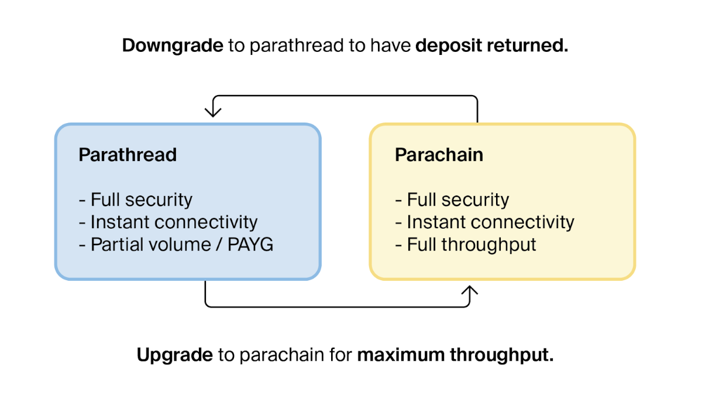

> Parachains require `20,000 DOT` tokens to be staked in order to secure a slot. And these projects don't have enough budget can use Parathreads so that they can come back to the parachain slot auction later.

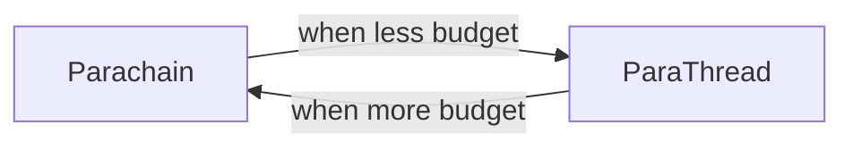
```mermaid
graph LR
Parachain --when less budget--> ParaThread --when more budget--> Parachain
```

- **Polkadot vs SC**:
  "Polkadot does not use a gas-metering model, but a weight-fee model, meaning Parachains do not have a gas-metered model in their logic. Parachains can implement powerful programming languages. Better put, parachains try to be proactive, while smart contract platforms are event-driven."

- **EVM vs WASM**:

| EVM                                                                      | WASM                                                                                                                        |
| ------------------------------------------------------------------------ | --------------------------------------------------------------------------------------------------------------------------- |
| it isn’t as fast as it should be and directly impact network efficiency  | it expands the supported languages that a developer can write a smart contract in, such as Rust, C/C++, C#, and Typescript. |
| it uses opcodes that are not optimized for different hardware platforms. | it is is highly performant.                                                                                                 |
| The support and reach for developing smart contracts are limited.        | it is optimized for different hardware platforms.                                                                           |

- **Pallet**: module that trigger functionality on a parachain. Typically like system contracts on a L1 Blockchain.

## Installation

## Quickstart

- Follow [this](https://docs.substrate.io/quick-start/)

## Parachains

- People interacting with parachains via smart contracts won't have to have DOT tokens to pay for fees. Instead, they'll pay in the native token of the parachain. So, with this feature user would not need to have DOT tokens in order to make any transaction on parachain. This is a huge step towards mass adoption because it would be easier for the user to interact with the parachain rather than having to buy DOT tokens.
- In order to reserve limited parachain slots, parachains must stake DOT tokens. The more DOT tokens staked, the higher the parachain's priority in the auction. Although their is a minimum DOT tokens (say 1M) to be staked.
- Now, the concern is to how to arrange that much amount of DOT tokens.
  1. One can buy DOT tokens from the market or already held DOT tokens.
  2. Ask the investor to stake DOT tokens as loan on your behalf. There is a guarantee of getting the money back as it would happen on-chain via pallets.
  3. Ask the community to stake DOT tokens via crowdloan on your behalf. There is a guarantee of getting the money back as it would happen on-chain via pallets.

### Astar

Has partnered with Alchemy

- [With Alchemy](https://www.alchemy.com/astar)

### Acala

Hub for DeFi in Polkadot, Kusama.

- Acala is on **Polkadot**
- Karura is on **Kusama**

### Moonbeam

EVM ✅

- [Developer docs](https://docs.moonbeam.network/builders/)
- [Collators](https://moonbeam.moonscan.io/collators)
- [Block explorers](https://docs.moonbeam.network/builders/get-started/explorers/)
- [Wallets](https://docs.moonbeam.network/builders/integrations/wallets/)
- [Pallets](https://docs.moonbeam.network/builders/pallets-precompiles/pallets/)

### Centrifuge

- [Website](https://centrifuge.io/)
- [Github](https://github.com/centrifuge/centrifuge-chain)

## Block Explorer

Switch to any L0, parachain, parathread network.

- [Subscan](https://polkadot.subscan.io/)
  - Beautiful looking UI/UX for viewing txns, blocks, accounts for Polkadot, Kusama, Rococo relaychain & parachains & testnets.
- [Polkadot.js](https://polkadot.js.org/apps/#/explorer)
- [Polkascan](https://explorer.polkascan.io/)
  - available for only Polkadot, Kusama, no local node support
- [IPFS based Polkadot.js](https://ipfs.io/ipns/dotapps.io/)
  - relatively slow

---

- [Contract Explorer](https://contracts-ui.substrate.io/)

## Wallet

These are the wallets (like Metamask):

URL: <https://wiki.polkadot.network/docs/build-wallets>

---

Browser extension: <https://chrome.google.com/webstore/detail/polkadot%7Bjs%7D-extension/mopnmbcafieddcagagdcbnhejhlodfdd/related>

---

Mobile wallets: <https://polkawallet.io/>

## Development

- Substrate allows the different features of Polkadot as it allows a modular design with pallets. Using different pallets like balance, account, transaction, block, consensus one can create own parachain.
- Substrate (by default) has a `WASM` runtime but it also allows to create a custom runtime like `EVM` using pallet programming. So, if someone wants to create a `EVM` runtime for running EVM SCs, then a set of pallet (account, balance, consensus, etc.) has to be created in order to join them together & form the required runtime for a parachain with that runtime.
- `FRAME` is the library which is used to build DApps.

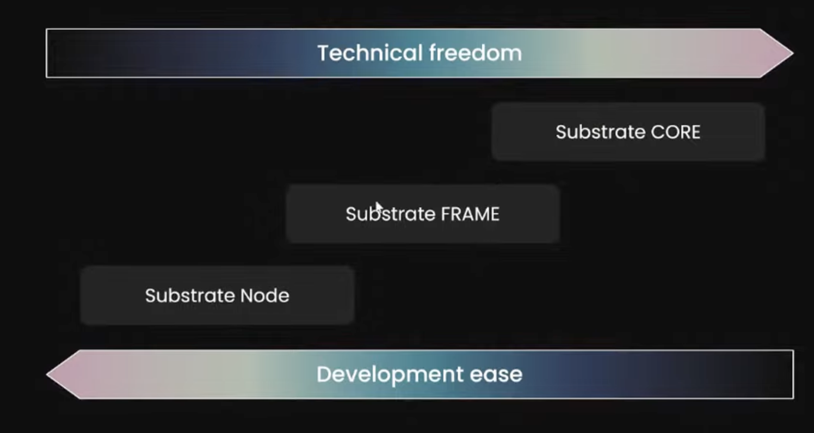

There are different FRAME pallets to choose from in order to add into runtime.

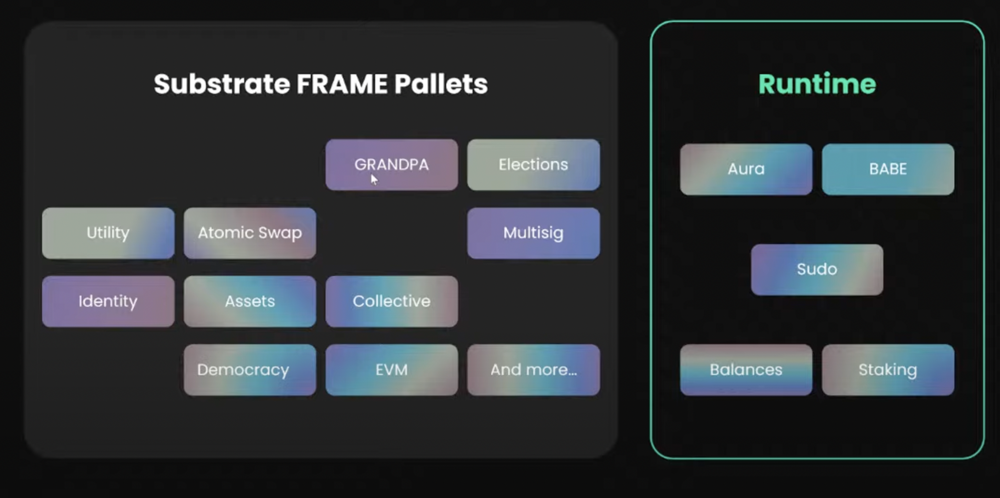

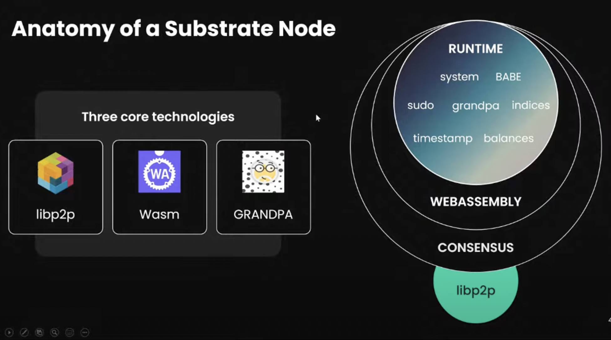

Another way to look at it:
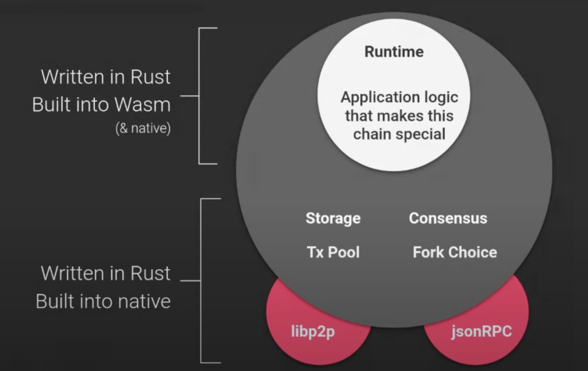

For networking, substrate use `libp2p` protocol (developed by IPFS creators).

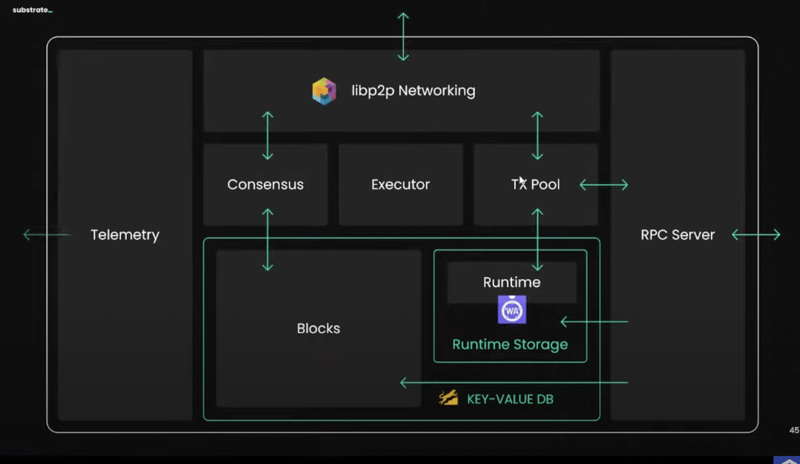

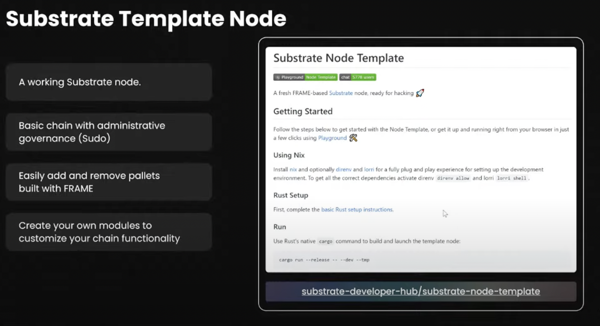

Using this template, we can start a chain locally. [repo](https://github.com/substrate-developer-hub/substrate-node-template).

Using the front-end template, we can view the information on a website. [repo](https://github.com/substrate-developer-hub/substrate-front-end-template).

Substrate pallets:


The development workflow to pallet:
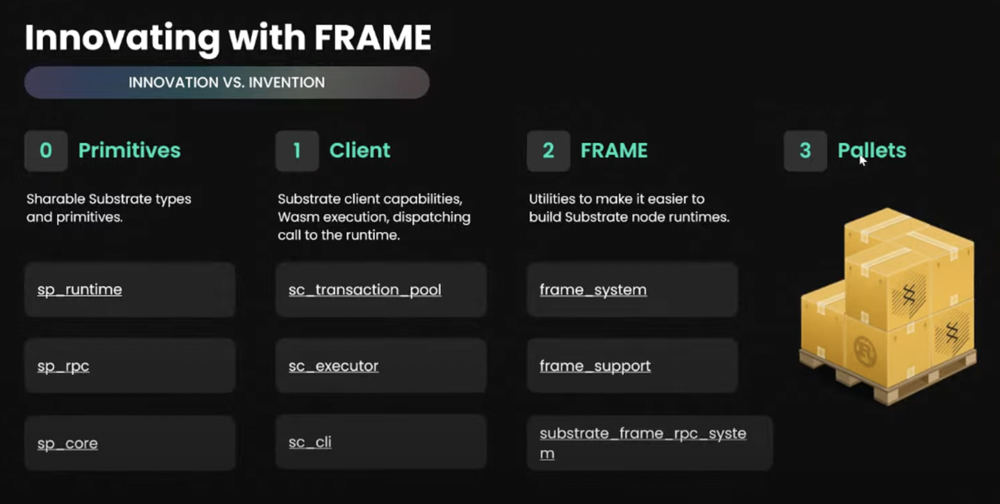

where, `sp: substrate primitive`, `sc: substrate client`

## Auction

In Polkadot, in order to secure a slot, a project/parachain has to bid in the auction. This auction has no end time. The winning is completely based on the highest amounts in terms of ranking.

This auction is similar to Candle auction in 16th century.

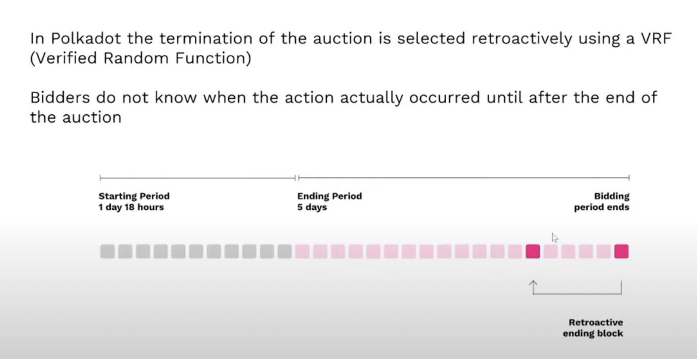

There is also a feature of crowdloan where anyone holding DOT can lend to project/parachain. And after the auction period is over, the DOTs are returned back to the owners permissionlessly.

## Tools

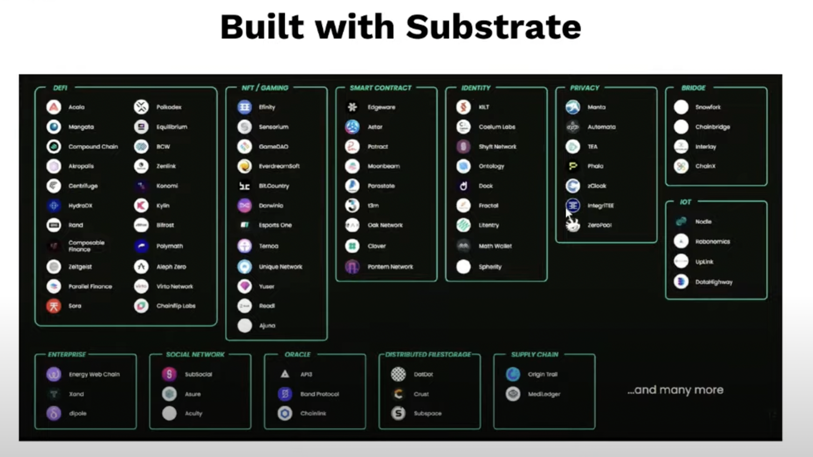

- [Substrate](./substrate/)
  - [playground](https://playground.substrate.dev/): setup w/o local PC.
- [Telemetry](https://telemetry.polkadot.io/): View all the nodes running polkadot.
- Polkadot explorer
  - polkascan: <https://explorer.polkascan.io/polkadot>
  - <https://polkadot.js.org/apps/?rpc=wss%3A%2F%2Fpolkadot.api.onfinality.io%2Fpublic-ws#/explorer>
- kusama explorer
  - polkascan: <https://explorer.polkascan.io/kusama>
  - <https://polkadot.js.org/apps/?rpc=wss%3A%2F%2Fkusama.api.onfinality.io%2Fpublic-ws#/explorer>
- [Substrate Utilities by Shawn](https://www.shawntabrizi.com/substrate-js-utilities/)

## Packages

All web3 packages here:

- [`polkadot-js` | JS](https://polkadot.js.org/docs/)
- [Python Substrate Interface | Python](https://github.com/polkascan/py-substrate-interface)
- [REST service for substrate blockchains | TS](https://github.com/paritytech/substrate-api-sidecar)

## Polkadot vs Kusama

- All the new features are deployed on Kusama 1st & then it gets deployed on Polkadot.
- There are plans to brige both these relay chains

## Interoperability

There are message protocols which are used for communicating b/w chains. E.g. XCM, XCMP

- XCM: Cross Consensus Message format
- XCMP: Cross Chain Messaging Protocol

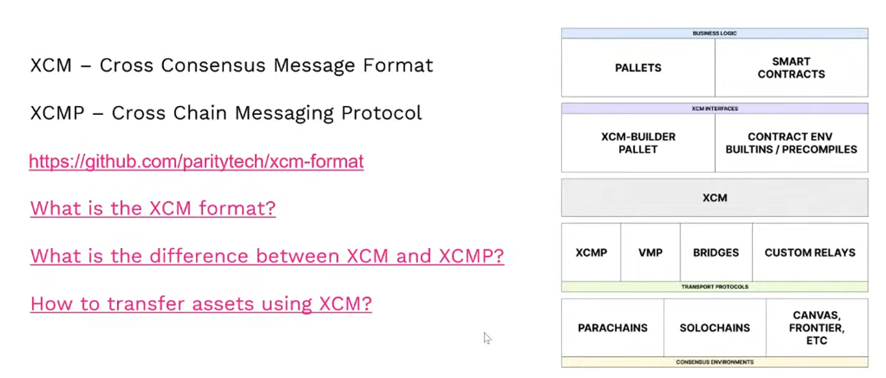

## Network architecture


The **collators** give the **proof** (parachains' block when reached finality i.e. 'proof of validity') to the **validators** who then add to the **relay chain**.

Each parachain has 2 options of adding blocks into the relay chain:

- slot (`stake DOT` & secure position)
- parathread pool (`pay-as-you-go` model)

## State transition

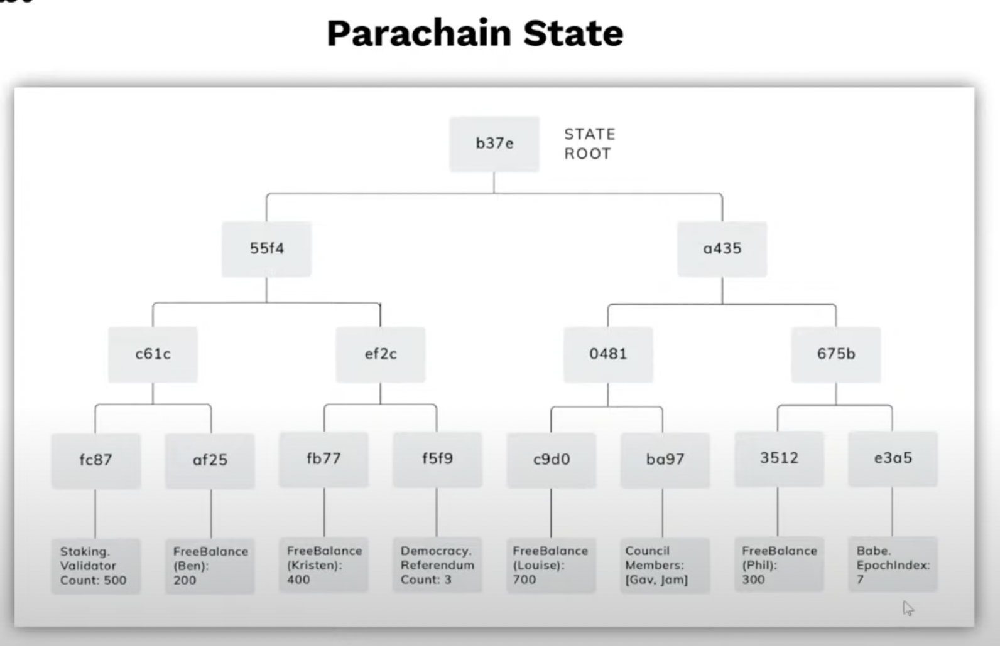

It stays in merkle tree.

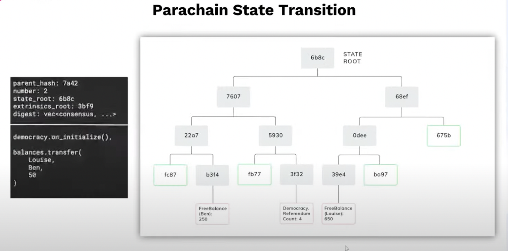

Here, only the nodes which have been changed in terms of data, those gets added in hash. The figure above shows the transition state.

## Proof of Validity

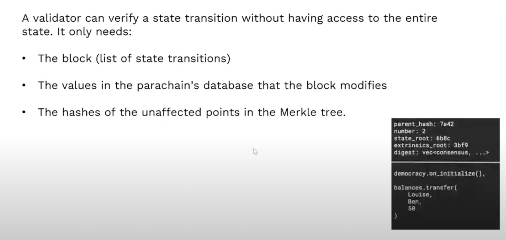

## Validation process

A receipt is used to put into the blocks of relay chain

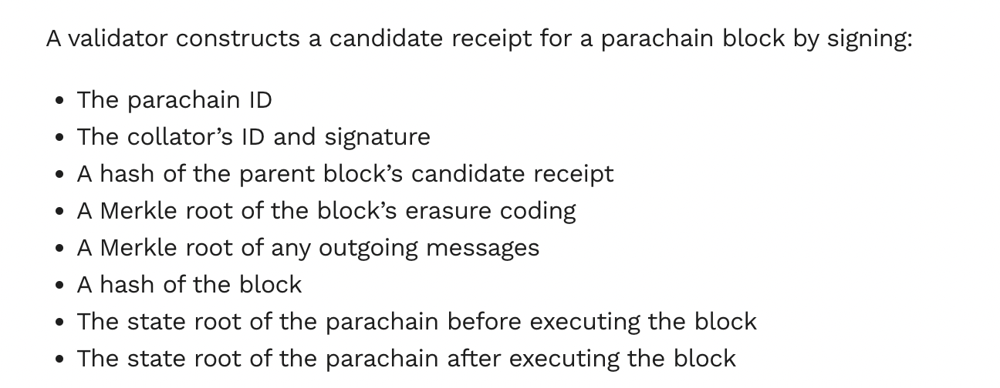

## Upgrades

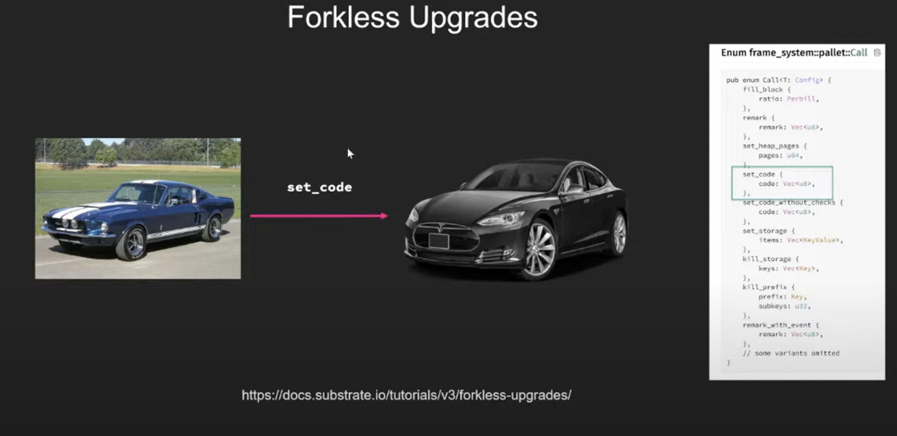

There is a `set_code` function which allows to upgrade the network.

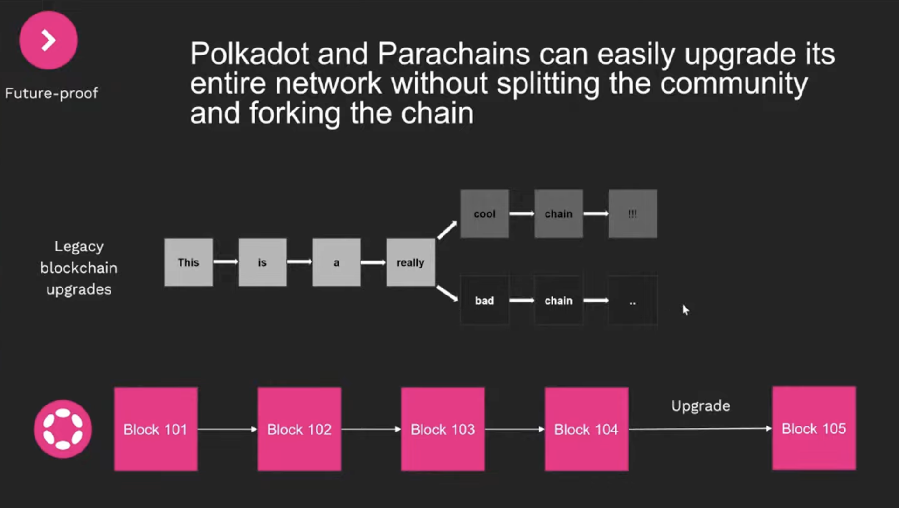

It shows comparo b/w legacy & polkadot blockchains.

## Repositories

**By ParityTech**:

- Substrate (The platform for blockchain innovators): <https://github.com/paritytech/substrate>
- Cumulus (Write Parachains on Substrate): <https://github.com/paritytech/cumulus>
- Polkadot (Polkadot Node Implementation): <https://github.com/paritytech/polkadot>
- Substrate node (relaychain) template: <https://github.com/substrate-developer-hub/substrate-node-template>
- Substrate parachain template: <https://github.com/substrate-developer-hub/substrate-parachain-template>
- Substrate node FE template: <https://github.com/substrate-developer-hub/substrate-front-end-template>
- Awesome Substrate (official): <https://github.com/substrate-developer-hub/awesome-substrate>
- ink! (Smart Contract Language for Substrate): <https://github.com/paritytech/ink>
- Lightweight, efficient, binary serialization and deserialization codec: <https://github.com/paritytech/parity-scale-codec>
  > SCALE is a light-weight format which allows encoding (and decoding) which makes it highly suitable for resource-constrained execution environments like blockchain runtimes and low-power, low-memory devices.

**By others**:

- zhubaiyuan/awesome-substrate: <https://github.com/zhubaiyuan/awesome-substrate>
- A Substrate pallet implementing role-based access control and permissions for Substrate extrinsic calls: <https://github.com/gautamdhameja/substrate-rbac> [TODO: add test to this repo]
- <https://github.com/darwinia-network/darwinia>
- Substrate Open Runtime Module Library (ORML): <https://github.com/open-web3-stack/open-runtime-module-library>
  - ORML Currencies pallet: <https://github.com/open-web3-stack/open-runtime-module-library>, package: "orml-currencies"
  - ORML traits
  - ORML tokens
- Lightweight client for Substrate-based chains, such as Polkadot and Kusama: <https://github.com/smol-dot/smoldot>
- Subwasm is a cli utility to inside a Substrate WASM Runtime: <https://github.com/chevdor/subwasm>
- Pallets by Integritee network: <https://github.com/integritee-network/pallets>
- DIA Oracle pallet: <https://github.com/pendulum-chain/oracle-pallet>
- DeFi based parachain that has DeFi pallets available as a tool:
  - Permission pallet: <https://github.com/sora-xor/sora2-network/tree/master/pallets/permissions>
  - DEX manager pallet: <https://github.com/sora-xor/sora2-network/tree/master/pallets/dex-manager>
  - Orderbook pallet: <https://github.com/sora-xor/sora2-network/tree/master/pallets/order-book>
  - Multicollateral Bonding curve pool pallet: <https://github.com/sora-xor/sora2-network/tree/master/pallets/multicollateral-bonding-curve-pool>
  - Pool xy=k pallet: <https://github.com/sora-xor/sora2-network/tree/master/pallets/pool-xyk>
  - trading pair pallet: <https://github.com/sora-xor/sora2-network/tree/master/pallets/trading-pair>

## Troubleshooting

### 1. 1010: Invalid Transaction: Transaction has a bad signature

Raised a question over [stackexchange](https://substrate.stackexchange.com/questions/8127/1010-invalid-transaction-transaction-has-a-bad-signature/8154#8154).

- _Cause_: Doesn't perform as expected. Seen this error on Polkadot JS Apps UI.
- _Solution_: Just reload the page. Use <kbd>cmd + r</kbd> to reload the App.

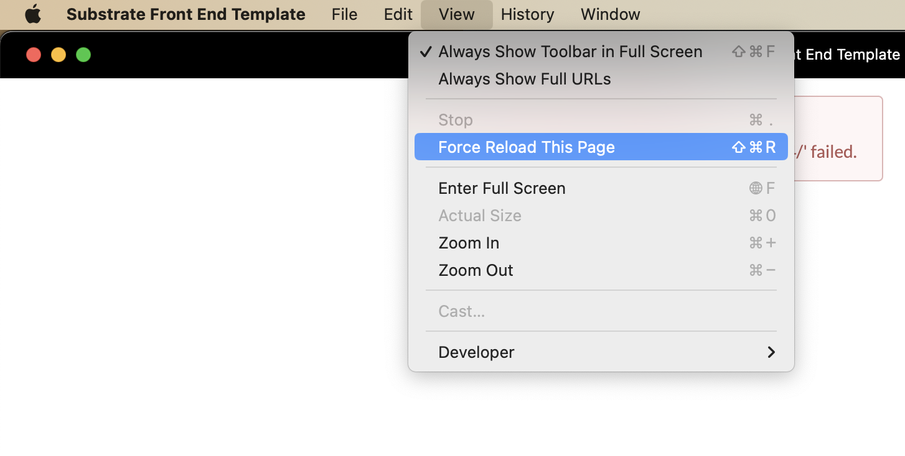

### 2. error[E0275]: overflow evaluating the requirement `<Runtime as pallet_voting::Config>::MaxProposalLength == _`

- _Cause_: This error is seen when we try to run the `cargo check -p node-template-runtime` command or `cargo build -r` command.
- _Solution_: We need to remove `Self` in the code like this:

**Before**:

```rust
parameter_types! {
 pub const MaxProposalLength: u32 = 100;
 pub const MinProposalLength: u32 = 5;
}

/// Configure the pallet-voting in pallets/voting.
impl pallet_voting::Config for Runtime {
 type RuntimeEvent = RuntimeEvent;
 type MaxProposalLength = Self::MaxProposalLength;
 type MinProposalLength = Self::MinProposalLength;
}
```

**After**:

```rust
parameter_types! {
 pub const MaxProposalLength: u32 = 100;
 pub const MinProposalLength: u32 = 5;
}

/// Configure the pallet-voting in pallets/voting.
impl pallet_voting::Config for Runtime {
 type RuntimeEvent = RuntimeEvent;
 type MaxProposalLength = MaxProposalLength;
 type MinProposalLength = MinProposalLength;
}
```

### 3. error: no rules expected the token `=`

- _Cause_: This error is seen during runtime build as there is no type annotation used the variables.

  ```sh
  307 |     pub const MaxProposalLength = 100;
        |                                 ^ no rules expected this token in macro call
  ```

- _Solution_: We need to add type annotation to the variables like this:

**Before**:

```rust
// runtime/src/lib.rs
parameter_types! {
 pub const MaxProposalLength = 100;
 pub const MinProposalLength = 5;
}
```

**After**:

```rust
// runtime/src/lib.rs
parameter_types! {
 pub const MaxProposalLength: u32 = 100;
 pub const MinProposalLength: u32 = 5;
}
```

### 4. How to fix `parity_scale_codec::MaxEncodedLen` is not implemented for `T`?

- _Cause_: The compiler thinks that `T` must also be bounded by `MaxEncodedLen`, even though `T` itself is not being used in the actual types.
- _Solution_:

  - M-1: Add `#[codec(mel_bound())]` to the type definition:

    ```rust
    // Struct for holding Kitty information.
    #[derive(Clone, Encode, Decode, PartialEq, RuntimeDebug, TypeInfo, MaxEncodedLen)]
    #[scale_info(skip_type_params(T))]
    #[codec(mel_bound())] // <---------------- Here
    pub struct Kitty<T: Config> {
        pub dna: [u8; 16],   // Using 16 bytes to represent a kitty DNA
        pub price: Option<BalanceOf<T>>,
        pub gender: Gender,
        pub owner: AccountOf<T>,
    }
    ```

  - M-2: Add generic type to the type definition:

    ```rust
    // Struct for holding Kitty information.
    #[derive(Clone, Encode, Decode, PartialEq, RuntimeDebug, TypeInfo, MaxEncodedLen)]
    pub struct Kitty<Account, Balance> {
      pub dna: [u8; 16],   // Using 16 bytes to represent a kitty DNA
      pub price: Option<Balance>,
      pub gender: Gender,
      pub owner: Account,
    }
    ```

    Sources: [1](https://substrate.stackexchange.com/a/1428/2795), [2](https://substrate.stackexchange.com/a/620/2795)

### 5. type mismatch resolving `<Test as Config>::AccountData == AccountData<u128>`

- _Cause_: Didn't use `pallet_balances` in `impl` block of `frame_system` for `Test` runtime
  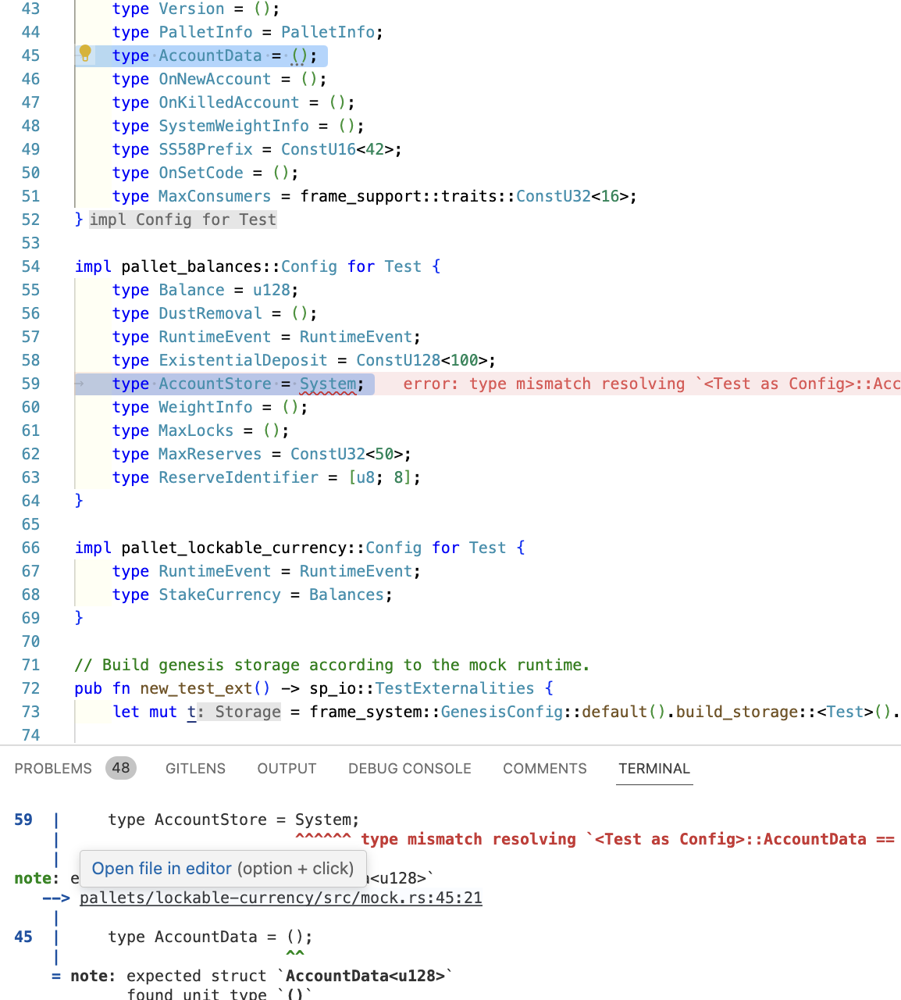
- _Solution_: Add `pallet_balances` in `impl` block of `frame_system` for `Test` runtime.

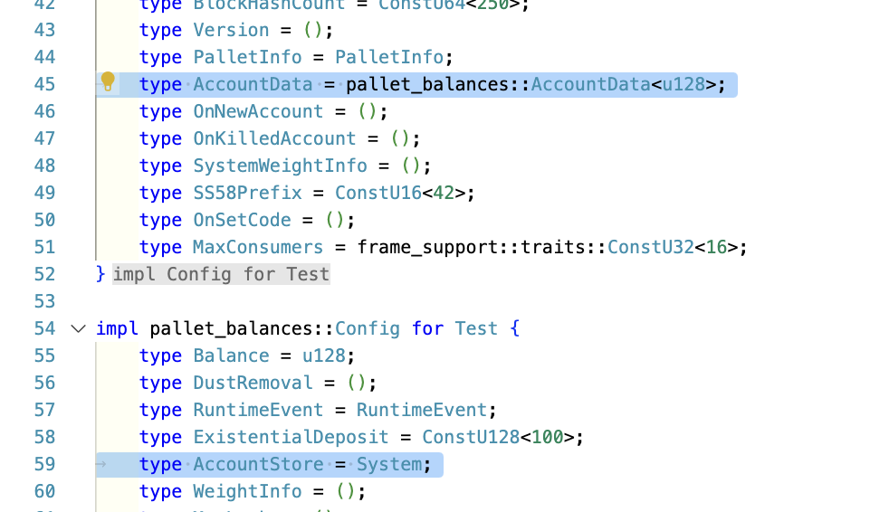

```diff
-type AccountData = ();
+type AccountData = pallet_balances::AccountData<u128>;
```

### 6. running 1 test thread 'tests::open_fd' panicked at '`get_version_1` called outside of an Externalities-provided environment.'

- _Cause_: Didn't use `new_test_ext().execute_with(|| {});` inside the test function
- Solution: Add `new_test_ext().execute_with(|| {});` inside the test function

Before:

```rust
#[test]
fn test_something() {
    // Test code
}

```

**After**:

```rust
#[test]
fn test_something() {
    new_test_ext().execute_with(|| {
        // Test code
    });
}
```

### 7. error: the wasm32-unknown-unknown target is not supported by default, you may need to enable the "js" feature. For more information see: <https://docs.rs/getrandom/#webassembly-support>

**Details**:

```sh
|
  235 | /         compile_error!("the wasm32-unknown-unknown target is not supported by \
  236 | |                         default, you may need to enable the \"js\" feature. \
  237 | |                         For more information see: \
  238 | |                         https://docs.rs/getrandom/#webassembly-support");
      | |________________________________________________________________________^

  error[E0433]: failed to resolve: use of undeclared crate or module `imp`
     --> /Users/jackson/.cargo/registry/src/github.com-1ecc6299db9ec823/getrandom-0.2.7/src/lib.rs:262:5
      |
  262 |     imp::getrandom_inner(dest)
      |     ^^^ use of undeclared crate or module `imp`
```

- _Cause_: it looks like one of your dependencies tries to generate random numbers.
- _Solution_: Insert `default-feature = false` into one of your dependency in `Cargo.toml
  > You can enable the default features in `[dev-dependencies]` i.e. `default-features = true` or remove it altogether as implemented by default, but you should not enable that in `[dependencies]` as it might trigger randomization.

```diff
// Cargo.toml

[dependencies]
- sp-core = { version = "7.0.0", git = "https://github.com/paritytech/substrate.git", branch = "polkadot-v0.9.42" }
+ sp-core = { version = "7.0.0", default-features = false, git = "https://github.com/paritytech/substrate.git", branch = "polkadot-v0.9.42" }
```

### 8. Error: error[E0463]: can't find crate for `std`

<details>
<summary><b>Error details:</b></summary>

```sh
Rust WASM toolchain not installed, please install it!

  Further error information:
  ------------------------------------------------------------
     Compiling wasm-test v1.0.0 (/var/folders/cw/dc7mkcsd6yx76lscv6w1hpcw0000gn/T/.tmp3NWr2N)
  error[E0463]: can't find crate for `std`
    |
    = note: the `wasm32-unknown-unknown` target may not be installed
    = help: consider downloading the target with `rustup target add wasm32-unknown-unknown`

  error: requires `sized` lang_item

  libunwind: malformed __unwind_info at 0x18AC83CA8 bad second level page
  error: cannot find macro `println` in this scope
   --> src/main.rs:3:5
    |
  3 |                 println!("{}", env!("RUSTC_VERSION"));
    |                 ^^^^^^^

  For more information about this error, try `rustc --explain E0463`.
  libunwind: malformed __unwind_info at 0x18AC83CA8 bad second level page
  error: could not compile `wasm-test` (lib) due to 2 previous errors
  warning: build failed, waiting for other jobs to finish...
  error: could not compile `wasm-test` (bin "wasm-test") due to 3 previous errors
  ------------------------------------------------------------

warning: build failed, waiting for other jobs to finish...
```

</details>

- _Cause_: `wasm32-unknown-unknown` target is not installed or may be it's installed but due to switching of channels, it's not supported anymore.
- _Solution_: If the error is popping up even after doing `$ rustup target add wasm32-unknown-unknown` & `$ rustup target install wasm32-unknown-unknown` then just uninstall `rustup` entirely and then reinstall. Build again. It would be fixed now.

## References

### Official

- [Parity Homepage](https://www.parity.io/)
- **Polkadot Blockchain Academy**:
  - [Github](https://github.com/Polkadot-Blockchain-Academy/Academy-PoW)
  - [Book](https://polkadot-blockchain-academy.github.io/pba-book/index.html)
- [Polkadot Wiki](https://wiki.polkadot.network/)
- [Substrate Homepage](https://substrate.io/)
  > Many pages need to be updated.
- [Parity Tech Rust Doc](https://paritytech.github.io/)
  - [Project Pages](https://paritytech.github.io/#project-pages)
    - subxt: [rust-doc](https://docs.rs/subxt/latest/subxt/index.html), [book](https://docs.rs/subxt/latest/subxt/book/index.html)
    - [frontier | docs.rs](https://paritytech.github.io/frontier/)
    - [XCM | docs.rs](https://paritytech.github.io/xcm-docs/)
    - [Wasmi | docs.rs](https://docs.rs/wasmi/latest/wasmi/)
    - [Parity Scale Codec | docs.rs](https://docs.rs/parity-scale-codec/latest/parity_scale_codec/)

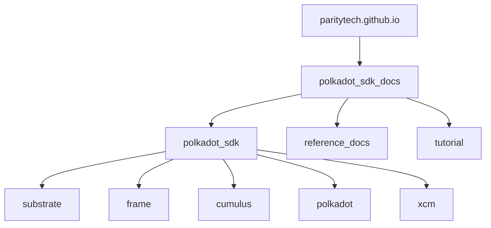
```mermaid
flowchart
    parity[paritytech.github.io] --> devhub[polkadot_sdk_docs]

    devhub --> polkadot_sdk
    devhub --> reference_docs
    devhub --> tutorial

    polkadot_sdk --> substrate
    polkadot_sdk --> frame
    polkadot_sdk --> cumulus
    polkadot_sdk --> polkadot
    polkadot_sdk --> xcm
```

- Polkadot Documentation
  > This doc has been created with `.rs` files. So, all the markdown based docs has been created inside `//!` in `.rs` files.
  > The crate name: "**polkadot_sdk_docs**".
  >
  > Modules:
  > - guides
  > - meta_contributing
  > - polkadot_sdk
  > - reference_docs

  - [Github](https://github.com/paritytech/polkadot-sdk/tree/master/docs)
  - [Polkadot SDK | docs.rs](https://paritytech.github.io/polkadot-sdk/master/polkadot_sdk_docs/polkadot_sdk/index.html)
  - [Substrate | docs.rs](https://paritytech.github.io/polkadot-sdk/master/polkadot_sdk_docs/polkadot_sdk/substrate/index.html)
  - [Guides | docs.rs](https://paritytech.github.io/polkadot-sdk/master/polkadot_sdk_docs/guides/index.html)
  - [Reference | docs.rs](https://paritytech.github.io/polkadot-sdk/master/polkadot_sdk_docs/reference_docs/index.html)
- [Polkadot Doc](https://paritytech.github.io/polkadot_page/)
- [Cumulus | docs.rs](https://paritytech.github.io/polkadot-sdk/master/polkadot_sdk_docs/polkadot_sdk/cumulus/index.html)
- Collection of Useful Bridge Building Tools 🏗️: [Github](https://github.com/paritytech/parity-bridges-common)

## Unofficial

- By Josh:
  - [Blockchain from scratch](https://github.com/JoshOrndorff/blockchain-from-scratch)
- [Substrate tutorials by **rusty-crewmates**](https://github.com/rusty-crewmates/substrate-tutorials)

### Blogs

- [Polkadot Blockchain Terms](https://learn.figment.io/tutorials/polkadot-blockchain-terms)
- [HOW TO BUILD PARACHAIN ON POLKADOT](https://www.leewayhertz.com/build-parachain-on-polkadot/)
- [Polkadot Messaging Scheme (XCMP)](https://deeprnd.medium.com/polkadot-messaging-scheme-xcmp-afcdb9b52616)
- [Support: Ask any Q.s here](https://support.polkadot.network/support/home)

### Videos

- [Gavin Wood: Explaining the Polkadot Launch Process](https://www.youtube.com/watch?v=TpcCeo-ZkDY) ✅
- [Chainlink | Introduction to Polkadot, Parachains, and Substrate](https://www.youtube.com/watch?v=gT-9r1bcVHY) ✅
- [The Path of a Parachain Block on Polkadot and Kusama Network](https://www.youtube.com/watch?v=m0vxqWwFfDs)
- [Intro to Substrate codebase and FRAME pallet deep-dive with Joe Petrowski and Shawn Tabrizi](https://www.youtube.com/watch?v=5PSllaWbYag) ✅
- [Learn Rust syntax for Substrate | Substrate Seminar](https://www.youtube.com/watch?v=VVU3Io2dACY) ✅
- [Polkadot and Substrate – Build Custom Blockchains that can Evolve](https://www.youtube.com/watch?v=HrTSpIqhyc0)
- [Sub0 Online: ink! 3.0: A Rust & Smart Contracts Love Story](https://www.youtube.com/watch?v=WNNJzK3dGGQ)
- [**Polkadot Deep Dives**](https://www.youtube.com/playlist?list=PLOyWqupZ-WGsfnlpkk0KWX3uS4yg6ZztG)
  - [Pallet Timestamp and Inherents](https://www.youtube.com/watch?v=HjtxPcuR8a0) ✅
  - [Democracy Pallet | Polkadot Deep Dives](https://www.youtube.com/watch?v=CgcUWK2E9Jo) ✅
  - [Balances Pallet | Polkadot Deep Dives](https://www.youtube.com/watch?v=_FwqB4FwWXk) 🧑🏻‍💻
- **Substrate Seminars**
  - details in this [repo](https://github.com/substrate-developer-hub/substrate-seminar/tree/main)
- [**Substrate Saturday by Polkadot India YT playlist**](https://www.youtube.com/playlist?list=PLiKqYiZDRE4_CWnXgSgejl3bJUYibq0Gp)
  > very down to earth & easy to understand videos. It is a must watch for beginners.
  - [Substrate Saturday by Polkadot India | Bootcamp 1 | 22.12.21](https://www.youtube.com/watch?v=1WL6B2XPMjk) ✅
  - [Substrate Saturday by Polkadot India | Bootcamp 2 | Session 1 | 22.01.22](https://www.youtube.com/watch?v=_Yxpqrdb_nM) ✅
  - [Substrate Saturday by Polkadot India | Bootcamp 2 | Session 2 | 05.02.22](https://www.youtube.com/watch?v=eNyeCfurFwc) ✅
  - [Substrate Saturday by Polkadot India | Bootcamp 3 | 26.02.22](https://www.youtube.com/watch?v=J126vvf24Lk)
  - [Substrate Saturday - Bootcamp Series 2 | Workshop | Ivan Temchenko | 23.07.22](https://www.youtube.com/watch?v=QSpJmrS2x4c)
  - [Substrate Saturday - Bootcamp Series 2 | Episode 5 | 13.07.22](https://www.youtube.com/watch?v=V3tTe8SHdd4)
  - [Substrate Saturday - Bootcamp Series 2 | Episode 1 | 09.07.22](https://www.youtube.com/watch?v=pe2iYNsW6wE)
  - [Substrate Saturday - Bootcamp Series 2 | Episode 2 | 16.07.22](https://www.youtube.com/watch?v=R-aYqqyD2Qo)
  - [Substrate Saturday - Bootcamp Series 2 | Episode 4 | 30.07.22](https://www.youtube.com/watch?v=CtGLtGmkcqE)
  - [Substrate Saturday - Bootcamp Series 2 | Workshop | Pierre Ossun | 20.08.22](https://www.youtube.com/watch?v=IrwpsMAysvk)
  - [Substrate Saturday - Bootcamp Series 2 | Episode 7 | 27.08.22](https://www.youtube.com/watch?v=-96T5e9drIo)
  - [Substrate Saturday - Bootcamp Series 2 | Episode 9 | 10.09.22](https://www.youtube.com/watch?v=9lPNkalGUcg)
  - [Substrate Saturday - Bootcamp Series 2 | Workshop | Faisal Ahmed | 17.09.22 |](https://www.youtube.com/watch?v=0SYELfmT21E)
- [The Future of the Network | Polkadot Blockchain Academy 2023](https://youtu.be/j6xEbgAiVvg) ✅
- [What Will the Next Generation of Dapps Look Like? | ETHDenver '23](https://youtu.be/YxEK8EvVAAo) ✅
- [🎮 Runtime Development](https://www.youtube.com/playlist?list=PLp0_ueXY_enU7jbm_A-3BrXiMbHPR0he0)
  - It mainly focuses on the runtime development of substrate using FRAME v2. Especially for the beginners, it is a must watch. Also, it's going to give you a good idea about the runtime development of substrate in terms of journey that how it has evolved from FRAME v1 to FRAME v2.
- [Centrifuge: From Solidity To Substrate | Sub0 2022](https://www.youtube.com/watch?v=xVDDuop2Mvg) ✅
- [Building blockchains the easy way | Substrate Seminar](https://www.youtube.com/live/YJwbpF6yROk) ✅
- [Set-up tips, key concepts and how to build with them | Substrate Seminar](https://www.youtube.com/live/69uCTnvzL60)
- [Starkware builds on Substrate w/ Louis Guthmann](https://www.youtube.com/live/ZQSTAI7hGVg)
- [Madara, a new Substrate-based sequencer for Starknet appchains (with Abdelhamid Bakhta)](https://youtu.be/lL9W6PhCOTQ)
- [Episode 229 - Going Cross-Chain with Polkadot’s XCM](https://youtu.be/DAsxa4_F7cU)
