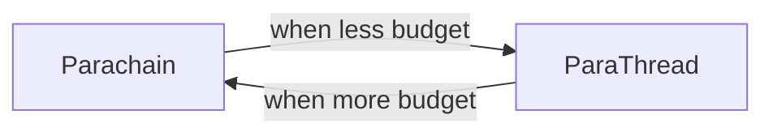

# My_Learning_Polkadot

Learn everything about Polkadot, Kusama, Substrate, etc.

## About

- Layer-0 i.e. L0
- chains (mainnet or testnet):

  - Relay chain
    - main/central chain
    - validators (297 approx.) ensuring the security of the network i.e. Polkadot
  - Parachains (100 max.)
    - collators (5 approx.)
    - they need to stake some auction fee in DOT (held every 6 months) to register a parachain on the relay chain. So, it's a weighted-fee.
  - slots
    - parachain slot (limited)
    - parachain bridge slot
    - parathread slot

- **Mainnet**:
  - Kusama (new feature launched here 1st),
  - Polkadot (at stable stage after feature launched on Kusama)
- **Testnet**: Rococo
- There are 2 ways to develop dApp on a substrate chain:

  - M-1: write SC on native parachain/parathread using `ink!` (ink! is a Rust-based eDSL for writing Wasm smart contracts)
  - M-2: write SC on EVM supported parachain/parathread using `solidity` (solidity is a high-level language for implementing smart contracts)

- pay fee with DOT for 2 different types of chains:

  - Parachain: weighted fee.
  - Parathread: participate on per use i.e. block basis or essentially `pay-as-you-go`.

- **Parachain vs Parathread**:

| Parachain                             | Parathread                                                    |
| ------------------------------------- | ------------------------------------------------------------- |
| 1. Parachain is always connected.     | 1. Parathread is not always connected.                        |
| 2. DOT staked, hence weight-fee model | 2. pay per block basis or pay-as-you-go or gas-metering model |
| 3. supports SC                        | 3. supports SC                                                |

- If you think about **Polkadot** as a giant computer, **parachains** are like applications that are in physical memory and highly available. **Parathreads** are like applications that are on disk and can be copied into memory when needed. For those already familiar with how **Bitcoin** and **Ethereum** work, users bid to enter a **parathread** block into the relay chain similar to how users bid to include a transaction in a **Bitcoin** or **Ethereum** block.

- Parathreads are ideal for three types of applications:

  - applications seeking an on-ramp to Polkadot,
  - applications worried about losing parachain slots, and
  - applications that have more reads than writes.

- Parathreads increases the number of applications that can operate on Polkadot by pooling them to share parachain slots. This will allow more infrastructure chains and improve composability."


> Parachains require `20,000 DOT` tokens to be staked in order to secure a slot. And these projects don't have enough budget can use Parathreads so that they can come back to the parachain slot auction later.



- **Polkadot vs SC**:
  "Polkadot does not use a gas-metering model, but a weight-fee model, meaning Parachains do not have a gas-metered model in their logic. Parachains can implement powerful programming languages. Better put, parachains try to be proactive, while smart contract platforms are event-driven."

- **EVM vs WASM**:

| EVM                                                                      | WASM                                                                                                                        |
| ------------------------------------------------------------------------ | --------------------------------------------------------------------------------------------------------------------------- |
| it isn’t as fast as it should be and directly impact network efficiency  | it expands the supported languages that a developer can write a smart contract in, such as Rust, C/C++, C#, and Typescript. |
| it uses opcodes that are not optimized for different hardware platforms. | it is is highly performant.                                                                                                 |
| The support and reach for developing smart contracts are limited.        | it is optimized for different hardware platforms.                                                                           |

- **Pallet**: module that trigger functionality on a parachain. Typically like system contracts on a L1 Blockchain.

## Installation

## Quickstart

- Follow [this](https://docs.substrate.io/quick-start/)

## Wallet

These are the wallets (like Metamask):

URL: https://wiki.polkadot.network/docs/build-wallets

Browser extension: https://chrome.google.com/webstore/detail/polkadot%7Bjs%7D-extension/mopnmbcafieddcagagdcbnhejhlodfdd/related

## Development

- Substrate allows the different features of Polkadot as it allows a modular design with pallets. Using different pallets like balance, account, transaction, block, consensus one can create own parachain.
- Substrate (by default) has a `WASM` runtime but it also allows to create a custom runtime like `EVM` using pallet programming. So, if someone wants to create a `EVM` runtime for running EVM SCs, then a set of pallet (account, balance, consensus, etc.) has to be created in order to join them together & form the required runtime for a parachain with that runtime.
- `FRAME` is the library which is used to build DApps.


There are different FRAME pallets to choose from in order to add into runtime.


For networking, substrate use `libp2p` protocol (developed by IPFS creators).


Using this template, we can start a chain locally. [repo](https://github.com/substrate-developer-hub/substrate-node-template).

Using the front-end template, we can view the information on a website. [repo](https://github.com/substrate-developer-hub/substrate-front-end-template).

Substrate pallets:


The development workflow to pallet:


where, sp: substrate pallet, sc: substrate client

## Auction

In Polkadot, in order to secure a slot, a project/parachain has to bid in the auction. This auction has no end time. The winning is completely based on the highest amounts in terms of ranking.

This auction is similar to Candle auction in 16th century.


There is also a feature of crowdloan where anyone holding DOT can lend to project/parachain. And after the auction period is over, the DOTs are returned back to the owners permissionlessly.

## Tools


- [Substrate](./substrate/)
  - [playground](https://playground.substrate.dev/): setup w/o local PC.
- [Telemetry](https://telemetry.polkadot.io/): View all the nodes running polkadot.
- Polkadot explorer
  - polkascan: https://explorer.polkascan.io/polkadot
  - https://polkadot.js.org/apps/?rpc=wss%3A%2F%2Fpolkadot.api.onfinality.io%2Fpublic-ws#/explorer
- kusama explorer
  - polkascan: https://explorer.polkascan.io/kusama
  - https://polkadot.js.org/apps/?rpc=wss%3A%2F%2Fkusama.api.onfinality.io%2Fpublic-ws#/explorer

## Polkadot vs Kusama

- All the new features are deployed on Kusama 1st & then it gets deployed on Polkadot.
- There are plans to brige both these relay chains

## Interoperability

There are message protocols which are used for communicating b/w chains. E.g. XCM, XCMP

- XCM: Cross Consensus Message format
- XCMP: Cross Chain Messaging Protocol


## Network architecture


The **collators** give the **proof** (parachains' block when reached finality i.e. 'proof of validity') to the **validators** who then add to the **relay chain**.

Each parachain has 2 options of adding blocks into the relay chain:

- slot (`stake DOT` & secure position)
- parathread pool (`pay-as-you-go` model)

## State transition


It stays in merkle tree.


Here, only the nodes which have been changed in terms of data, those gets added in hash. The figure above shows the transition state.

## Proof of Validity


## Validation process

A receipt is used to put into the blocks of relay chain


## Upgrades


There is a `set_code` function which allows to upgrade the network.


It shows comparo b/w legacy & polkadot blockchains.

## References

### Blogs

- [Polkadot Blockchain Terms](https://learn.figment.io/tutorials/polkadot-blockchain-terms)
- [HOW TO BUILD PARACHAIN ON POLKADOT](https://www.leewayhertz.com/build-parachain-on-polkadot/)
- [Polkadot Messaging Scheme (XCMP)](https://deeprnd.medium.com/polkadot-messaging-scheme-xcmp-afcdb9b52616)

### Videos

- [Gavin Wood: Explaining the Polkadot Launch Process](https://www.youtube.com/watch?v=TpcCeo-ZkDY)
- [Chainlink | Introduction to Polkadot, Parachains, and Substrate](https://www.youtube.com/watch?v=gT-9r1bcVHY)
- [The Path of a Parachain Block on Polkadot and Kusama Network](https://www.youtube.com/watch?v=m0vxqWwFfDs)

```

```
