# Pallets

## Installation

Refer [this](../ink/README.md#installation) for installation.

## Runtime

The substrate chain runtime is considered as state transition function. So, there are many pallets available that can be selected in order to select the desired functionality.

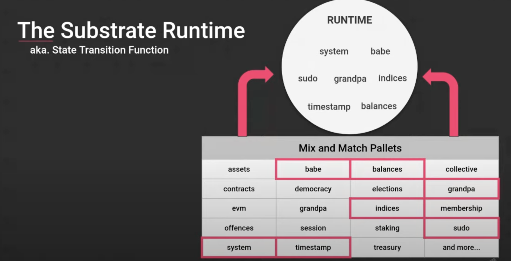

Most of the developers in substrate work as runtime developer. They are responsible for writing the runtime code. The runtime code is written in Rust. The runtime code is compiled to `wasm` and then it's deployed to the blockchain.

Parity Technologies started building relay chain of Polkadot. But, then ended up releasing the substrate. So, now the relay chain is built using substrate.


And now, anyone can create their own relay chain using substrate like this:
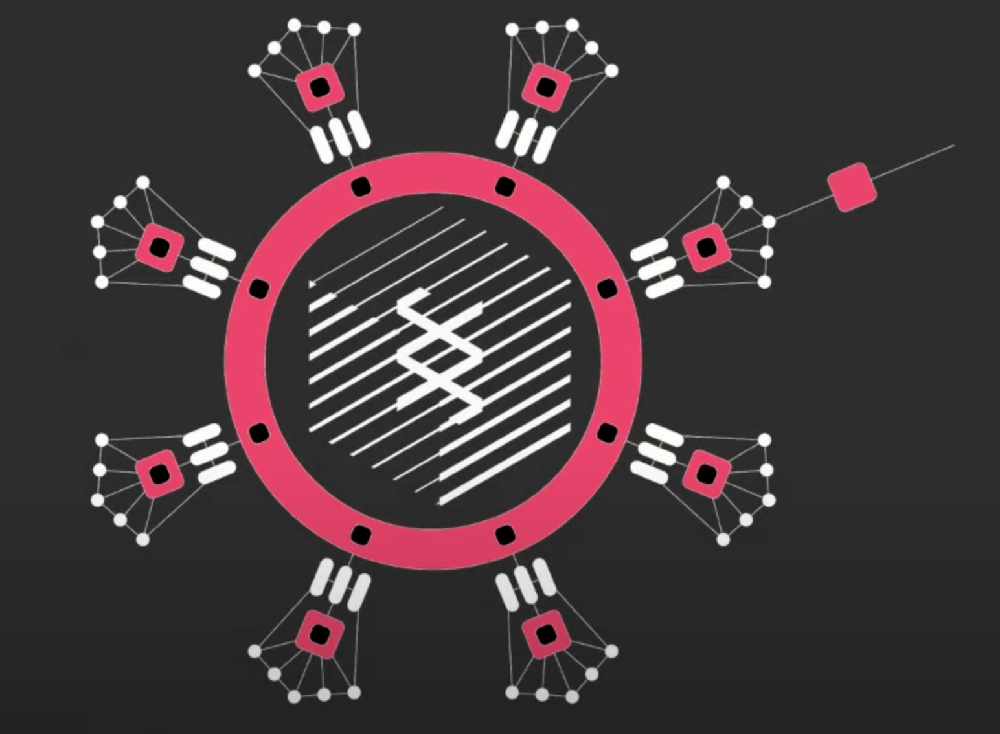

> Basically the reusable parts have been extracted out of Polkadot and made available as substrate.

Not just the relay chain, but the parachains can be built using substrate as well. So, now the parachains are built using substrate like this:
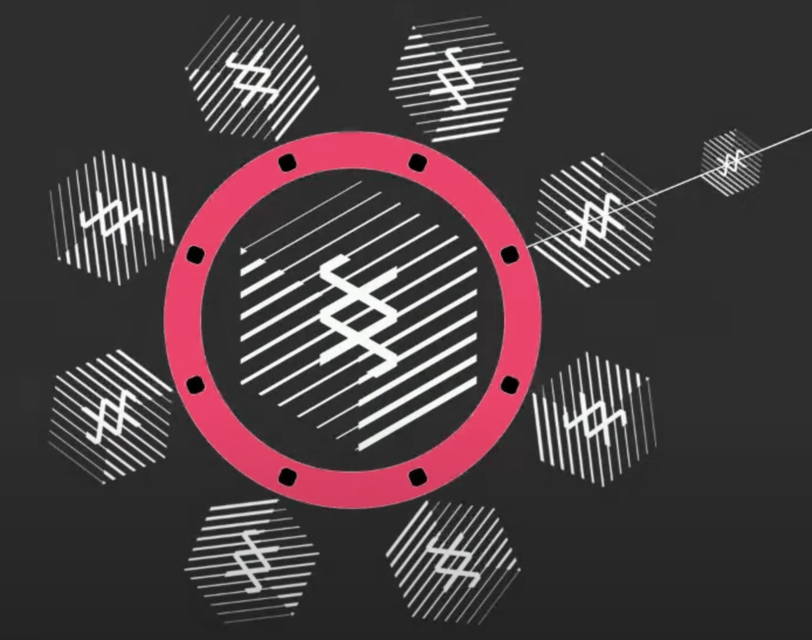

And not just that you can have your own chain which are not connected to polkadot like this:
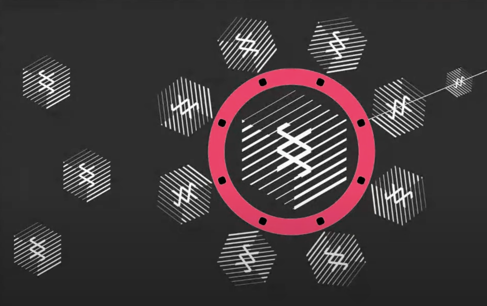

We can have this at the end (in Venn diagram):
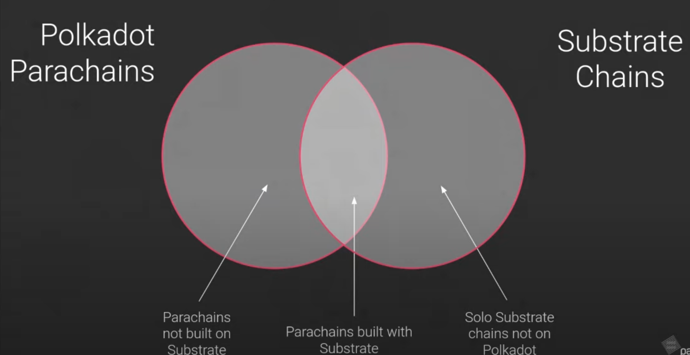

Whenever any issue is found regarding performance, block time, then the `node-template` is build with release mode. And then it would generate optimized `wasm`. And then the optimized runtime `wasm` is deployed to the blockchain.

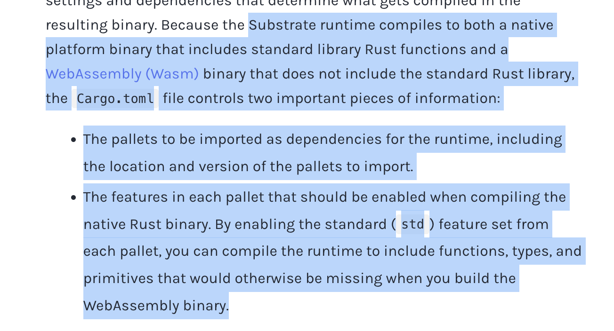

## FRAME Version Transition

FRAME has transitioned from `v1` to `v2` to `v3`.

> The changes were major especially from `v1` to `v2` i.e. from declarative to procedural (attribute) macros. The changes were not that major from `v2` to `v3`.

Illustrates the old vs new code [here](https://github.com/paritytech/substrate/discussions/7788?sort=top#discussioncomment-482199).

references: [1](https://github.com/paritytech/substrate/discussions/7788), [2](https://blog.knoldus.com/how-substrate-frame-v2-different-from-frame-v1/)

---

**FRAME Pallet v1** code template looks like this:
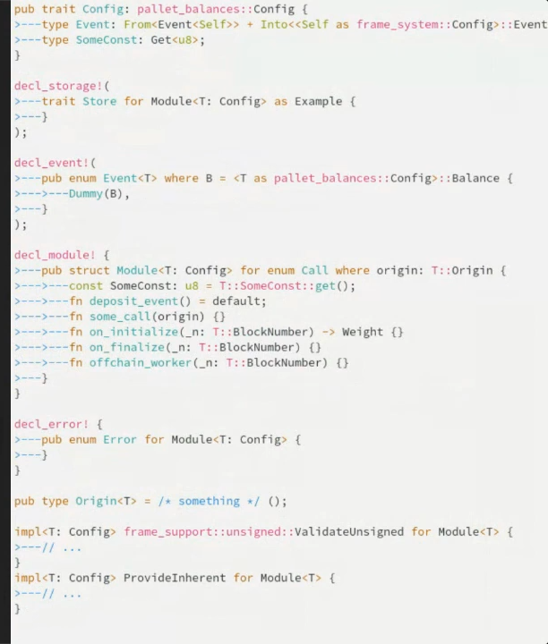

---

**FRAME Pallet v2** code template looks like this:
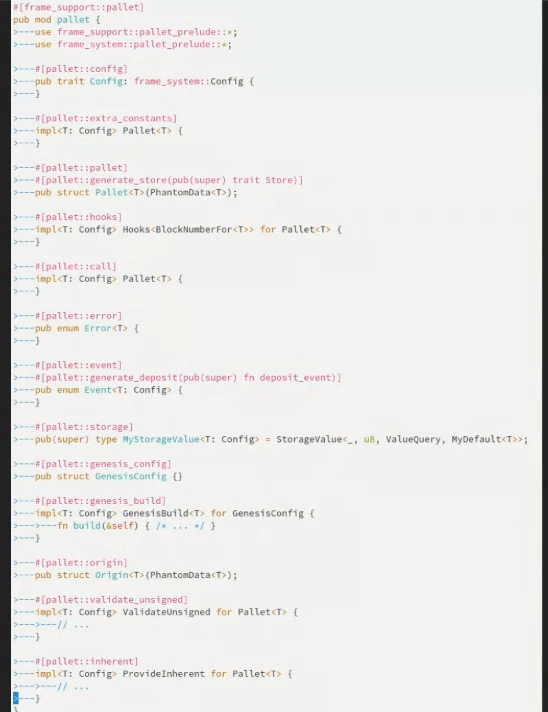

There is no change in the final source code if the macros are expanded. The change is major in the way the code is re-written using the new style of macros i.e. from declarative to procedural (attribute) macros.

---

`construct_runtime!` macro is used to define the runtime. It's a declarative macro which takes the pallets as input and generates the entire runtime code. So, this is same for both `v1` & `v2`.

## `substrate-contracts-node` vs `node-template`

Follow [this](../ink!/README.md#3-the-substrate-sc-node)

Inside a [`substrate-node-template`](https://github.com/substrate-developer-hub/substrate-node-template) repo, these folders are the main target to be modified:

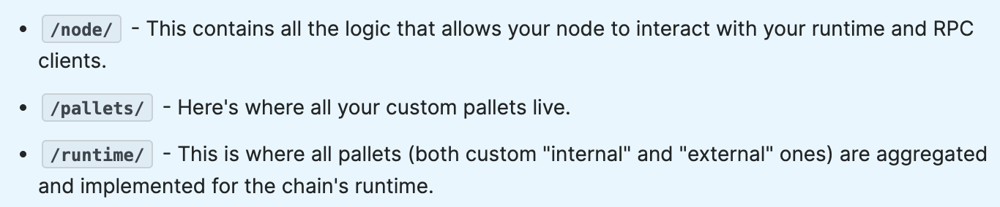

## Terminology

- **Relay chain**: The Polkadot super chain which is connected to different parachains.
- **Parachain**: The side-chains which are connected to the main Polkadot relay chain. They are more like shards in ETH 2.0.
- **Collator**: Validator for Polkadot parachain
- **Substrate runtime**: It's like `wasm`, `bytecode` for other blockchain networks.
- **FRAME**: meta-program (code that writes & modifies other code) macros (used like meta-programming ) to define pallets, storage, events, errors, etc. E.g. `println!("Hello world!")`, `#[pallet::pallet]`, `#[pallet::storage]`, `#[pallet::event]`, `#[pallet::error]`, etc. In C/C++, there are macros like `#define`, `#include`, templates, etc.

  - macros are syntactical sugars or a way to improve the developer UX in the compiled languages.

- **FRAME pallet**: The runtime modules which are used to build the runtime. They are different from the typical smart contracts which are generally designed to be used by the end-users. FRAME pallets are designed to be used by the blockchain developers. They are like the building blocks of the blockchain runtime. Also, they are very important for the L0 network stakeholders like validators, collators, etc.

## ink!

## Comparo with EVM

| EVM Stack                          |
| ---------------------------------- |
|  |

| Substrate Stack                 |
| ------------------------------- |
|  |


## Why Rust

- Able to write safe code, at compile-time (done using `$ cargo check`), rather than run-time failures in C++
- Fast
- High level compared to C++

> NOTE: Any language can be chosen for Substrate. Parity, Web3 foundation is inclined towards Rust.

## Architecture


Substrate is modular & extensive. Each module is called "Pallet".

## Blockchain Framework

If someone wants to create a blockchain, then they can use Substrate. It's a framework for creating different blockchain modules. The image below shows the different layers of a blockchain framework:

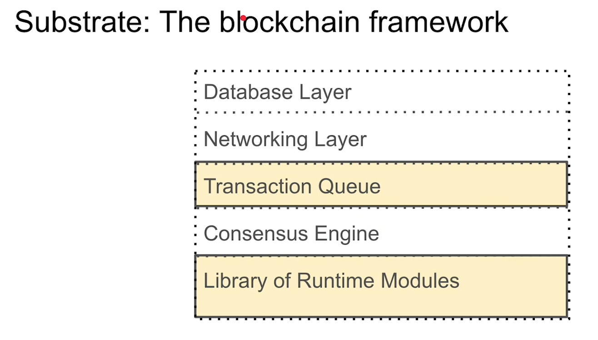

Here, `Database Layer`, `Networking Layer`, `Consensus Layer` is provided by Substrate.

---

Development wise, here is the diagram which shows the easy to difficult way of using Substrate for your own blockchain:

`Substrate Node` --> `Substrate FRAME` --> `Substrate CORE`


---

Here is what it looks like before & after creating blockchain using Substrate:

**Before**:


**After**:
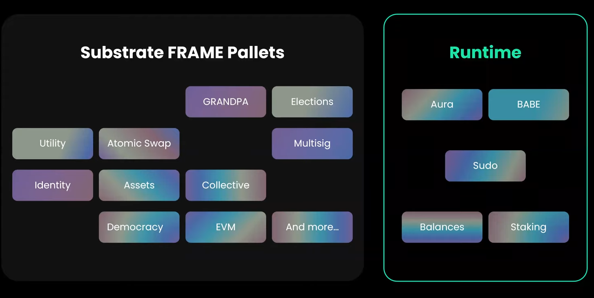

## Coding

FRAME is itself a programming language. It's a DSL (Domain Specific Language) for writing Substrate runtime, pallets.

### FRAME macros

They essentially look like this, where the LHS code is converted into kind of like AST (Abstract Syntax Tree) on the RHS:

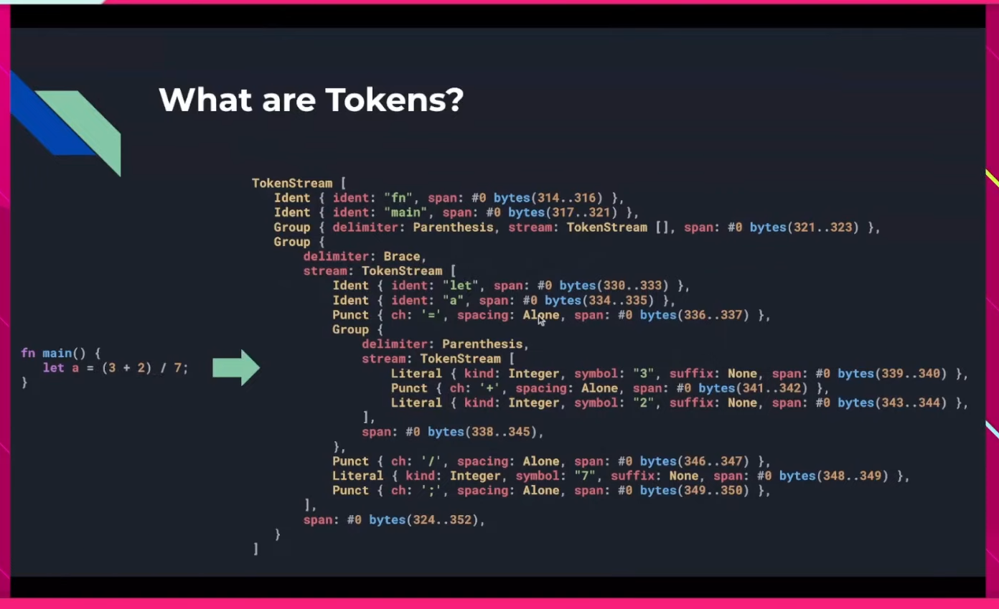

> An Abstract Syntax Tree (AST) is a tree representation of the abstract syntactic structure of source code written in a programming language. It is used to represent the syntax of a programming language in a more structured form, making it easier to analyze and understand. ASTs are typically generated by compilers and can be used for various tasks such as code optimization, type checking, and code analysis. <kbd>ChatGPT-3</kbd>

There are **declarative** macros which are generally recursive. They somewhat look like this:

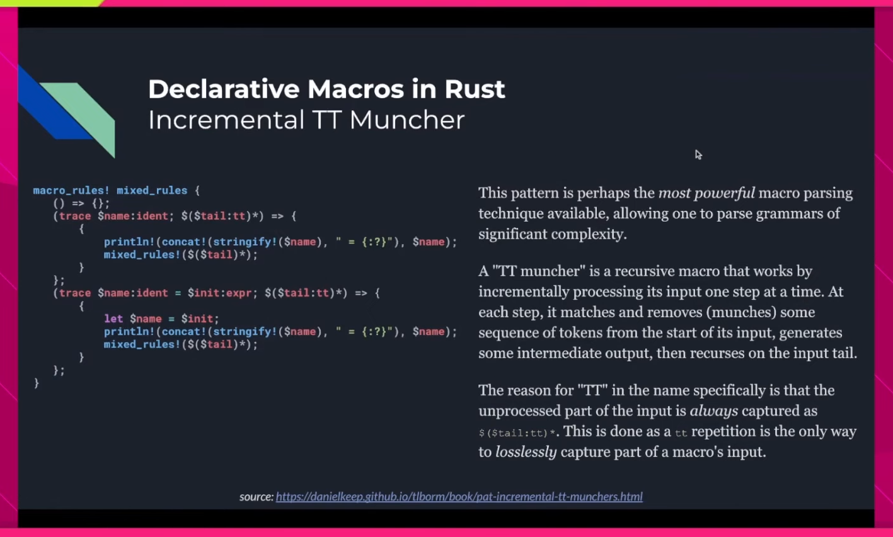

E.g.:

```rust
assert_eq!(my_function(), expected_result);
```

This macro is defined as follows:

```rust
macro_rules! assert_eq {
    ($left:expr, $right:expr $(,)?) => ({
        match (&$left, &$right) {
            (left_val, right_val) => {
                if !(*left_val == *right_val) {
                    panic!(
                        "assertion failed: `(left == right)`\n\
                         left: `{:?}`,\nright: `{:?}`",
                        left_val, right_val
                    )
                }
            }
        }
    });
}
```

Hard to write especially for people with non-functional programming background. But they are easy to read & understand.

---

Procedural macros are very powerful & has some limitations. They can export anything but proc macros. More on this below:

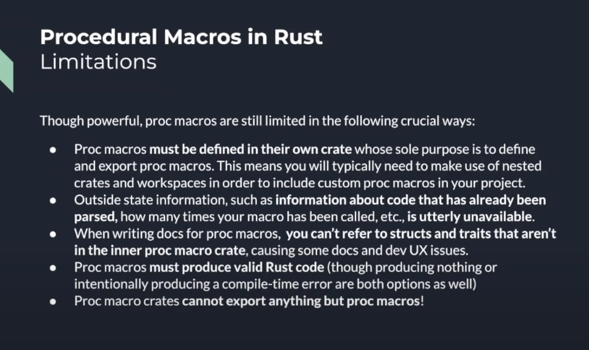

the front face of proc macros is `attribute proc macros`.

Here is an example:

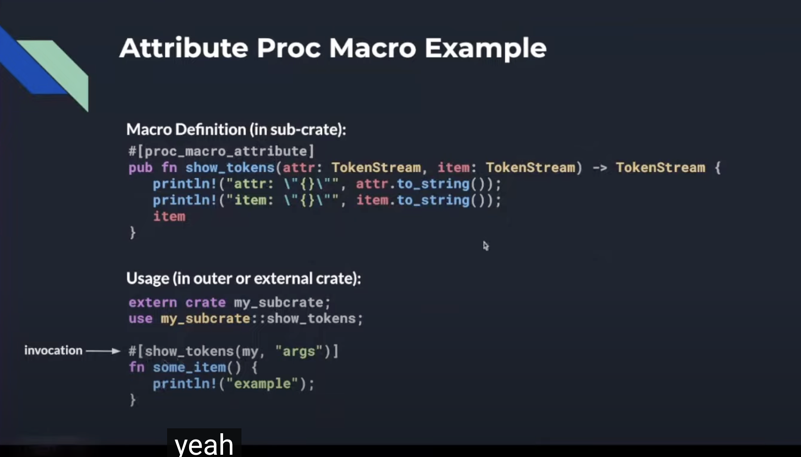

⬆️ In the above eg, the `show_tokens` function is a proc macro attribute which is defined inside a crate `my_subcrate`. And then in order to use it in another crate, we need to add the following line:

```rust
extern crate my_subcrate;   // declared subcrate
use my_subcrate::show_tokens; // used subcrate's function
```

Macros generally have 15 lines of code, but actually it abstracts around 300-3000 (small/large) lines of code. So, macros are that powerful.

The outer vs inner macros are explained in the image below:

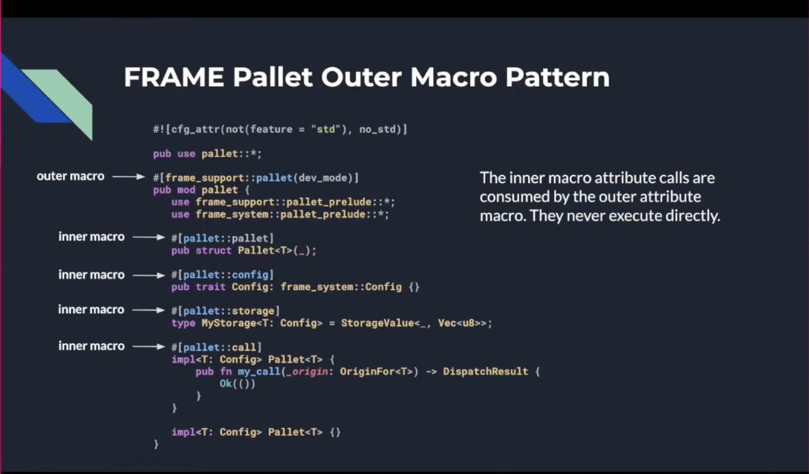

Without the outer macros, inner macros doesn't make any sense. Never use `dev_mode` in production mode. The compiler wouldn't show any error if you use `dev_mode`.

### Pallet

A FRAME pallet has these components:

- Storage
- Dispatchables
- Events
- Errors
- Config

On crates:

- More on [`frame_support::pallet`](https://paritytech.github.io/substrate/master/frame_support/attr.pallet.html#) on crates doc.
- [`#[frame_support::pallet::*]` attributes](https://paritytech.github.io/substrate/master/frame_support/attr.pallet.html#pallet-attributes)

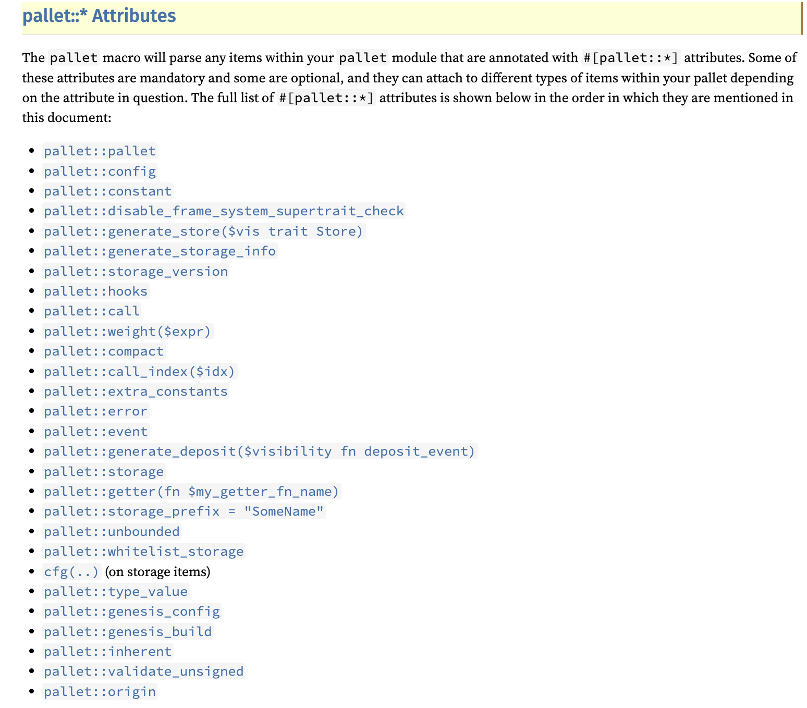

[Source](https://github.com/substrate-developer-hub/substrate-node-template#pallets)

**Start a chain with given/custom runtime**:

- If needs to create a substrate node, then go to `substrate::bin/node/runtime/` & use the codebase. All pallets are used.
- If needs to use a substrate node template, then go to `substrate::bin/node-template/runtime/` & use the codebase. Here, limited pallets are used. You can add more pallets here.
- If needs to create a chain with your own runtime, then just go to `runtime/src/lib.rs` & write your own code.

---

**pallets**: `sudo`, `system`

- `sudo` pallet gives the root permission. It's like `sudo` in Linux. It's more like a on-chain governance.
- `system` pallet is the most important pallet without which no other pallet would work. Infact, it's the core pallet.
- `origin` is the account which is sending the transaction i.e. the caller of the transaction. These are the possible origin values:
  - `None`: For unsigned transactions
  - `Signed`: For signed transactions
  - `Root`: For transactions which are sent by the root
    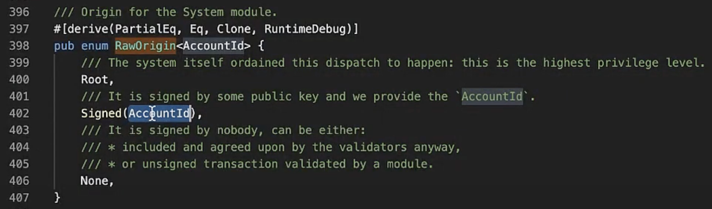

`get` who is making the call here:

```rs
let who = ensure_signed(origin)?;
```

---

**Recovery pallet**

This is mainly to recover your account based on validation given by a set of users (no. defined in the pallet).

### Others

In Substrate, one can create a blockchain which supports any length of account id. Like in Ethereum, it's 20 bytes. In Substrate, it can be any length. That's why we need to use `AccountId` instead of `Address`. And the `AccountId` type can be defined as:

```rs
type AccountId = [u8; 20];  // 20 bytes for Ethereum
type AccountId = [u8; 32];  // 32 bytes for a chain
```

In order to make things generic, we define `Config` like this for defining AccountId, Event, Blocksize, etc.:

```rs
// `frame_system` has already defined the `Config` trait
trait Config {
  type AccountId;
  type BlockNumber;
  // etc...
}
```

And therefore, we get to see `<T>`, `T::`. This is because we are using the `Config` trait.

---

**Gas** in Substrate is called **Weight** (max. value). It's a unit of measurement for the amount of computation required to execute a transaction. It's a measure of the time it takes to execute a transaction.

---

### Pallet module (mandatory)

[Source](https://crates.parity.io/frame_support/attr.pallet.html#)

> Here, mandatory indicates that this must be considered for a pallet.

Note that various types can be automatically imported using `frame_support::pallet_prelude` and `frame_system::pallet_prelude`:
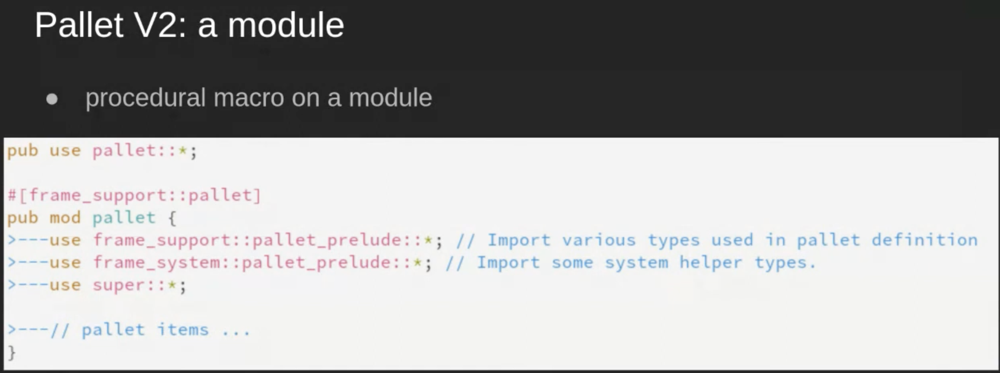

One needs to define a pallet with this initial boilerplate code. This is the entry point for the pallet items detailed below.

### Pallet config (mandatory)

[Source](https://crates.parity.io/frame_support/attr.pallet.html#config-trait-palletconfig-mandatory)

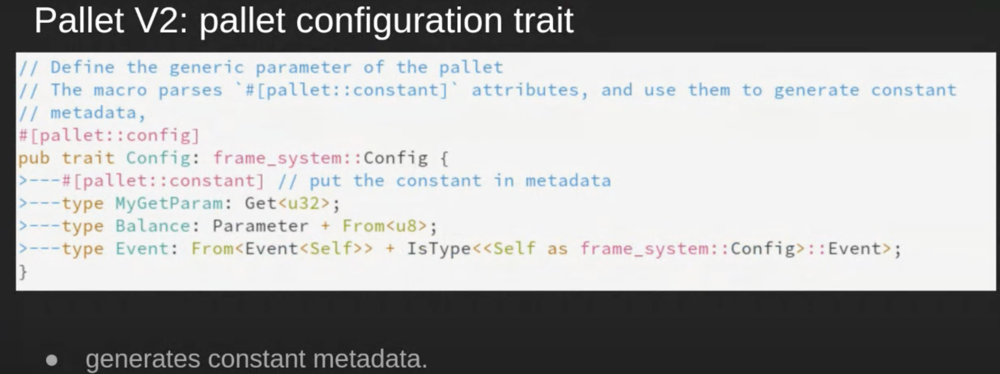

Here, the primary inheritance is from `Config` trait defined `frame_system` module inherently.

```rs
pub trait Config: frame_system::Config {
  #[pallet::constant] // This is used to define a constant
  type MyGetParam: Get<u32>;
  type Balance: Parameter + From<u8>;
  type MyEvent: From<Event<Self>> + Into<<Self as frame_system::Config>::Event>;
}
```

Within the `Config` trait, there are several associated types defined using the `type` keyword:

- `MyGetParam`: This is an associated type with the `Get` trait (bound), which returns a u32 value. An associated type defines a type that is associated with the trait.
- `Balance`: This is an associated type that implements the `Parameter` trait and can be converted from a u8 value. In Rust, a parameter is a type that can be passed into a generic function or struct.
- `MyEvent`: This is an associated type that implements both `From<Event<Self>>` and `Into<<Self as frame_system::Config>::Event>` traits. It is used to define events that this module emits. An event represents something interesting that happened in the system, which can then be subscribed to by other modules.

Finally, there is a Rust macro called `#[pallet::constant]` used to define a constant in a pallet, which is a collection of types and functions that can be reused across multiple modules.

### Pallet extra constants (optional)

[Source](https://crates.parity.io/frame_support/attr.pallet.html#pallet-struct-placeholder-palletpallet-mandatory)

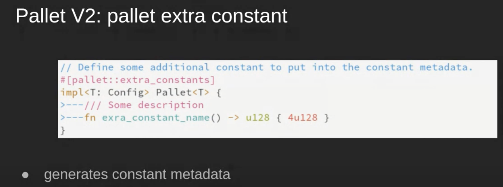

Refer the official doc [here](https://paritytech.github.io/substrate/master/frame_support/attr.pallet.html#extra-constants-palletextra_constants-optional).

### Pallet placeholder (mandatory)

The pallet struct placeholder `#[pallet::pallet]` is mandatory and allows you to specify pallet information.

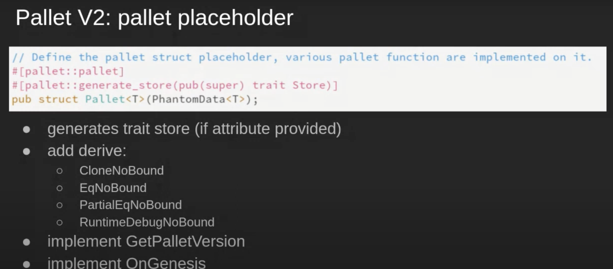

This was the initial version of v2. Now, in v3 it's changed to:

```rs
#[pallet::pallet]
pub struct Pallet<T>(_);
```

The abstracted meaning of the `PhantomData` (used in FRAME `v2`) is that it is a type that is used in generic code when the compiler needs to know that a type is used, but the code doesn't need to use the type itself. This is just to make the compiler happy. That's it!

Here, the `PhantomData` is a zero-date size type.

---

`#[pallet::pallet]` attribute macro expands to these:

- implement these traits:

```rs
#[derive(
	frame_support::CloneNoBound,
	frame_support::EqNoBound,
	frame_support::PartialEqNoBound,
	frame_support::RuntimeDebugNoBound,
)]
```

- replaces the type `_` with the type `PhantomData<T>`
- also implements [`GetStorageVersion` trait](https://paritytech.github.io/substrate/master/frame_support/dispatch/trait.GetStorageVersion.html)

```rs
pub trait GetStorageVersion {
    fn current_storage_version() -> StorageVersion;
    fn on_chain_storage_version() -> StorageVersion;
}
```

- also implements [`OnGenesis` trait](https://paritytech.github.io/substrate/master/frame_support/traits/trait.OnGenesis.html#method.on_genesis):

  ```rs
  pub trait OnGenesis {
    fn on_genesis() { ... }
  }
  ```

---

To generate a `Store` trait associating all storages, use the attribute `#[pallet::generate_store($vis trait Store)]`, e.g.:

```rs
#[pallet::pallet]
#[pallet::generate_store(pub(super) trait Store)]
pub struct Pallet<T>(_);
```

Here, `#[pallet::generate_store(pub(super) trait Store)]` is used to implement `Store` trait which has associated types for each storage.

E.g. if there is a pallet storage defined as `Foo`, then it can be accessed from the `Pallet` via `<Pallet as Store>::Foo`.

---

To access the full storage:

```rs
#[pallet::pallet]
#[pallet::set_storage_max_encoded_len]
pub struct Pallet<T>(_);
```

---

To inform the `current_storage_Version` to the macro, use the attribute `#[pallet::storage_version($version: expr)]`, e.g.:

```rs
const STORAGE_VERSION: StorageVersion = StorageVersion::new(5);

#[pallet::pallet]
#[pallet::storage_version(STORAGE_VERSION)]
pub struct Pallet<T>(_);
```

---

More on this topic [here](https://crates.parity.io/frame_support/attr.pallet.html#pallet-struct-placeholder-palletpallet-mandatory).

### Pallet hooks (optional)

[Source](https://crates.parity.io/frame_support/attr.pallet.html#hooks-pallethooks-optional)

It is mainly to define the runtime hooks associated with the pallet w.r.t different stages of the block execution.

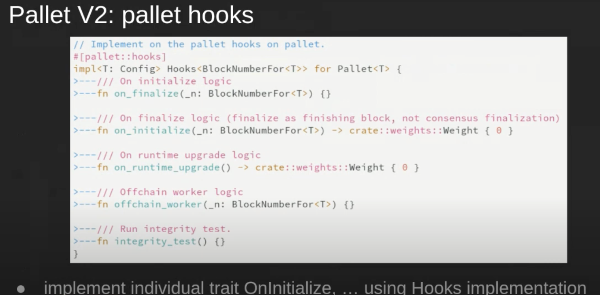

Normally, the hooks are defined as:

```rs
#[pallet::hooks]
impl<T: Config> Hooks<BlockNumberFor<T>> for Pallet<T> $optional_where_clause {
}
```

---

If no hooks are defined, then it defaults to this code:

```rs
#[pallet::hooks]
impl<T: Config> Hooks<BlockNumberFor<T>> for Pallet<T> {}
```

---

The macro implements the traits

- `OnInitialize`,
- `OnIdle`,
- `OnFinalize`,
- `OnRuntimeUpgrade`,
- `OffchainWorker`,
- `IntegrityTest`

using Hooks implementation.

### Pallet dispatchables (mandatory)

[Source](https://crates.parity.io/frame_support/attr.pallet.html#call-palletcall-optional)

```rs
#[pallet::call]
impl<T: Config> for Pallet<T> {
	/// $some_doc
	#[pallet::weight($ExpressionResultingInWeight)]
	pub fn $fn_name(
		origin: OriginFor<T>, // NOTE: mandatory
		$some_arg: $some_type,
		// or with compact attribute: #[pallet::compact] $some_arg: $some_type,
		...
	) -> DispatchResultWithPostInfo { // or `-> DispatchResult`
		...
	}
	...
}
```

Here, each function is a dispatchable function or dispatchable call or simply dispatchable.

The macro `#[pallet::macro]` implements:

- `Call` enum for each dispatchable
- The macro create an enum `Call` with one variant per dispatchable.

  This **enum** implements:

  - `Clone`
  - `Eq`
  - `PartialEq`
  - `Debug` (with stripped implementation in `not("std")`, otherwise it will not include the debug information if the std library is not available.)
  - `Encode`,
  - `Decode`
  - `GetDispatchInfo`
  - `GetCallName`
  - `UnfilteredDispatchable`

  The macro implement on `Pallet`, the `Callable` trait and a function call_functions which returns the dispatchable metadatas.

---

If no #[pallet::call] exists, then a default implementation is automatically generated:

```rs
#[pallet::call]
impl<T: Config> for Pallet<T> {}
```

### Pallet storage (mandatory)

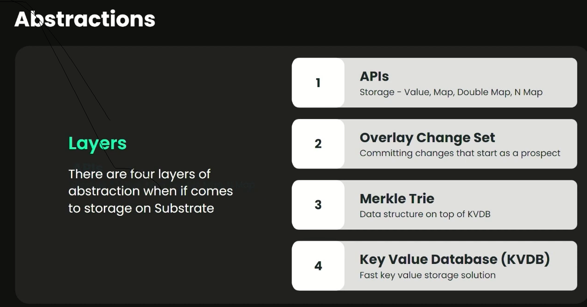

#### A. APIs

The following Storage APIs (data persistence) are available for storage on a substrate blockchain:

- `StorageValue`: Storing a single type in storage.

  - `#[pallet::storage]]`, `#[pallet::getter()]` macros are used for this.
  - can accept any type i.e. `u8`, `String`, etc.
  - `T` is the runtime.

  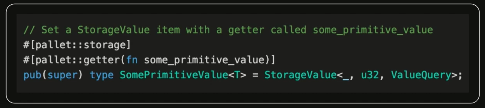

  - Manipulating `StorageValue`:

  ```rs
  // Put a value in storage
  CountForItems::<T>::put(10);

  // Get the value from storage
  CountForItems::<T>::get();

  // kill a value in storage
  CountForItems::<T>::kill();
  ```

- `StorageMap`: Storing a map from key to value in storage.

  - `#[pallet::storage]]`, `#[pallet::getter()]` macros are used for this.
  - can accept any type as key or val i.e. `u8`, `String`, etc.
  - Here, **[Blake2_128Concat](https://paritytech.github.io/substrate/master/frame_support/struct.Blake2_128Concat.html)** is used as the hashing algorithm. It's a hashing algorithm which is used to hash the key to get the storage key. It's a 128 bit hash.
  - `T::AccountId` is used as the key type.
  - `T` is the runtime.

  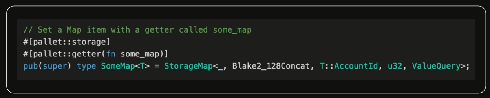

  - Manipulating `StorageMap`:

  ```rs
  // Check if a value exists in storage
  let is_false = Items::<T>::contains_key(user);

  // put a value in storage
  Items::<T>::insert(user, new_item);

  // Get the value from storage
  Items::<T>::get(user);

  // kill a value in storage
  Items::<T>::remove(user);
  ```

More complex storage types are also possible.

- `StorageDoubleMap`: Storing a map from 2 keys to single value in storage on a substrate chain.

  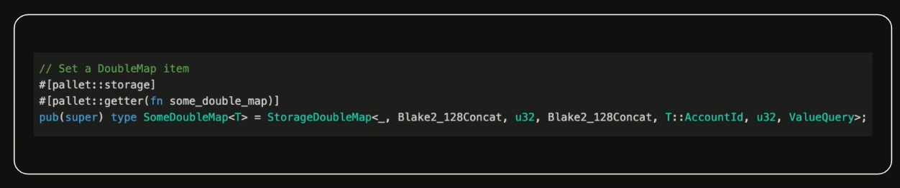

- `StorageCountMap`: Storing a map from n keys to single value in storage on a substrate chain.

  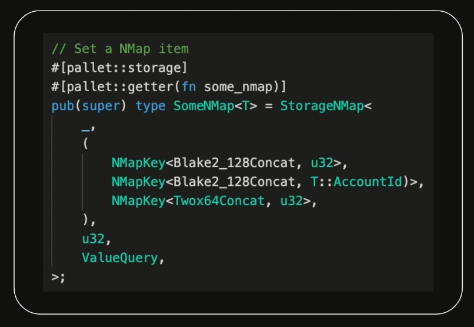

#### B. Overlay Change Set

#### C. Merkle Trie

#### D. KVDB

Key Value Database

## Substrate Chain Setup

Here are the steps to create different chains: **relay**, **parachain**, **parathread**, etc.

In order to create a `L0` network, we need to create a relay chain. And then, we can create a parachain on top of it. And then, we can create a parathread on top of it. There is a provision of switching b/w parachain & parathread based on their economic viability.

`substrate-node-template` binary requires 2 parts to run:

1. The genesis state information is stored in the `node/src/chain_spec.rs` file. This file is used to create the genesis block of the chain.

2. There is another part required for `substrate-node-template` binary to run i.e. `node/src/service.rs` file. This file is used to create the runtime of the chain.

---

**Runtime** is the core of the chain. It's the logic of the chain. It's the state transition function. It's the code which is executed when a transaction is sent to the chain. Different activity can be done using different pallets like block authoring, finalization, etc. And all the pallets are added in `pallets/` folder. It depends on 2 things:

1. Each pallet has to be configured using `impl $PALLET_NAME::Config for Runtime`. All are done in this file - `runtime/src/lib.rs`.
2. So, basically there are multiple pallets in a runtime (a blockchain). And each pallet has its own storage, logic, etc. And the runtime is the combination of all these pallets. And it's done using `construct_runtime!` macro.

[More](https://github.com/substrate-developer-hub/substrate-node-template#runtime)

### 1. Build a local blockchain

Basically, we are going to create a single node development chain. This is the simplest way to create a blockchain. We are going to use the `node-template` binary (generated after build process) to create a local blockchain & can view the blocks, transactions, etc. in both CLI & GUI (front-end-template or Polkadot.js explorer).

[Source](https://docs.substrate.io/tutorials/get-started/build-local-blockchain/)

The `node-template` command-line options specify how you want the running node to operate.

`--dev`:

- chain running in `development` mode & also erases all active data - keys, blockchain database, networking info when <kbd>ctrl+c</kbd> is pressed.
- ensures you have a fresh node every time you run it.

**1st time**:

```console
$ git clone https://github.com/substrate-developer-hub/substrate-node-template
$ cd substrate-node-template
$ git switch -c my-branch-v0.9.29
$ cargo build --release
$ ./target/release/node-template --dev
```

> check for the latest version [here](https://github.com/substrate-developer-hub/substrate-node-template/tags)

**next time onwards**:

```console
// go to the directory where you cloned the repo
$ gco main
$ git switch -c polkadot-v0.9.35
$ cargo build --release
$ ./target/release/node-template --dev
```

So, here the node is running & producing blocks & view on CLI:
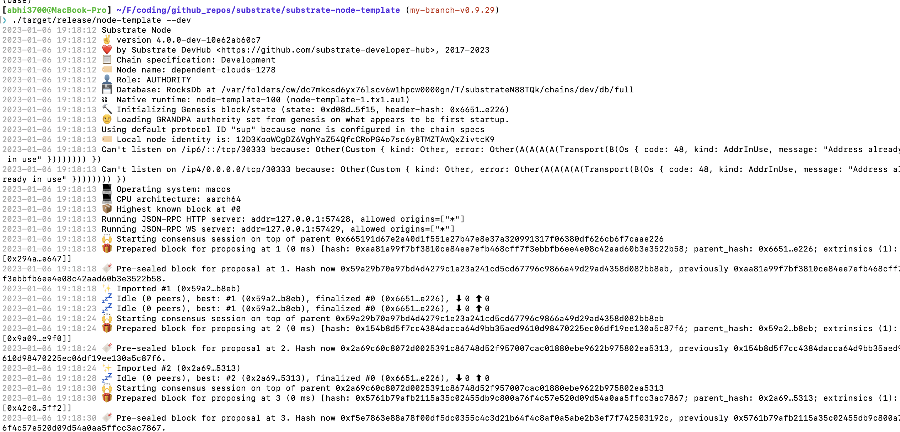

We can clear the DB using this:

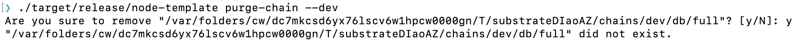

We can get more details as `DEBUG`:

```console
‚ùØ RUST_BACKTRACE=1 ./target/release/node-template -ldebug --dev
```

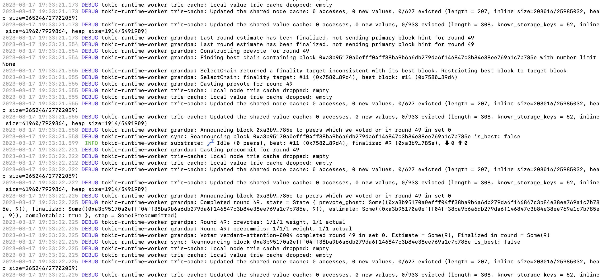

We can also pass a custom folder as DB for the node.

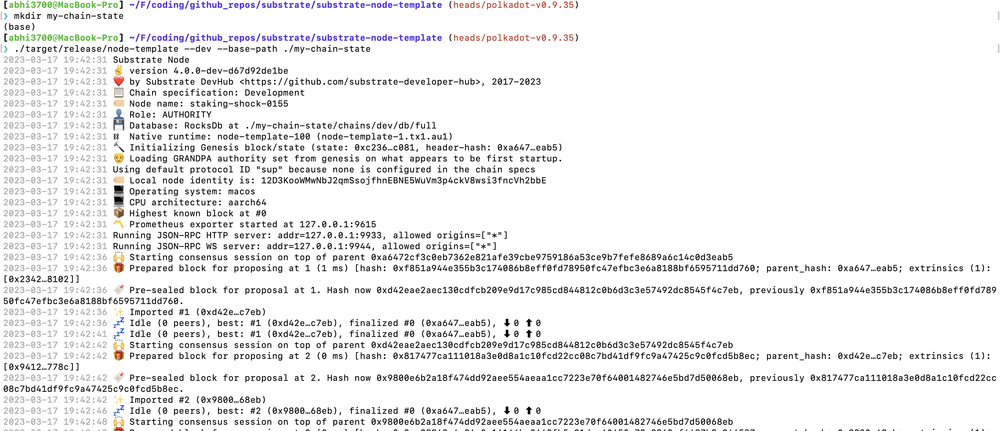

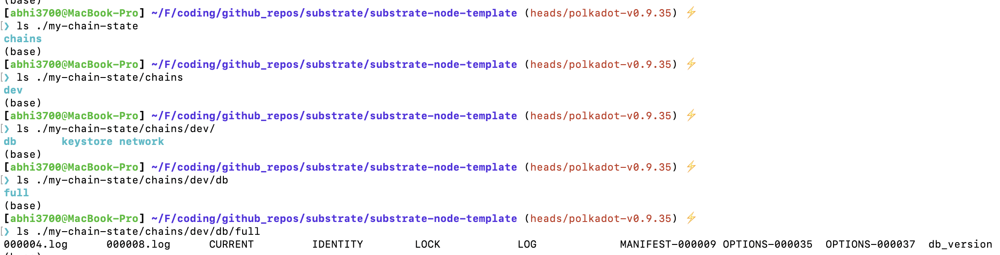

We can see the full log stored in a file (on VSCode):

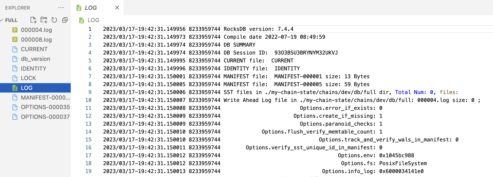

---

**View the blocks on GUI** via `front-end-template`:

**1st time**:

```console
$ git clone https://github.com/substrate-developer-hub/substrate-front-end-template
$ cd substrate-front-end-template
$ gco latest
$ yarn install  // `v1.22.1` was not able to download semantic-ui dependency, so chose npm instead
$ npm i
$ npm run start or yarn start
```

**next time onwards**:

```console
$ gco main
$ git pull origin main
$ gco latest
$ npm i
$ npm run start
```

It opens [this](http://localhost:8000/substrate-front-end-template)

- Here, we can see the blocks being produced & confirmed.
- User's details like `address`, `balance` (in MegaUnits), etc. can also be seen.

One can also see the blocks via [PolkadotJS](https://polkadot.js.org/apps/#/explorer) explorer.

---

**Transfer funds**

Using the `front-end-template`, we can transfer funds from one account to another like `45 Units` (45,000,000,000,000) from `Alice` to `Dave`:
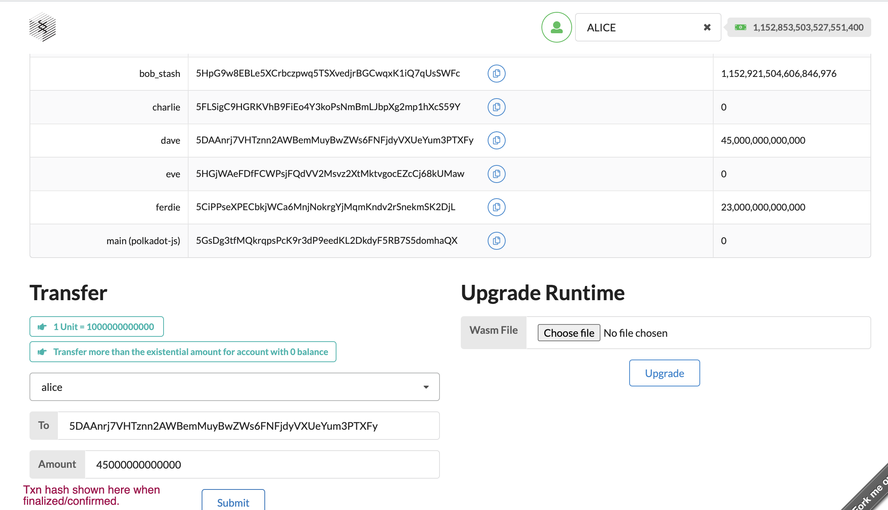

Using the `PolkadotJS` explorer, we can transfer funds from one account to another like `23 Units` (23,000,000,000,000) from `Alice` to `Ferdie`:

> Accounts >> Transfer

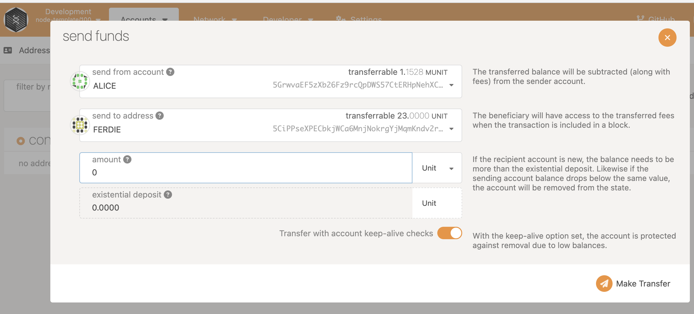

---

Events fired by the `node-template`:

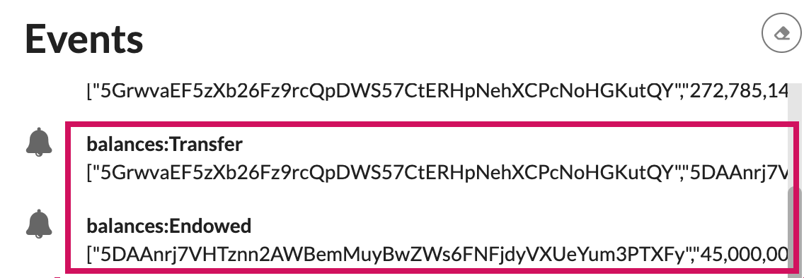

---

View the recent events in the "Chain info" tab:
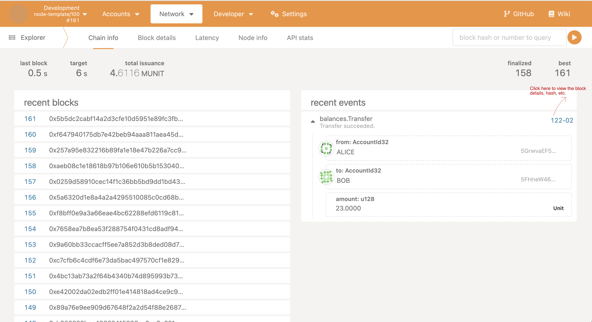

---

View the transaction hash details:

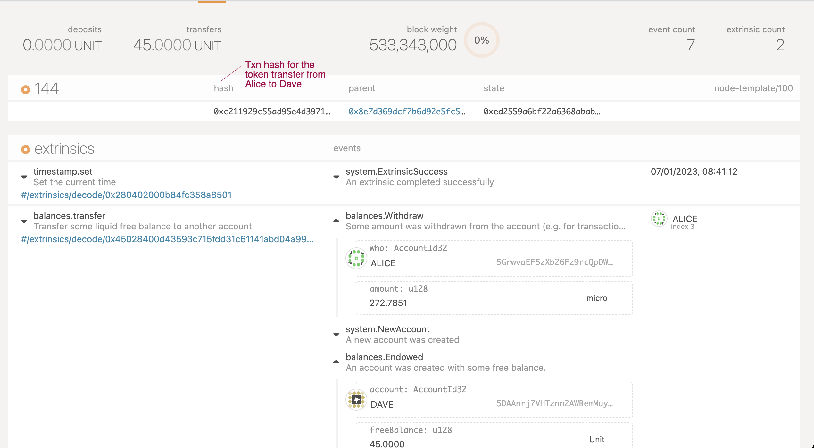

---

**Shutdown the local blockchain**

Press <kbd>ctrl+c</kbd> to shutdown the node on the `node-template` terminal.

### 2. Simulate a network

[Source](https://docs.substrate.io/tutorials/get-started/simulate-network/)

We can start a private blockchain network with an **authority set** of private **validators** like `Alice`, `Bob`, `Charlie`, etc. Basically, we are going to create a **multi node local testnet** as multiple validators are involved.

> In this simulated network, the two nodes are started using different accounts and keys but run on a single computer. In a real network, each node would run on a separate computer.

---

First clear the data from the node `alice`:

```sh
$ ./target/release/node-template purge-chain --base-path /tmp/alice --chain local
```

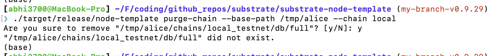

Run the `alice` node:

```sh
$ ./target/release/node-template \
--base-path /tmp/alice \
--chain local \
--alice \
--port 30333 \
--ws-port 9945 \
--rpc-port 9933 \
--node-key 0000000000000000000000000000000000000000000000000000000000000001 \
--telemetry-url "wss://telemetry.polkadot.io/submit/ 0" \
--validator
```

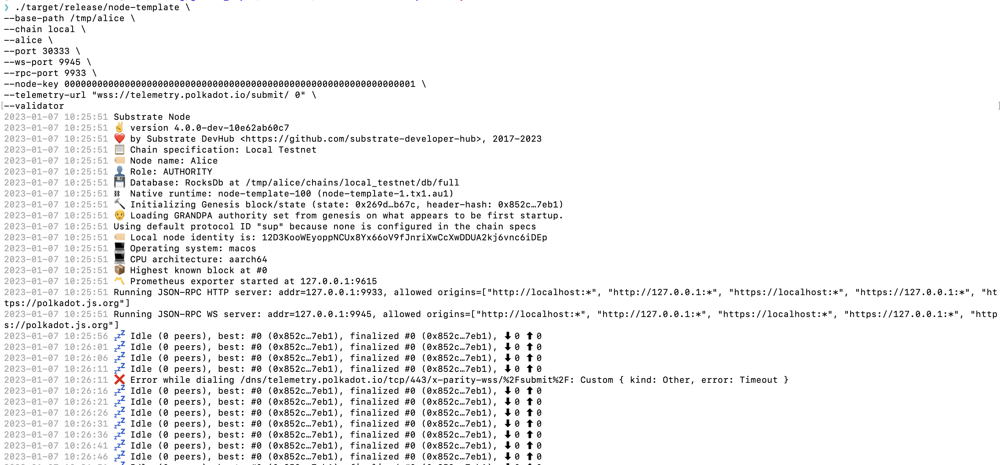

<u>Observations</u>:

- üè∑ Local first node identity is: `12D3KooWEyoppNCUx8Yx66oV9fJnriXwCcXwDDUA2kj6vnc6iDEp`
- Database (type: RocksDb developed by Facebook) is maintained at `/tmp/alice/chains/local_testnet/db/full`
- The node is running on `30333` p2p port.
- The node is running on `9945` JSON-RPC websocket server port.
- The node is running on `9933` JSON-RPC http server port.
- `2023-01-07 10:26:16 💤 Idle (0 peers), best: #0 (0x852c…7eb1), finalized #0 (0x852c…7eb1), ⬇ 0 ⬆ 0` indicates that there are no other nodes in the network and that no blocks are being produced. Another node must join the network before blocks can start to be produced.
- To know more about the commands, refer this [link](https://docs.substrate.io/tutorials/get-started/simulate-network/) section "Review the command-line options".

You can view the block explorer [here](https://polkadot.js.org/apps/?rpc=ws%3A%2F%2F127.0.0.1%3A9946#/explorer)

> Just need to edit the ws rpc port to `9945` in the URL like this: `ws://127.0.0.1:9945`. And then you will be able to view the block explorer.

---

First clear the data from the node `bob`:

```sh
$ ./target/release/node-template purge-chain --base-path /tmp/bob --chain local -y
```


Run the `bob` node:

```sh
./target/release/node-template \
--base-path /tmp/bob \
--chain local \
--bob \
--port 30334 \
--ws-port 9946 \
--rpc-port 9934 \
--telemetry-url "wss://telemetry.polkadot.io/submit/ 0" \
--validator \
--bootnodes /ip4/127.0.0.1/tcp/30333/p2p/12D3KooWEyoppNCUx8Yx66oV9fJnriXwCcXwDDUA2kj6vnc6iDEp
```

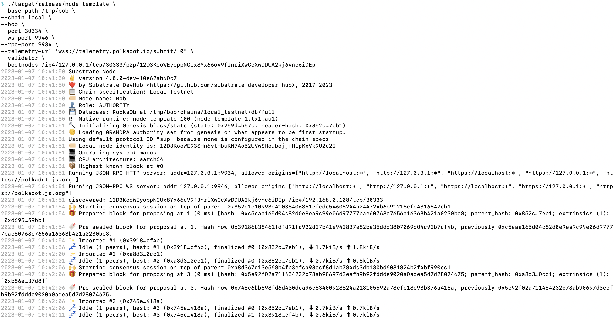

<u>Observations</u>:

- üè∑ Local second node identity is: `12D3KooWE93SHn6vtHbuKN7Ao52UVwSHoubojjfHipKxVk9U2e2J`
- Database (type: RocksDb developed by Facebook) is maintained at `/tmp/bob/chains/local_testnet/db/full`
- The node is running on `30334` p2p port.
- The node is running on `9946` JSON-RPC websocket server port.
- The node is running on `9934` JSON-RPC http server port.

You can view the block explorer [here](https://polkadot.js.org/apps/?rpc=ws%3A%2F%2F127.0.0.1%3A9946#/explorer)

> Just need to edit the ws rpc port to alice or bob's ws rpc port in the URL like this: `ws://127.0.0.1:9945` or bob's ws-port. And then you will be able to view the block explorer.

---

Run the `charlie` node:

```sh
./target/release/node-template \
--base-path /tmp/charlie \
--chain local \
--charlie \
--port 30335 \
--ws-port 9947 \
--rpc-port 9937 \
--telemetry-url "wss://telemetry.polkadot.io/submit/ 0" \
--validator \
--bootnodes /ip4/127.0.0.1/tcp/30333/p2p/12D3KooWEyoppNCUx8Yx66oV9fJnriXwCcXwDDUA2kj6vnc6iDEp
```

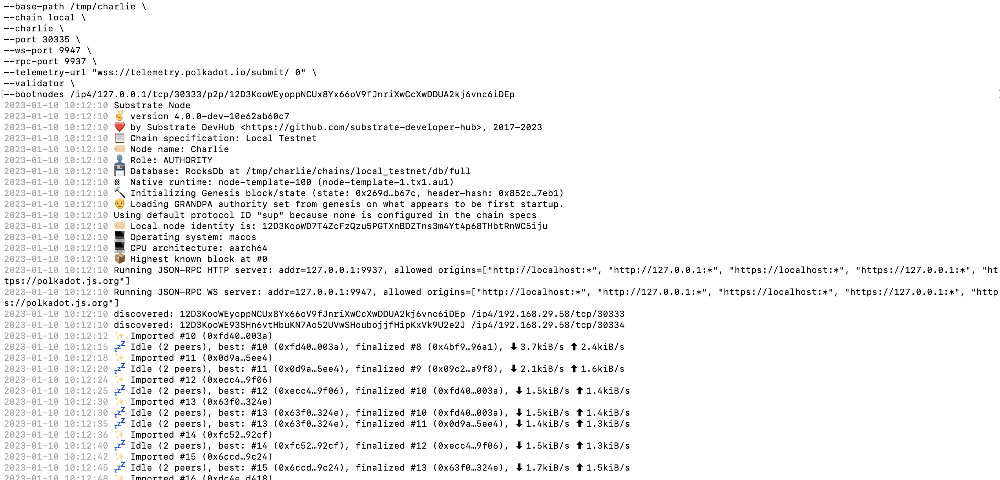

---

**Close one of the validator nodes out of many (> 1)**

Now, if you close the `alice` node, then the `bob` node will stop producing blocks. It shows like this on the `bob` terminal:

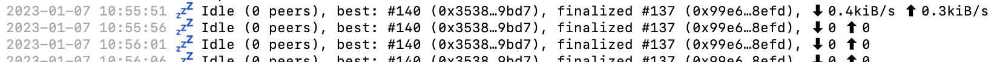

And on `alice` terminal:


<u>Observations</u>:

- üè∑ Local third node identity is: `12D3KooWD7T4ZcFzQzu5PGTXnBDZTns3m4Yt4p68THbtRnWC5iju`
- Connected via discovering the p2p nodes:

  ```sh
  2023-01-10 10:12:10 discovered: 12D3KooWEyoppNCUx8Yx66oV9fJnriXwCcXwDDUA2kj6vnc6iDEp /ip4/192.168.29.58/tcp/30333
  2023-01-10 10:12:10 discovered: 12D3KooWE93SHn6vtHbuKN7Ao52UVwSHoubojjfHipKxVk9U2e2J /ip4/192.168.29.58/tcp/30334
  ```

- Database (type: RocksDb developed by Facebook) is maintained at `/tmp/charlie/chains/local_testnet/db/full`
- The node is running on `30335` p2p port.
- The node is running on `9947` JSON-RPC websocket server port.
- The node is running on `9937` JSON-RPC http server port.

You can view the block explorer [here](https://polkadot.js.org/apps/?rpc=ws%3A%2F%2F127.0.0.1%3A9946#/explorer)

> Just need to edit the ws rpc port to alice or bob's ws rpc port in the URL like this: `ws://127.0.0.1:9945` or bob's ws-port. And then you will be able to view the block explorer.

---

If one (`charlie` say) of the 3 nodes is closed, then the other 2 nodes will continue to produce blocks. It shows like this on the `bob` terminal:


---

Resume the `alice` node:

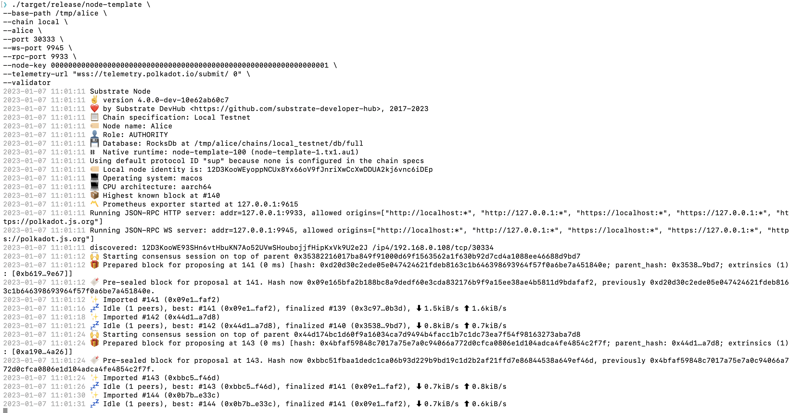

> `discovered: 12D3KooWE93SHn6vtHbuKN7Ao52UVwSHoubojjfHipKxVk9U2e2J /ip4/192.168.0.108/tcp/30334` indicates that the `alice` node has discovered the `bob` node.

and this shows on the `bob` terminal:

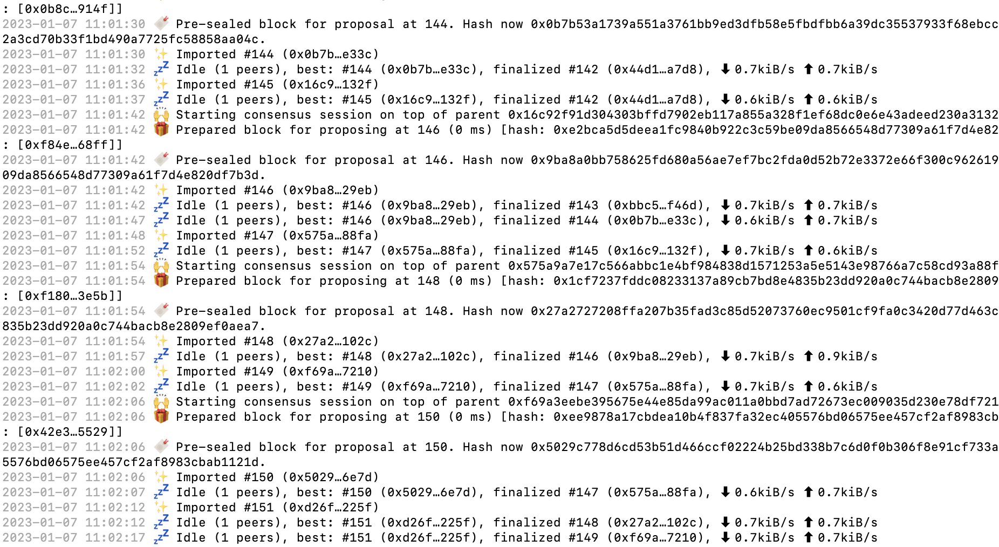

## Tutorials

Try out the following tutorials:

- [kitties-tutorial](https://learn.figment.io/tutorials/substrate-kitties-setup), [doc in PDF](tuts/Figment%20Learn%20_%20Substrate%20Kitties%20-%20Basic%20Setup.pdf)

## Repositories

- [zhubaiyuan/awesome-substrate](https://github.com/zhubaiyuan/awesome-substrate)

## References

- Rust Crates doc:
  - [paritytech.github.io](https://paritytech.github.io/) [OLD]
  - [crates.parity.io/](https://crates.parity.io/) [Latest]

> Both have almost the same content except for some changes in some of the cases.

- [Documentation | By Parity](https://docs.substrate.io/main-docs/)
  - [Fundamentals](https://docs.substrate.io/fundamentals/)
    - [Transaction & Block Basics](https://docs.substrate.io/fundamentals/transaction-types/)
    - [Runtime Development](https://docs.substrate.io/fundamentals/runtime-development/)
    - [Accounts, Addresses and Keys](https://docs.substrate.io/fundamentals/accounts-addresses-keys/)
    - [Polkadot JS Client](https://docs.substrate.io/fundamentals/light-clients-in-substrate-connect/)
    - [Rust for Substrate](https://docs.substrate.io/fundamentals/rust-basics/)
  - [Tutorials](https://docs.substrate.io/tutorials/)
    - [Build a local blockchain](https://docs.substrate.io/tutorials/get-started/build-local-blockchain/) ‚úÖ
    - [Simulate a network](https://docs.substrate.io/tutorials/get-started/simulate-network/) ‚úÖ
    - [SC](https://docs.substrate.io/tutorials/smart-contracts/)
      - [Build a Token SC](https://docs.substrate.io/tutorials/smart-contracts/build-a-token-contract/)
  - [Reference](https://docs.substrate.io/reference/)
    - [FRAME macros](https://docs.substrate.io/reference/frame-macros/)
    - [How-to quick reference guides](https://docs.substrate.io/reference/how-to-guides/)
    - [Cryptography](https://docs.substrate.io/reference/cryptography/)
- [Substrate StackExchange](https://substrate.stackexchange.com/)
- [Substrate Recipes](https://github.com/JoshOrndorff/recipes)
  - for opening the book, run `mdbook serve` in the root directory of the repo.
  - [video](https://www.youtube.com/watch?v=KVJIWxZSNHQ)
- [Substrate Rust doc](https://paritytech.github.io/substrate/)
- [Rustlings like game for Substrate](https://github.com/rusty-crewmates/substrate-tutorials) [Funded by Web3 Foundation]

### Videos

- [Substrate: A Rustic Vision for Polkadot by Gavin Wood at Web3 Summit 2018](https://www.youtube.com/watch?v=0IoUZdDi5Is)
- [Chainlink | Intro to Substrate](https://www.youtube.com/watch?v=o5ANk0sRxEY) ‚úÖ
- [Sub0 Online: Storage on a Substrate chain](https://www.youtube.com/watch?v=ek8SzCCk59o)
- [Sub0.1: Storage on Substrate - Shawn Tabrizi, Developer experience at Parity](https://www.youtube.com/watch?v=kKKOL20FdII)
- [Demystifying FRAME Macro Magic | Substrate Seminar (full livestream)](https://www.youtube.com/watch?v=aEWbZxNCH0A) 🧑🏻‍💻
- [A substrate developer journey (after 1 week of joining)](https://youtu.be/vAOQczmVcLU) ‚úÖ
- [Deep dive into FRAME V2 pallet macros | Substrate Seminar 2021](https://www.youtube.com/watch?v=5pLHzKMCEtg&list=PLp0_ueXY_enU7jbm_A-3BrXiMbHPR0he0&index=3) 🧑🏻‍💻
- [Substrate Recipes Workshop - Learn to Build a Custom Blockchain](https://www.youtube.com/watch?v=KVJIWxZSNHQ) 🧑🏻‍💻
  > Although this is a 2020 workshop, it is still very relevant and useful. It is a good starting point for learning Substrate from v1.
  > It uses FRAME v1. The corresponding recipes book is here: [substrate-recipes](https://substrate.dev/recipes/)
- [Polkadot Deep Dives 2023](https://youtube.com/playlist?list=PLOyWqupZ-WGsfnlpkk0KWX3uS4yg6ZztG)
