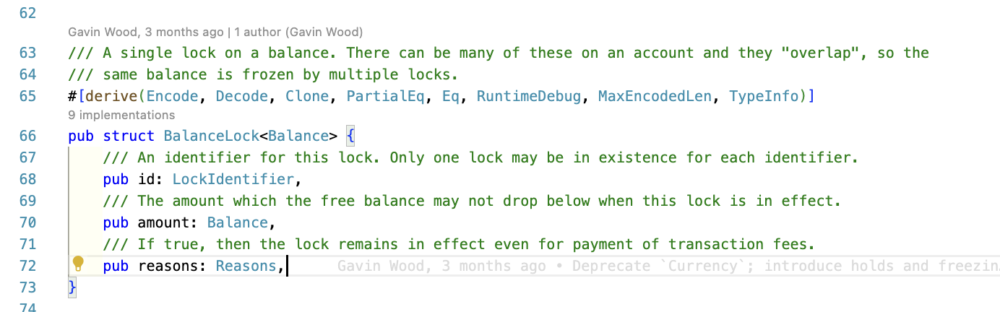

# Balances Pallet

## Overview

- The balances pallet is designed to be used as the blockchain's underlying currency (where the different traits are implemented). It is extremely optimized for balance movements and transfers, which ensures that the fees that users pay to actually move balances are very low.
- In terms of struct, there is a `AccountInfo` (defined in `frame_system` pallet), `AccountData` (defined in `balances` pallet). The `AccountInfo` is the struct that holds the `AccountData` and other information about the account. The `AccountData` is the struct that holds the balance of the account.

## Notes

### Theory

- Main purposes
  

- **TotalIssuance** vs **Imbalance**
  

  - **TotalIssuance**: This refers to the total number of tokens that have been issued in the blockchain network. It's a dynamic value that _**changes as new tokens are minted (which increases total issuance) or burned (which decreases total issuance)**_. In other words, it's a measure of all tokens currently in existence in the network, including those that might be locked or reserved.

  - **TotalSupply**: This is often used interchangeably with TotalIssuance in many blockchain contexts. It's a measure of the total amount of tokens of all accounts. It changes when tokens moved to/from Imbalance (postive/negative).

  - **Imbalance**: In the Substrate framework, an "Imbalance" represents an unhandled difference in the token balance that's created when tokens are minted or burned. It's a kind of temporary state that's used internally to help manage changes in account balances and ensure that all token operations are safe and consistent. There are two types of imbalances: `PositiveImbalance<T>` (which represents an increase in the total supply of tokens) and `NegativeImbalance<T>` (which represents a decrease in the total supply of tokens). These imbalances are created when tokens are minted or burned, respectively, and they're automatically handled and "balanced out" by the system.

  > Remember that `<T>` in `PositiveImbalance<T>` and `NegativeImbalance<T>` is a placeholder for the specific type of token being managed.

  Here, the Imbalance gets changed when there is any burn or mint operation. For example, if Alice burns 200 units, then the Imbalance will be `NegativeImbalance<T>` of 200 units. Now, this imbalance needs to be balanced out. So, the system will reduce the total supply by 200 units. So, the total supply will be reduced from `1000` to `800` units.

  

  At 2nd level, there is a reduction in the total supply because, the Alice's balance is slashed by 200 units. So, the total supply is reduced by 200 units => from `1000` to `800` units.

  Now, what to do with the Imbalance now? It needs to be balanced out. So, the system will either:

  - transfer to treasury & then use it to incentivize validators/community based on their activity.
  - burn

  > **Observations** in the above example 🔝,
  >
  > - When Alice's balance is reduced by 200 units. Total supply is reduced by 200 units. And the 200 units is moved to Imbalance, hence no change in TotalIssuance.
  >
  > - When the Imbalance was balanced out,
  >   - the 200 units was transferred to treasury. Hence, the TotalIssuance remains unchanged. But the TotalSupply is increased by 200 units as Treasury is an account.
  >   - the 200 units was burned. Hence, the TotalIssuance is reduced by 200 units.

- `Currency` trait & its methods and acts as dependency for other traits.
  
- How `Currency` trait acts as dependency for other traits:
  

---

- **ExistentialDeposit**:
  
- `AccountData`: The Balances pallet revolves around this struct where there are different fields corresponding to which the `free`, `reserved`, etc. balances are maintained.
  

As per the current struct of `AccountData`, this is how the balances are maintained:


The `AccountData` struct in the Substrate `Balances` pallet represents the account balance information. Here's what each field represents:

1. `free`: This is the balance that the account holder has access to and can use freely. This balance is relevant for most operations involving tokens, such as transfers, staking, and paying transaction fees.

2. `reserved`: This balance represents funds that have been locked or reserved for a specific purpose and cannot be used freely by the account holder. Reserved balance could be locked due to reasons like ongoing transactions, staking requirements, or governance votes. It's important to note that the sum of this balance includes all individual holds along with any sums still under the deprecated reserves API.

3. `frozen`: This balance represents a minimum limit that the sum of `free + reserved` cannot fall below. The idea behind the `frozen` balance is to ensure a minimum balance that safeguards against actions where the account owner cannot benefit from a reduction in balance, like slashing (punitive reductions in balance for misbehavior in the network).

4. `flags`: This field holds additional information about the account. The Most Significant Bit (MSB) was used as a flag to indicate if the new reference-counting logic has been implemented for this account. The details of the `ExtraFlags` struct and its use might need to be looked up in the Substrate documentation or codebase for the most current and detailed understanding.

- Existential Deposit (Cont...):
  

---




**Reservable** vs **Lockable**:


1. Here, in the above example 🔝, the `reserved_balance` keeps getting added whereas the `locked_balance` ensures the parsed value as min_lock balance. So, when `10` is locked, it gets locked, but then `5` is locked, then no update in locked_balance as it is already `10`. But, when `15` is locked, then the locked_balance gets updated to `15`. But, if the same case applied for reserved_balance, then the reserved_balance would have been `30` instead of `15` as all gets added.

   > So, lock_balance is the **max.** of all the locked balances whereas the reserve_balance is the **sum** of all the locked balances.

2. `locks` are typically used for **time-based** operations, while `reserves` are used for operations that require a **deposit**.
3. **One common feature**: Both reserved & locked tokens are not `free` to use. They need to be either unreseved or unlocked to be used.

4. **Use case for understanding the difference between `Reservable` & `Lockable`**:

   > At one point I was confused between `Reservable` & `Lockable`. But, then the following example helped me understand the difference between the two more vividly.

   In case of multiple locks, it is best to create ids for different purposes although we have the option of going for both partial and multiple locks. For instance, I was thinking 🤔 like this:

   <details>
   <summary><b> Click 🖱️ for details:</b></summary>

   **Q**. In lockable, if I have 10 tokens locked & I only want 5 tokens unlocked for my pallet, then I should not be unlocking that, because that 10 tokens might be a pre-requisite for another pallet. So, shouldn't I use the `Reservable` trait in this case?

   **A**. In Substrate, `LockableCurrency` supports partial and multiple locks. This means you can lock 10 tokens in one context (like staking in one pallet), and lock 5 tokens in another context (like in your custom pallet), and they won't conflict. Each lock is identified by a lock identifier. If the same identifier is used in different places, then one lock could potentially overwrite another. But if different identifiers are used, multiple locks can coexist on the same account.

   When you want to unlock tokens, you specify the lock identifier. This ensures you only unlock the tokens that are locked in that specific context.

   Here's an example:

   ```rust
   let id1 = b"lock1";
   let id2 = b"lock2";

   // Lock 10 tokens under `id1`
   T::Currency::set_lock(*id1, who, amount1, WithdrawReasons::all());

   // Lock 5 tokens under `id2`
   T::Currency::set_lock(*id2, who, amount2, WithdrawReasons::all());

   // Now you can unlock the 5 tokens locked under `id2` without affecting the 10 tokens locked under `id1`
   T::Currency::remove_lock(*id2, who);
   ```

   So in your case, it seems like using `LockableCurrency` could still work fine. But of course, it depends on the specifics of your application, and `ReservableCurrency` could be a better fit in some scenarios.

   </details>

5. Another thought 🤔:
   <details>
   <summary><b> Click 🖱️ for details:</b></summary>
    
   **Q**. In substrate, in case of reserved tokens is there any need of id generation like what happens in locked tokens?

   **A**. No, in Substrate's `ReservableCurrency` trait, there's no concept of identifiers like in the `LockableCurrency` trait. When you reserve tokens, they are simply deducted from the free balance and added to the reserved balance for that account. You can't have multiple separate reserves on a single account, and you don't need to provide an ID when reserving or unreserving tokens.

   The functions for reserving and unreserving look like this:

   ```rust
   /// Reserve some funds in an account to be used for a later return or slash.
   fn reserve(who: &Self::AccountId, value: Self::Balance) -> DispatchResult;

   /// Unreserve some funds in an account.
   fn unreserve(who: &Self::AccountId, value: Self::Balance) -> Self::Balance;
   ```

   As you can see, they simply take the account and the amount of tokens to reserve or unreserve.

   This simplifies the interface and makes it easier to use, but it also means you lose the ability to have separate reserves that can be individually controlled. If you need this functionality, you might need to implement your own custom logic or use locks instead.
   </details>

6. **Applications**: "In terms of application, we should prefer getting our work done with `Lockable` trait as it keeps more free tokens available for the user. Hence, the user can use the free tokens for other purpose without the pallet requiring the free tokens in case of reserved_tokens".
   In general, this is correct, but still it depends on the specifics of your use case.

   The `LockableCurrency` trait in Substrate is indeed more flexible in that it allows multiple locks on an account's balance, each identified with a unique ID and potentially for different reasons. A user can still use their tokens that are locked for one purpose for another purpose, provided the second purpose doesn't conflict with the reasons for the lock. For example, if tokens are locked for staking, they can still be used for voting if the voting mechanism supports the use of locked tokens.

   On the other hand, the `ReservableCurrency` trait subtracts from an account's `free` balance, so reserved tokens can't be used for other purposes until they're unreserved.

   In general, if a user needs to put some tokens aside as collateral (in DeFi) or a deposit for a specific function and shouldn't use them for anything else, `ReservableCurrency` is the way to go. If a user needs to "lock" their tokens to indicate they're being used for a certain purpose but they could potentially still be used for other non-conflicting purposes, `LockableCurrency` is the better choice.

   Ultimately, the choice between using `LockableCurrency` and `ReservableCurrency` depends on the specifics of your use case and the design of your blockchain.

---

**Coupling**:


⬇️ the `Balances` pallet is dependent on the `frame_system` pallet for the `StoredMap` trait (as declared in `frame_support`) implementation.


The `Balances` pallet is dependent on these 5 traits. And these 5 traits can also be used in any other pallets as well.


`Currency` trait is used in these pallets:


`ReservableCurrency` trait is used in these pallets:


`LockableCurrency` trait is used in these pallets:


Use cases of `ReservableCurrency` vs `LockableCurrency` trait:


Here 🔝, `pallet_staking` can have multiple scenarios, where it can use `ReservableCurrency` or `LockableCurrency` trait. For example, imagine there is a need of **fixed deposit** in a bank, then we do need to use `ReservableCurrency` to ensure that there is going to be accrued interest for each amount deposited in separate vaults.


Here 🔝, we have to define types (in a pallet A) with a trait that is defined in another pallet B.

like this:

```rust
type BalanceOf<T> = <<T as Config>::Currency as Currency<<T as frame_system::Config>::AccountId>>::Balance;
```

### Coding

- 2 ways to store balance of account:
  - Inside `System` pallet's `AccountData`, precisely inside frame_system's `AccountInfo`. This is nice because the balance is then stored on the Frame System level. But, this is not recommended, but rather the `AccountData` is moved over to the `Balances` pallet.
  - Inside `Balances` pallet under pallet_balances's `Account` storage which is a map from `AccountId` to `AccountData`.
- Abstraction layers of the pallet in form of traits, useful for loose pallet coupling with pallets (your pallet which might require the currency methods). And these abstractions combined with storing the balance on the Frame System level, enables balances to be really "useful" at the runtime level. For example, we **lock** balances for democracy and staking, allowing the same balance to be used twice across two services. On the other hand, we use **reserved** balances for a lot of things like storage deposits making sure that this kind of balance CANNOT be used twice. The traits used by the Balances pallet are:

  - [Currency trait](https://crates.parity.io/frame_support/traits/tokens/currency/trait.Currency.html)
    - has additionally `issue`, `burn` major methods in addition to `Balances` pallet.
  - [ReservableCurrency trait](https://crates.parity.io/frame_support/traits/tokens/currency/trait.ReservableCurrency.html)
  - [NamedReservableCurrency trait](https://crates.parity.io/frame_support/traits/tokens/currency/trait.NamedReservableCurrency.html)
  - [LockableCurrency trait](https://crates.parity.io/frame_support/traits/tokens/currency/trait.LockableCurrency.html)
  - [Imbalance trait](https://crates.parity.io/frame_support/traits/tokens/imbalance/trait.Imbalance.html)

  > It is recommended to use these traits as loose coupling whenever any methods or storage is to be used. I have implemented the same in `vault` pallet in my [`substrate-playground`](https://github.com/abhi3700/substrate-playground).

- `Balance` is the amount of blockchain (relaychain) currency, the type of which is set inside the runtime `runtime/src/lib.rs` file.
- [Dispatchables](https://github.com/abhi3700/substrate-playground)
  - `transfer`
  - `set_balance`
  - `force_transfer`
  - `transfer_keep_alive`
  - `transfer_all`
- This pallet depends on struct [`GenesisConfig`](https://crates.parity.io/pallet_balances/pallet/struct.GenesisConfig.html) defined inside it, to initialize the balances of the treasury accounts like `Alice`, `Alice_stash`, `Bob`, `Bob_stash`, etc. i.e., it can be used to configure the genesis state of this pallet.


- `Balances` vs `Asset` pallet

  - It's relaychain native currency whereas the later is for custom tokens (like ERC20) on
  - It's a single token, whereas the later is multi-token in a single pallet (asset). Hence, the later is kind of like a ERC20 factory.
  - So in essence, you can create your underlying native currency using the balances pallet and if you need additional currencies you can leverage the assets pallet.

- "Imbalance" represents a difference in the token balance (positive or negative) that is yet to be handled or "balanced".

  - Imbalances are used to manage and keep track of changes in the balance of an account as a result of operations like transfers, rewards, and fees. They're part of Substrate's way of abstracting token handling and ensuring safety. Imbalances are created whenever tokens are minted (creating a positive imbalance) or burned/destroyed (creating a negative imbalance).

  - These imbalances must be dealt with and balanced out, usually by the system. For example, when tokens are transferred from one account to another, a negative imbalance is created in the sender's account and a positive imbalance in the receiver's account. The system ensures that these imbalances cancel each other out so that the total supply of tokens remains constant.

  - There are two primary types of imbalances:

    - `PositiveImbalance<T>`: This type of imbalance represents an increase in the total supply of tokens. It's created when tokens are minted or introduced into the system.

    - `NegativeImbalance<T>`: This type of imbalance represents a decrease in the total supply of tokens. It's created when tokens are burned or removed from the system.

  - The `<T>` in `PositiveImbalance<T>` and `NegativeImbalance<T>` is a placeholder for the specific type of token being managed.

  - Imbalances are automatically handled by the Substrate framework. When you're writing a pallet that involves token operations, you usually don't need to deal with imbalances directly, but you do need to be aware of them and understand how they work.

In `frame_system` pallet:

- The `AccountData` type is defined in `frame_system` pallet's Config. It is used to store the data associated with an account (other than nonce/transaction counter, which `frame_system` pallet does regardless):

  ```rust
  /// Data to be associated with an account (other than nonce/transaction counter, which this
  /// pallet does regardless).
  type AccountData: Member + FullCodec + Clone + Default + TypeInfo + MaxEncodedLen;
  ```

- The `AccountInfo` struct is defined in `frame_system` pallet. It includes `nonce` and `consumers` fields along with `data` (of type `AccountData`):
  
- And then, we map the individual `AccountId` with the `AccountInfo` struct here in `frame_system` pallet:
  

---

In `Balances` pallet:

- Now, the `AccountStore` associated type of Balances' `Config` trait is defined in `runtime/src/lib.rs` file where we are implementing the `Config` trait of `Balances` for `Runtime` (T in `Pallet<T>` is `Runtime` here):
  
- 🔝 the `AccountData` struct is defined as:
  
- `ExistentialDeposit` is defined in the runtime configuration of `Balances` pallet:
  
- There are multiple structs defined in `balances/src/types.rs` file:
  
- And the usage of these structs have been done for different types of balances storage - locks, reserves, etc in `balances/src/lib.rs` file:
  
- `ReserveIdentifier` is defined in `balances/src/lib.rs` file:
  

  Here, 🔝 we are considering 8 characters (each character of 1 byte in **UTF-8** ) of identifier like `b"staking"` or `b"vesting"`. These come under `NamedReservableCurrency` trait.

---

#### **`AccountInfo` vs `AccountData`**:

<details><summary><b>View details:</b></summary>

In the Substrate codebase, `AccountInfo` and `AccountData` are data structures related to accounts but serve different purposes:

1. `AccountInfo`: This is a structure defined in the frame_system pallet, and it holds information about a specific account. It consists of the following fields:

   - `nonce`: The number of transactions the account has sent.
   - `consumers`: A reference counter indicating the number of other modules that currently depend on this account's existence. The account cannot be removed until this is zero.
   - `providers`: A reference counter indicating the number of other modules that allow this account to exist. The account cannot be removed until this and `sufficients` are both zero.
   - `sufficients`: A reference counter indicating the number of modules that allow this account to exist for their own purposes only. The account cannot be removed until this and `providers` are both zero.
   - `data`: The `AccountData` structure that can be configured to hold different kinds of data.

2. `AccountData`: The `AccountData` type is used within the `AccountInfo` struct and can be configured to hold different kinds of data. In the context of the Balances pallet, the `AccountData` struct is used to hold account balance information. This could be configured to use storage native to its own instance, as long as it satisfies the `AccountStore` type it's configuration expects. The Balances pallet is typically set to use the `System` pallet because `AccountData` from the Balances pallet is most commonly used alongside other data the System pallet keeps track of, such as `nonce`, `consumers`, `providers`, and `sufficients`【16†source】.

The reference counters (`consumers`, `providers`, `sufficients`) in `AccountInfo` help manage account dependencies and life cycles in the runtime. For example, `consumers` is incremented when data is stored under an account's control and decremented when such data is removed. `providers` indicates if an account is ready to be depended upon, and `sufficients` indicates if an account can exist by itself, for example, when it holds a sufficient number of certain assets but without owning any native account balance. These counters can be manipulated using methods exposed by the `frame-system`. [source](https://github.com/substrate-developer-hub/substrate-docs/blob/main/content/md/en/docs/reference/account-data-structures.md)

</details>

## References

- [Balances Pallet | Polkadot Deep Dives](https://www.youtube.com/watch?v=_FwqB4FwWXk) ✅
- [Balances pallet in `crates.parity.io`](https://crates.parity.io/pallet_balances/index.html)
- [substrate stackexchange](https://substrate.stackexchange.com/a/712/2795)
