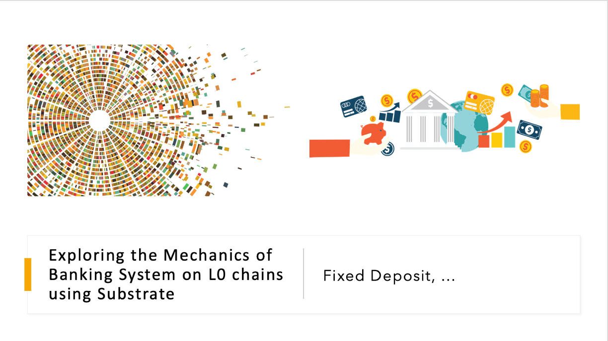

# Bank Pallet



**TRA**ditional fi**N**ancial system using **SU**bstrate **B**lockchain framework (**TRANSUB**).

## Overview

## [Code](https://github.com/abhi3700/substrate-playground/pallets/bank)

## Concepts

In this formula, Investment Score (IS) = MA (`maturity_amount`), I want to enable a `difficulty_factor` in order to scale IS value to be within a specific range (say 0 to 1000). Also, want to have an effect starting with more rapid IS value increase & then saturates (move slowly) when getting closer to 1000.

Please give me suggestion on this.

=>

To achieve this, you can introduce a difficulty factor and use a logarithmic function to create a scoring system that starts with a rapid increase and then slows down as it approaches the maximum score.

**Let's define**:

**Difficulty Factor (DF)**: MA constant that you can adjust to control the rate of increase of the investment score. MA higher difficulty factor will make the score increase more slowly.

Now, you can modify the investment score formula like this:

`Investment Score (IS) = 1000 * log10(1 + (MA/DF))`

where,

- MA is the maturity amount and
- DF is the difficulty factor.

This formula uses the logarithm base 10 function (log10) to create a score that increases rapidly for smaller MA values and slows down as MA increases. The "+1" inside the log function ensures that the argument is always greater than zero, as the log of zero is undefined.

The difficulty factor DF is used to scale the maturity amount MA. By adjusting DF, you can control how quickly the investment score increases. MA smaller DF will make the score increase more rapidly, while a larger DF will make it increase more slowly.

The "1000 \*" outside the log function scales the score to be within the range of 0 to 1000.

Please note that the logarithmic function used here will never actually reach 1000, but it will get very close as MA increases. If you want the maximum score to be exactly 1000, you could normalize the scores by dividing by the maximum observed score and then multiplying by 1000.

> Remember to adjust the DF based on your specific needs and the range of maturity amounts you expect in your system.

In a consensus-critical context like Substrate, it's important to avoid using floating-point arithmetic including logarithms. And instead use Power functions. So, you can use a power function instead of a logarithmic function to achieve a similar result. For example, you could use the following formula:

`IS = 1000 * (1 - (1 / (1 + MA / DF)))`

This formula will produce a curve that starts at 0 and asymptotically approaches 1000 as the maturity_amount increases.

> The DF controls how quickly the investment score approaches the maximum value.

Here's how you might implement this formula in Substrate:

```rust
use sp_arithmetic::traits::{CheckedAdd, CheckedDiv, CheckedMul, CheckedSub};
use sp_runtime::FixedU128;

fn calculate_investment_score(maturity_amount: FixedU128, difficulty_factor: FixedU128) -> Option<FixedU128> {
    let one = FixedU128::from(1);
    let thousand = FixedU128::from(1000);

    // Calculate the ratio of maturity_amount to difficulty_factor
    maturity_amount.checked_div(&difficulty_factor)
        // Add 1 to the ratio
        .and_then(|ratio| ratio.checked_add(&one))
        // Calculate the reciprocal of the incremented ratio
        .and_then(|incremented_ratio| one.checked_div(&incremented_ratio))
        // Subtract the reciprocal from 1
        .and_then(|reciprocal| one.checked_sub(&reciprocal))
        // Multiply the result by 1000
        .and_then(|subtracted| subtracted.checked_mul(&thousand))
}
```

In this version of the function, each operation is performed in a separate and_then call. If any operation returns None (indicating an overflow), the remaining operations will be skipped and the function will return None.

This code uses the `CheckedAdd`, `CheckedDiv`, `CheckedMul`, and `CheckedSub` traits from the `sp-arithmetic` crate to perform the arithmetic operations with overflow checking. The `FixedU128` type from the `sp-runtime` crate is used to represent the fractional numbers.

Please note that this is a simplified example and you might need to adjust it to fit your specific use case. Also, keep in mind that the behavior of this formula might not exactly match the behavior of your original formula. You should test it thoroughly to ensure that it meets your requirements.

---

Now, browse through the possible options to incorporate difficulty factor in financial system considering the Fixed Deposit use case.

=>

Based on the information gathered, here are some potential ways to incorporate a difficulty factor into the investment score for a Fixed Deposit (FD) system:

1. **Macroeconomic Conditions**: The difficulty factor could be influenced by the overall macroeconomic conditions. For instance, during periods of economic instability or recession, the difficulty factor could be increased to reflect the higher risk associated with investments. This could be measured using indicators such as GDP growth rate, inflation rate, or unemployment rate.

2. **State of the Financial System**: The health of the financial system could also influence the difficulty factor. If the banking system is sound and stable, the difficulty factor could be lower. However, if there are systemic issues or instability in the banking system, the difficulty factor could be higher. This could be assessed using indicators such as the number of bank failures, the level of non-performing loans, or the stability of the banking sector.

3. **Regulatory Environment**: The regulatory environment could also impact the difficulty factor. If the regulatory environment is stringent and provides strong protections for investors, the difficulty factor could be lower. However, if the regulatory environment is lax or provides weak protections for investors, the difficulty factor could be higher. This could be measured using indicators such as the strength of investor protection laws, the effectiveness of financial regulators, or the level of regulatory compliance in the banking sector.

4. **Market-based vs State-directed Financial Intermediation**: The nature of financial intermediation in a country could also influence the difficulty factor. In market-based systems, where resource distribution and credit decisions are made by the market, the difficulty factor could be lower. However, in state-directed systems, where these decisions are made by the state, the difficulty factor could be higher. This could be assessed using indicators such as the level of state intervention in the financial sector, the degree of market liberalization, or the extent of financial market development.

Incorporating these factors into the investment score could help to ensure that the score accurately reflects the risk and difficulty associated with investing in a FD in different economic and financial conditions. The exact formula for incorporating these factors would need to be determined based on the specific goals and requirements of your investment system.

---

`IS = a * IS_FD + b * IS_RD + c * IS_ID + d * IS_ED`

where:

- a, b, c, d = weights for each investment type. would be decided by the admin/root.
- IS_FD = Investment Score for Fixed Deposits
- IS_RD = Investment Score for Recurring Deposits
- IS_ID = Investment Score for Insurance Deposits
- IS_ED = Investment Score for Equity Deposits

---

**Recurring Deposit (RD)**

- Recurring Deposits (RDs) are typically designed for monthly deposits. The idea behind an RD is to encourage regular savings on a monthly basis. However, the exact terms and conditions can vary from one financial institution to another.
- While most banks and financial institutions offer RDs with a monthly deposit frequency, some may offer more flexibility with quarterly or even annual deposits. It's less common, but it's possible depending on the specific policies of the financial institution.
- If you're interested in making quarterly or annual deposits, it would be best to check with the specific bank or financial institution to see if they offer such options. Alternatively, you might want to consider other types of investment products that better suit your preferred deposit frequency.
- Like FDs, Recurring Deposits (RDs) also offer compounded interest. However, the way interest is calculated for RDs is slightly different from Fixed Deposits (FDs).
- In a Recurring Deposit, you make regular monthly deposits for a fixed tenure. The interest is compounded quarterly, but it's important to note that each monthly deposit is considered as a separate deposit for the purpose of interest calculation.
- For example, if you start an RD in January and make monthly deposits, the deposit made in January will earn interest for all the quarters till maturity, the deposit made in February will earn interest from February till maturity, and so on. The last deposit you make (say in December, if it's a one-year RD) will earn interest only for that particular month.
- So, while the interest on RDs is compounded, each deposit earns interest for a different length of time depending on when it was deposited during the tenure of the RD.
- Yes, there is a mathematical formula to calculate the maturity amount for a Recurring Deposit (RD). The formula takes into account the fact that every installment of an RD is effectively a separate deposit, each earning interest for a different length of time.

The formula for the maturity amount of an RD is:

```
  A = P \* [ (1 + r/n)^(nt) - 1 ] / (1 - (1 + r/n)^(t/n))
  where:
  A is the maturity amount.
  P is the monthly installment.
  r is the annual interest rate (in decimal form).
  n is the number of times that interest is compounded per year.
  t is the number of years the money is deposited for.
```

This formula calculates the sum of the compound interest for each installment. The interest is compounded quarterly for RDs, so n would be 4. The term t is in years, so if the RD is for 6 months, t would be 0.5.

> Please note that this formula assumes that the interest rate remains constant over the entire period of the RD, which may not always be the case in real-world scenarios.
