# Democracy Pallet

## Overview

- Like a DAO pallet.
- Proposals are taken one by one into referendum based on the no. of `seconds` on a proposal.
- This is done on a per-block basis. So, if it's time i.e. 28 days passed for the current referendum, then the next referendum is taken into account. And the earlier referendum is sent to enactment period if voted 'Yes', else 'No'.
- During the enactment period, it depends on the Council members to review & then if it's good, then it's approved & hence implemented based on the pallet's call.
- In this way, the whole system is handled on-chain, unlike the offchain method done in the past.
- Procedure:
  - A user makes a public proposal by depositing some tokens.
  - Other users can "second" the proposal by also depositing tokens. The more seconds a proposal has, the sooner it will be reviewed.
  - Each launch period (a set number of blocks), the proposal with the most tokens behind it (from both the initial deposit and the seconds) is chosen to be put to a vote.
  - The proposal becomes a referendum, and all users can vote on it. And the deposited tokens are returned here.
  - Depending on the vote, the proposal is either sent to Council or rejected.
  - If it is sent to Council members, they have a chance to review it and either approve it or reject it.
  - If approved, then immediately it's scheduled (using `Scheduler` pallet) for enactment in the next block.

## Notes

### Theory

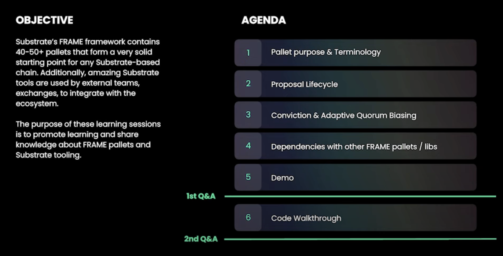

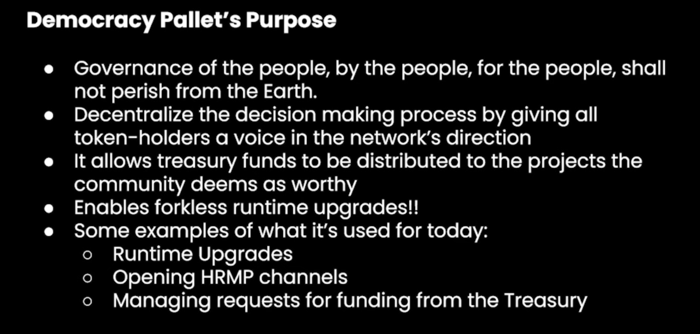

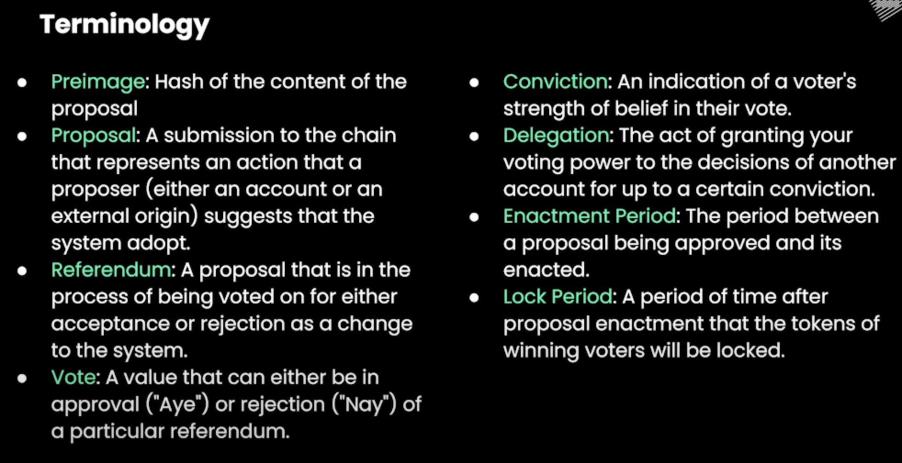

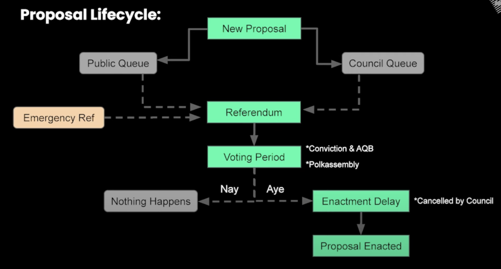

As soon as the Enactment delay ends, the proposal is sent to the "Scheduler Pallet" deploy the code to the runtime.

On Kusama, the voting period is 8 days & on Polkadot, it is 28 days.

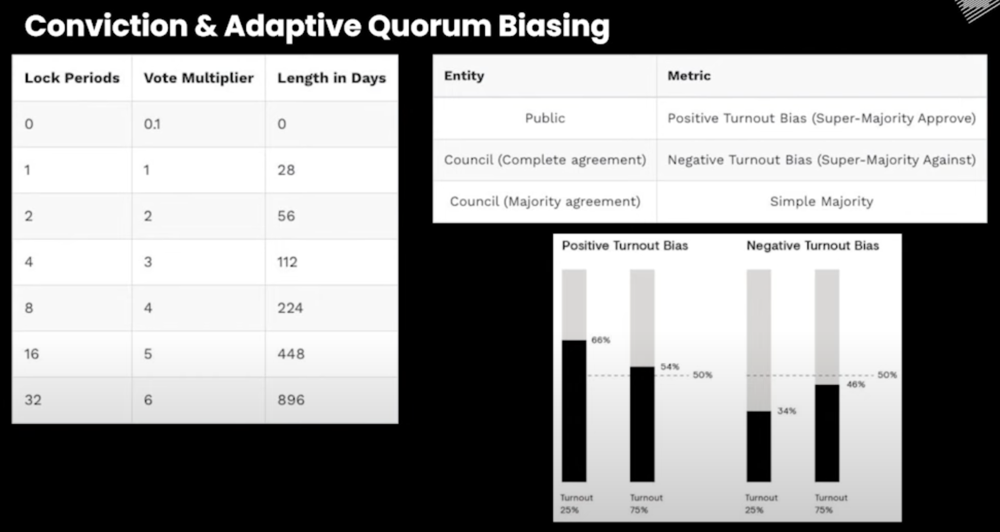

Here, if someone locks token for 28 days, they will get 1 as vote multiplier. If they lock for 56 days, they will get 2 as vote multiplier. This is called conviction voting. We can also delegate voting power to someone else. Still the vote multiplier is applicable.

**Conviction Voting**: This is a mechanism that allows a token holder to lock their tokens for an extended period of time to gain a multiplier to the strength of their vote. The longer they are willing to lock their tokens, the stronger their vote is going to be. This also applies when delegating votes to another person. [Video](https://www.youtube.com/watch?v=CgcUWK2E9Jo&list=PLOyWqupZ-WGsfnlpkk0KWX3uS4yg6ZztG&index=26&t=671s)

**Adaptive Quorum Biasing**: This is a mechanism used to combat low voter turnout in on-chain governance. It helps to pass proposals when there's low turnout but a high degree of certainty that the proposal is needed. In positive turnout bias, if 25% of the total token holders participate, 66% agreement is needed for a proposal to pass. In negative turnout bias, only one-third agreement is needed. However, as participation moves towards 100%, it becomes closer to a simple majority. [Video](https://www.youtube.com/watch?v=CgcUWK2E9Jo&list=PLOyWqupZ-WGsfnlpkk0KWX3uS4yg6ZztG&index=26&t=671s)

Here, collective means a group of people i.e. council. The council can be elected by the token holders. The council can also be a fixed set of people. The council can also be a single person. The council can also be a single person who is the owner of the chain.
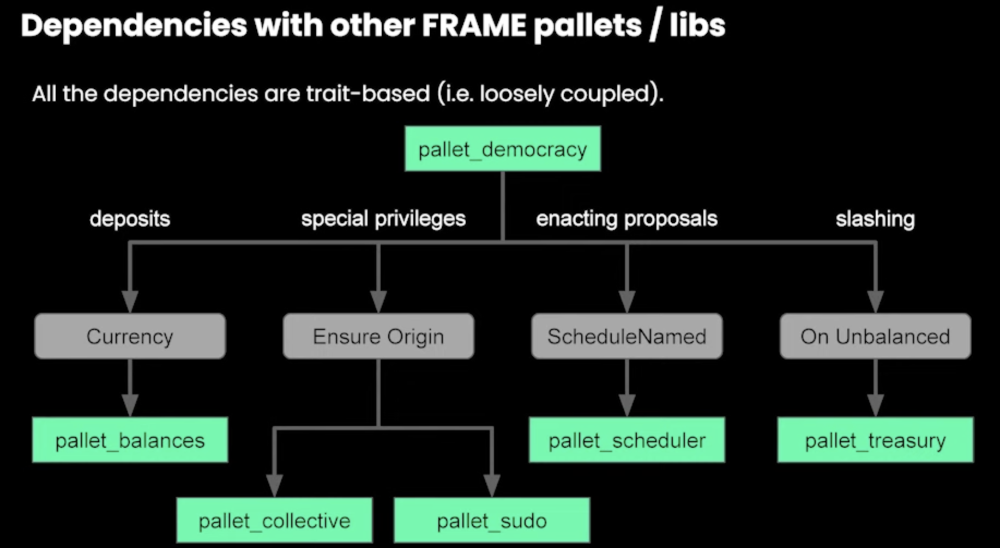

- **Preimage pallet**: when any proposal is created, then its preimage hash is created & stored in this pallet. When the proposal is voted, then the preimage is checked to verify the proposal.
- **Collective pallet**: for handling multiple types of Origin (caller) for different functionality related to proposal (blacklist, cancel, etc.)
- **Scheduler pallet**: to schedule the enactment of the proposal (after Council's approval).
- **Balances pallet**:
  - to reserve (deposit), unreserve (return) the tokens. These tokens are important for the proposal to be taken to Referendum stage based on the no. of seconds (each second has to deposit >= proposer's deposit amount).
  - For voting on the referendum, the `Locked tokens` are considered. So, based on the locking period, we get the vote multiplier. No transfer of tokens into pallet. `LockableCurrency` is considered to determine the vote multiplier.
- **Sudo pallet**: for special previleges related to Access Control.
- **Treasury pallet**: when slashing done in case of `blacklist` proposal if malicious proposal is created.

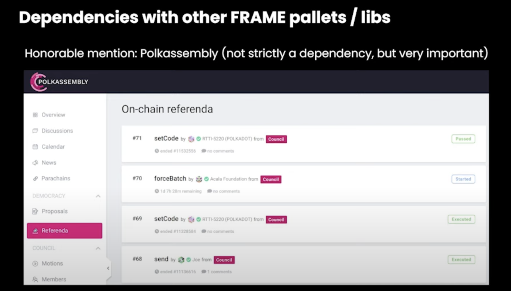
Visit the [Polkaassembly](https://polkadot.polkassembly.io/) platform to view the proposals & discussions around it & voters & enactment.

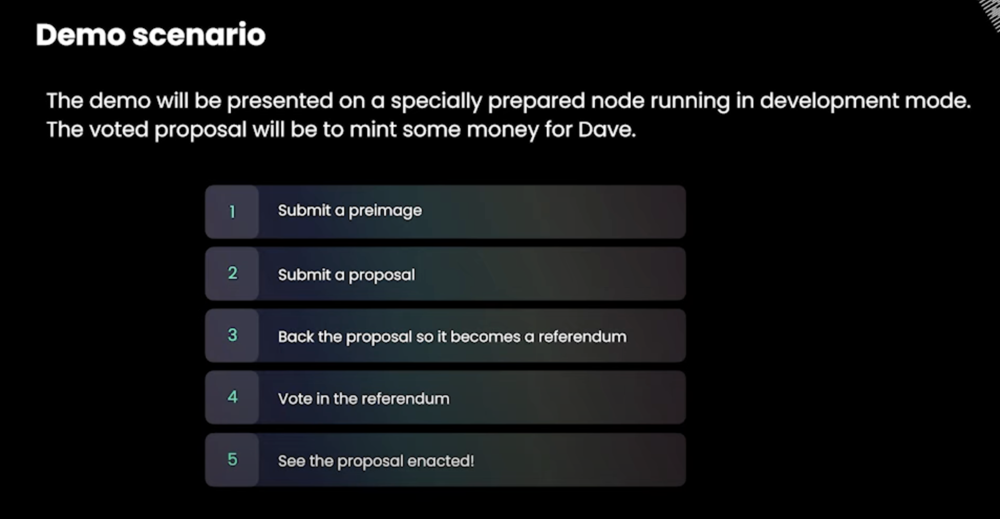

[Differences between Stash Account & Controller Account on Polkadot and Kusama](https://www.holdpolkadot.com/post/stash-account-controller-account-on-polkadot-and-kusama)

#### Demo

Watch from [here](https://www.youtube.com/watch?v=CgcUWK2E9Jo&list=PLOyWqupZ-WGsfnlpkk0KWX3uS4yg6ZztG&index=26&t=1216s)

1. Create a preimage hash for the proposal. E.g. "Create a balance of 1 Unit for Dave"...Use `Balances` pallet, `set_balance` function to transfer 1 Unit to Dave. Then, use `hash` function to create a preimage hash. E.g. "0x0a0b0c0d0e0f" (autogenerated in PolkadotJS UI App).
2. Create a proposal with the preimage hash. The proposal is shown with details of token transfer.
3. Endorse your proposal (some amount is locked for the lifetime of the proposal).
4. Now, wait for the votes to be casted. The votes are shown in the UI during the voting period.
5. If there is no Council, then after passing a default enactment period, it automatically gets enacted. Here, for scheduling, `Scheduler` pallet is used.

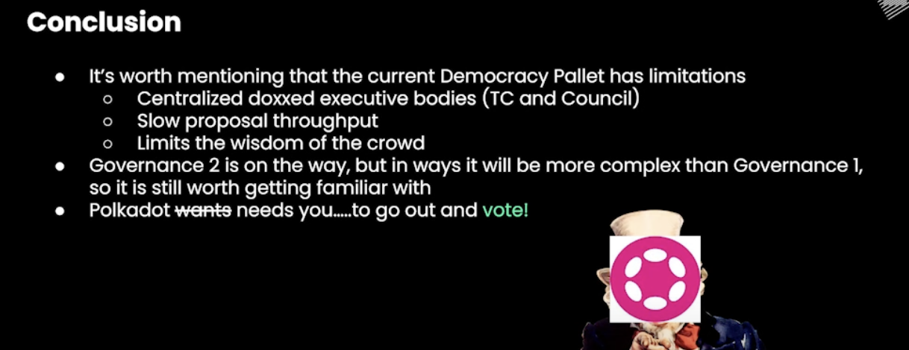

Governance 2.0 would have more throughput. Currently, we have only 28 days. That means only 12 proposals a year as 1 proposal per block rule set.

### Coding

<!--
TODO:

- Structure of the pallet.

  ```
  [Democracy mod]
      |__ [Config]
      |__ [Pallet struct]
      |__ [Storage]
      |__ [Hooks]
      |__ [Impl Pallet with extrinsics]
      |__ [Impl Pallet with intrinsics]
  [Impl Pallet]
  [Impl Time for Pallet]
  [Impl UnixTime for Pallet]
  ``` -->

- There are so many constants in democracy pallet, implementation of which is done inside `parameter_types!` of the runtime `src/lib.rs` file.
  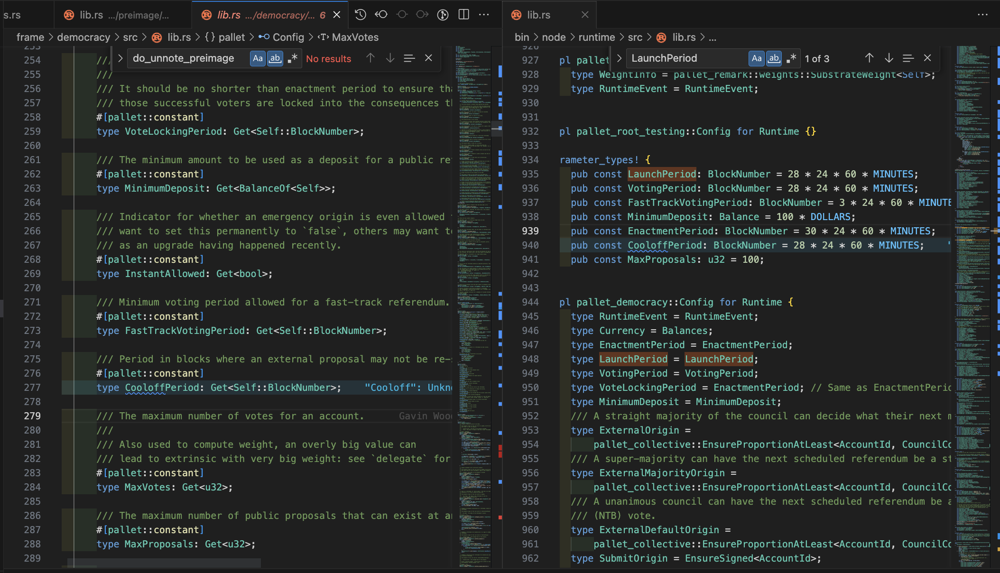

- Emergency has been set here:
  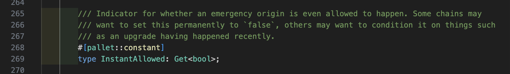

- Proposal counter is set here:
  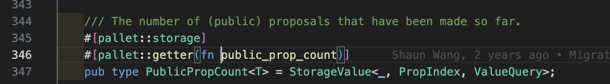

- `propose` extrinsic has a Call type argument i.e. `proposal` which is of `Call` type => Some extrinsic call can be the proposal.
  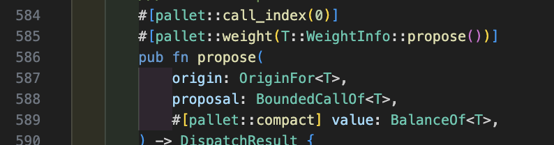

- These are the collective i.e. council members:
  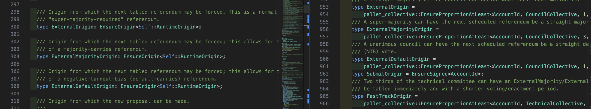

  All the Origin types means they have a defined role in the system. `ExternalOrigin` is the origin of the council members. `ExternalMajorityOrigin` is the origin of the majority of the council members. `ExternalDefaultOrigin` is the origin of the default council member. If we don't want to set any council, we can set the respective associated types:

  ```rust
  type ExternalOrigin = ();
  type ExternalMajorityOrigin = ();
  type ExternalDefaultOrigin = ();
  ```

  Then, we would just have the public origin to vote. And they can take the decision. There won't be any enactment delay.

  We can set different origins for different purposes - blacklist proposal, emergency proposal, cancel proposal after vote winning, etc.

- For blacklisting, there are origins set & only those people can call that:
  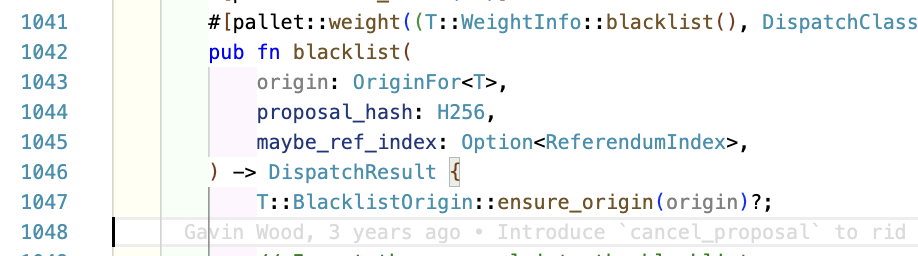
- And when proposal blacklisted, `slashing` is done for the proposer. The proposer loses the amount of tokens he/she has locked for the proposal.
  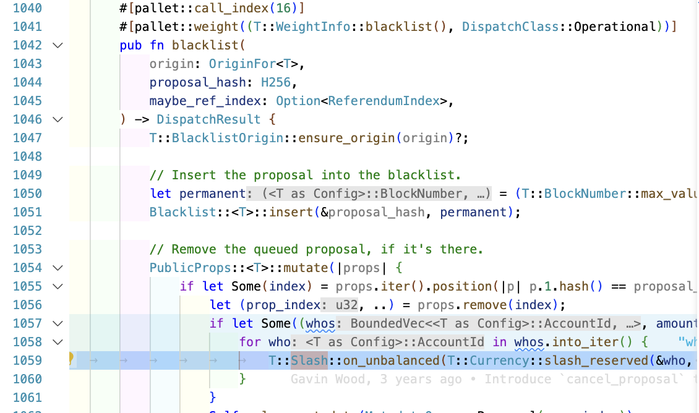

  > **Slashing** is a type of penalty applied to validators in a PoS system when they act maliciously or fail to fulfill their duties. In essence, slashing involves reducing or "slashing" the stake (the amount of cryptocurrency) that the validator has put up as collateral to participate in the network. The slashed stake is typically burned (destroyed), meaning it's taken out of circulation, but in some systems it may also be partially redistributed to other participants.
  >
  > This is done to incentivize validators to act honestly and reliably. If they don't, they stand to lose a significant amount of their own money. It's an important mechanism for maintaining the security and integrity of the network.

- For emergency, there are origins set & only those people can call that:
  
- For canceling, there are origins set & only those people can call that:
  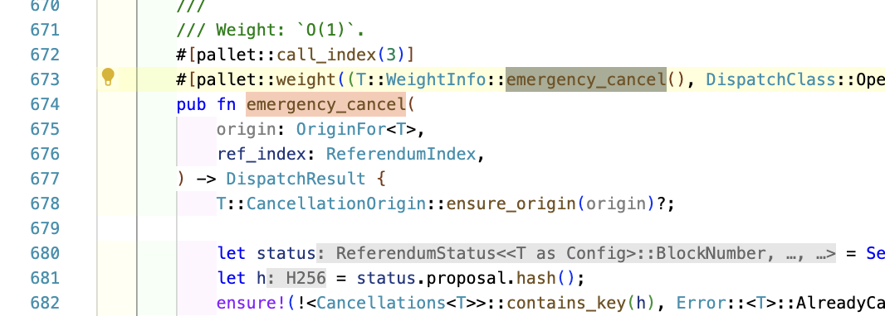

- Once a proposal is created, people need to `second` it in order to show support for the proposal.

  > "Seconding" a proposal in the context of the Democracy pallet in Substrate refers to the act of a user supporting a public proposal to help it become a referendum. When a user seconds a proposal, they lock up an amount of tokens equal to or greater than what the original proposer did. This is to indicate support for the proposal and help it move forward in the process.
  >
  > Here's a brief explanation of the process:
  >
  > 1. A user makes a public proposal by depositing some tokens.
  > 2. Other users can "second" the proposal by also depositing tokens. The more seconds a proposal has, the sooner it will be reviewed.
  > 3. Each launch period (a set number of blocks), the proposal with the most tokens behind it (from both the initial deposit and the seconds) is chosen to be put to a vote.
  > 4. The proposal becomes a referendum, and all users can vote on it.
  > 5. Depending on the vote, the proposal is either enacted or rejected, and the deposited tokens are returned.

  > This is part of Polkadot's on-chain governance model, which allows the network and its rules to be governed in a decentralized way by its token holders.

- After good no. of seconds, a proposal is moved to referendum. Then, it is voted upon. If it passes, then it is moved to referendum. If it fails, then it is rejected.
- So, on every block start, this code is run to check if there is any proposal to be moved to referendum. Done via this code using pallet hooks:
  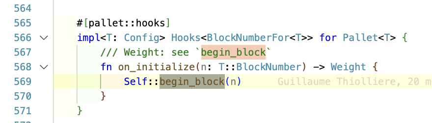
- And then this function checks for either 28 days reached (`.is_zero()`) or not, so that we have to load another proposal (based on most no. of seconds) into referendum:
  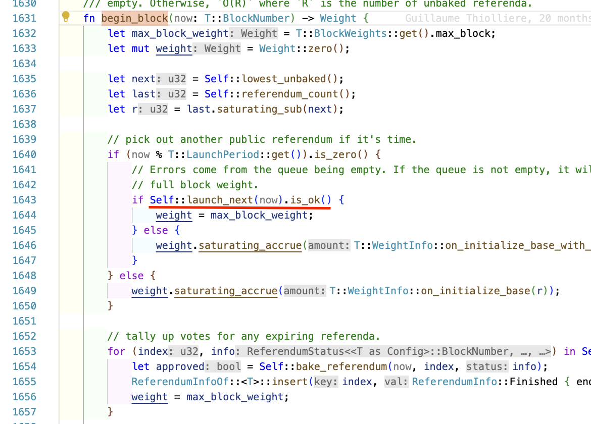

  > This is the only way for a proposal to go to referendum. No direct way of making the transition from proposal to referendum.

- `bake_referendum` function is used to conclude a referendum. When a referendum is "baked", it means that the voting has been closed and the votes have been tallied. If the referendum is approved, it is then scheduled for enactment​.
  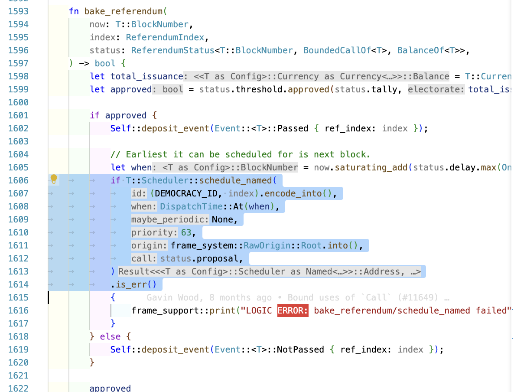
- In order to fast track, there was a function called `enact_proposal`, now renamed to this:
  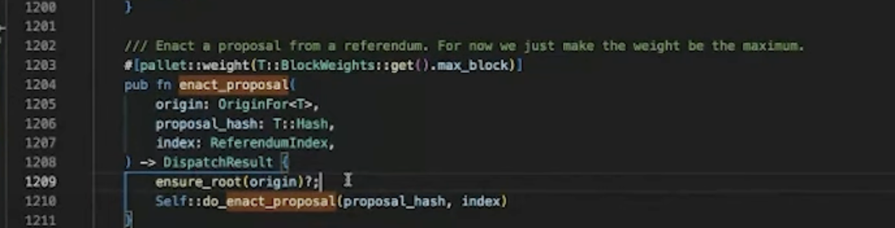
  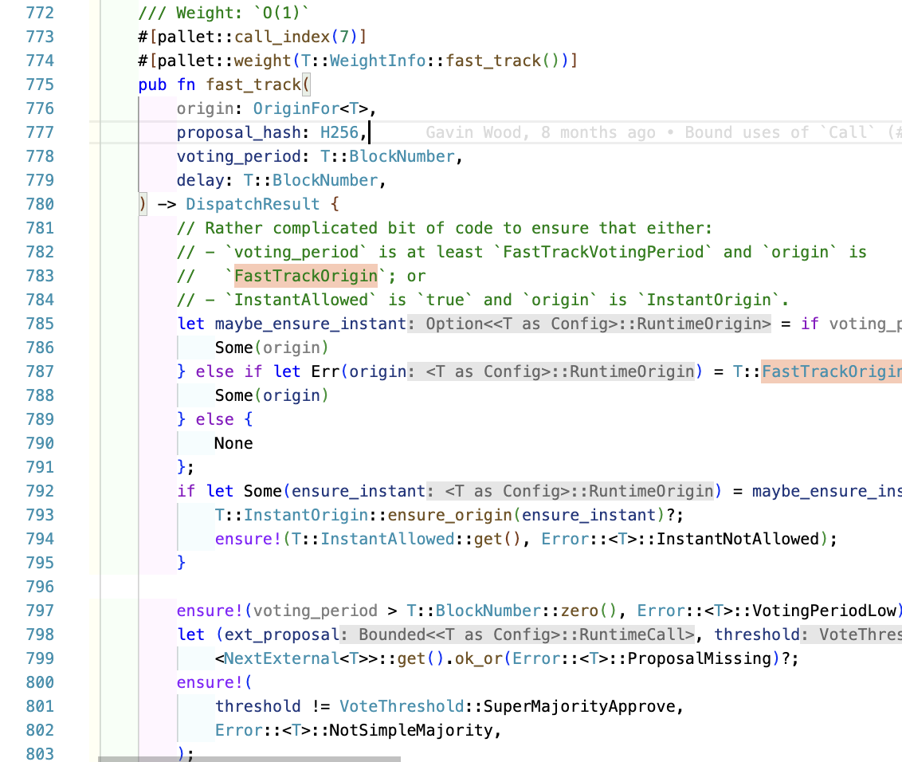

  This can only be run by FastTrackOrigin. This is the origin of the council members. So, they can fast track a proposal to referendum. This is done when there is an emergency. So, they can fast track a proposal to referendum.

- In Polkadot, there is no sudo account, but there is a collective. So, the council members can do the sudo work. They can fast track a proposal to referendum. They can cancel a proposal. They can blacklist a proposal. They can do all the sudo work. So, there are different roles for each activity in the Collective pallet.

## References

- [Democracy Pallet | Polkadot Deep Dives](https://www.youtube.com/watch?v=CgcUWK2E9Jo&list=PLOyWqupZ-WGsfnlpkk0KWX3uS4yg6ZztG&index=26) ✅
- [Polkassembly](https://polkadot.polkassembly.io/)
