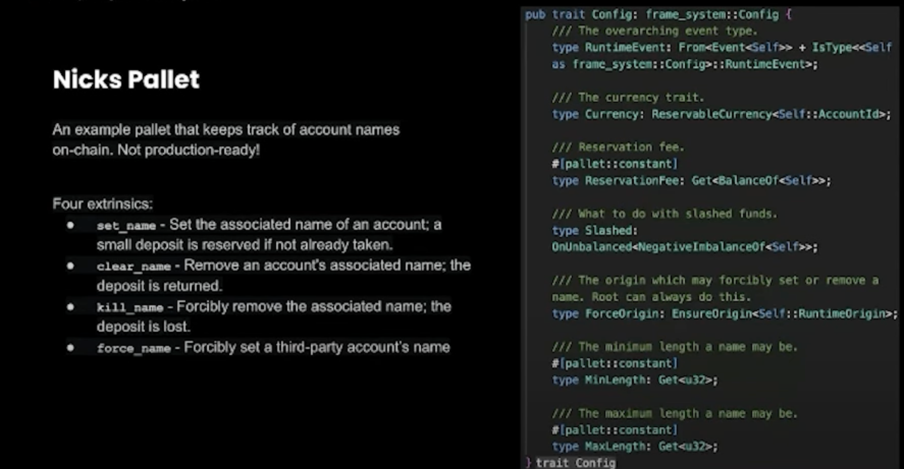
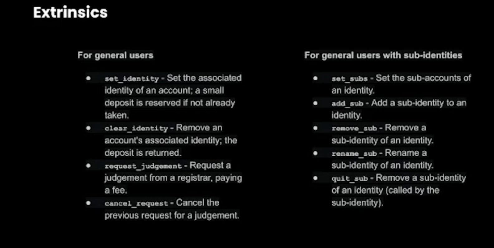
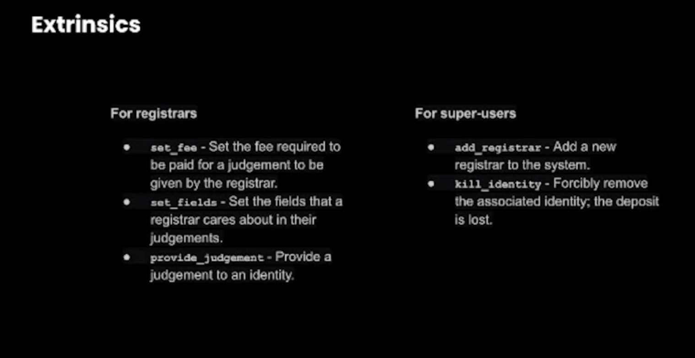
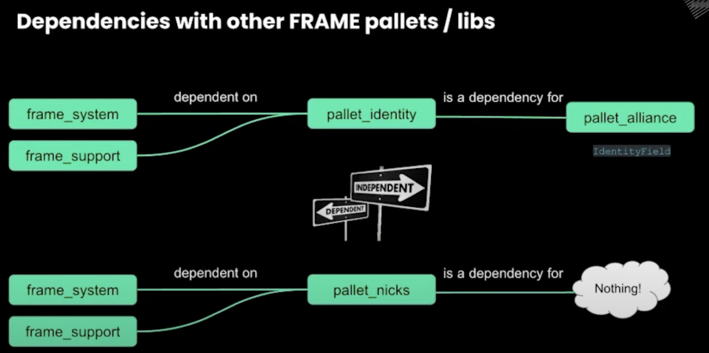
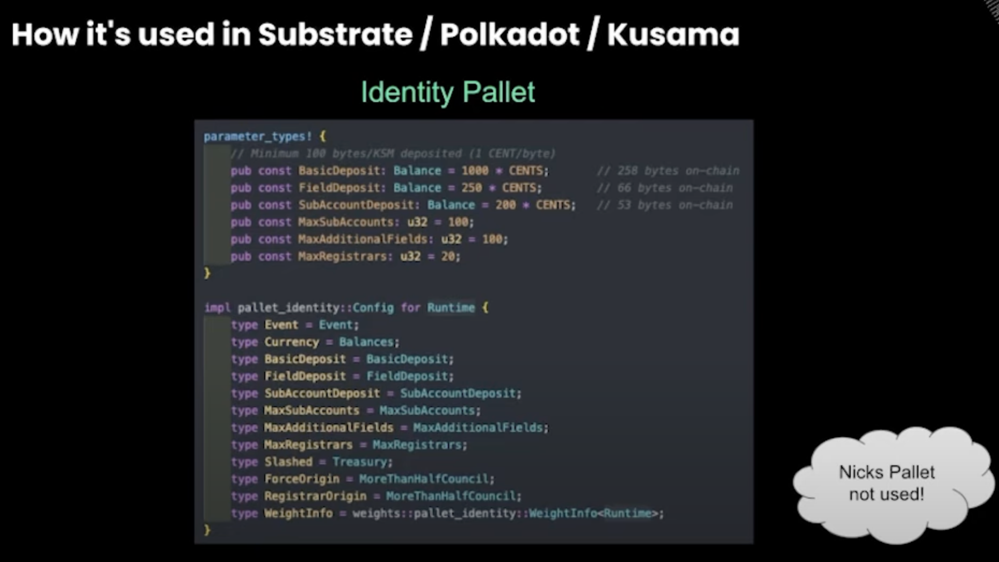
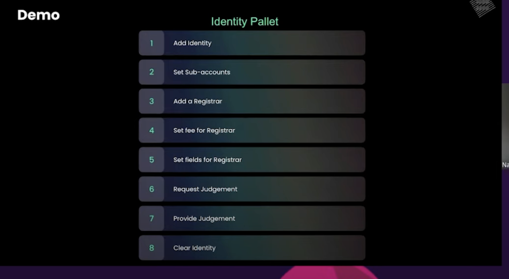
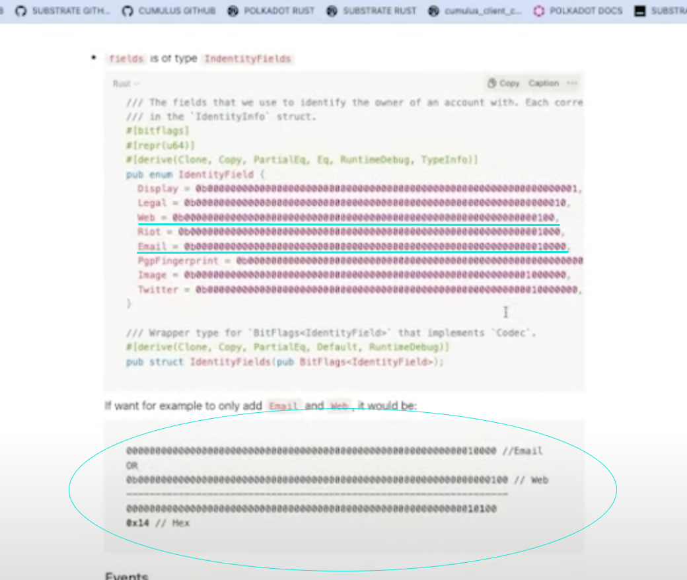
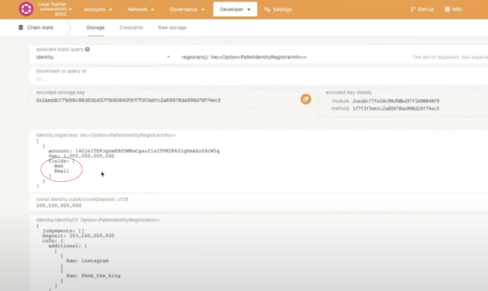

# Identity & Nicks Pallet

## Overview

- Nicks Pallet provides functionality to set a nickname for an account.
- Nicknames are unique and can be transferred.
- It is not a production ready pallet, but it is a preliminary example of how to build an identity pallet.
- An identity pallet can have sub-identities.
- Whenever any nickname is submitted, it is checked for uniqueness along with info related to other fields like email, twitter handle, etc.
- **Dependency**:
  - Identity pallet:
    - dependant on `frame_support` & `frame_system`
    - dependency for `pallet-alliance`
  - Nicks pallet:
    - dependant on `frame_support` & `frame_system`
    - dependency for nothing

## Notes

Nicks pallet extrinsics:

Identity pallet extrinsics:

Nicks & Identity pallets have the following dependencies:

Here, if the `root_origin` decides to kill the identity, then it would go back to `Treasury` account instead of identity holder.

Identity pallet demo in this [video](https://youtu.be/6OduyxOwuxg?list=PLOyWqupZ-WGsfnlpkk0KWX3uS4yg6ZztG&t=771):

In the demo of Identity pallet, when the `setFields` function is executed, if we need to provide the email & website, then we need to parse the input in hex like this:

[video](https://youtu.be/6OduyxOwuxg?list=PLOyWqupZ-WGsfnlpkk0KWX3uS4yg6ZztG&t=1223)
[code](https://youtu.be/6OduyxOwuxg?list=PLOyWqupZ-WGsfnlpkk0KWX3uS4yg6ZztG&t=1820)

So, here the binary representation of the fields are done `OR` operation. And the corresponding hex is `0x14`.

After the extrinsic operation, we get to see in the storage:

## Reference

- [Identity & Nicks pallets | Polkadot Deep Dives](https://www.youtube.com/watch?v=6OduyxOwuxg) 🧑🏻‍💻
