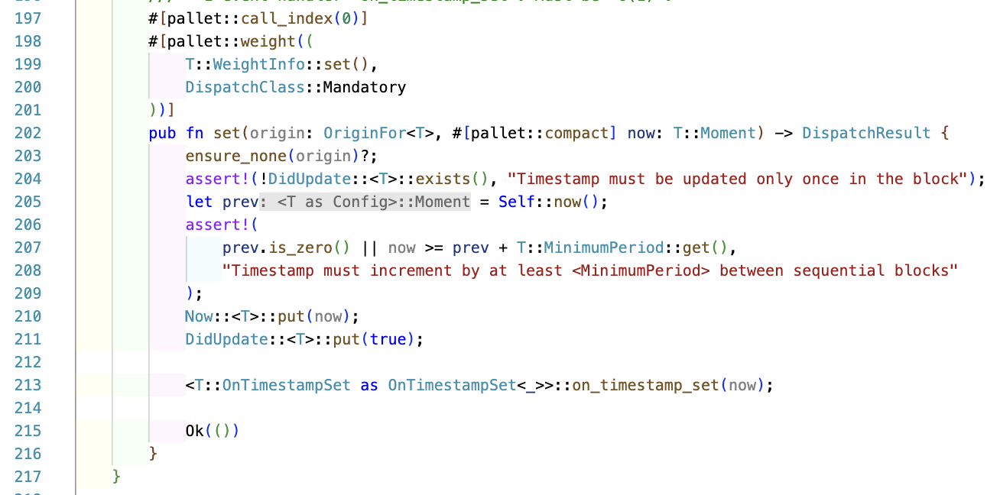
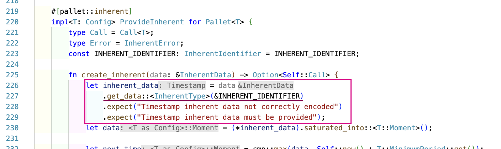
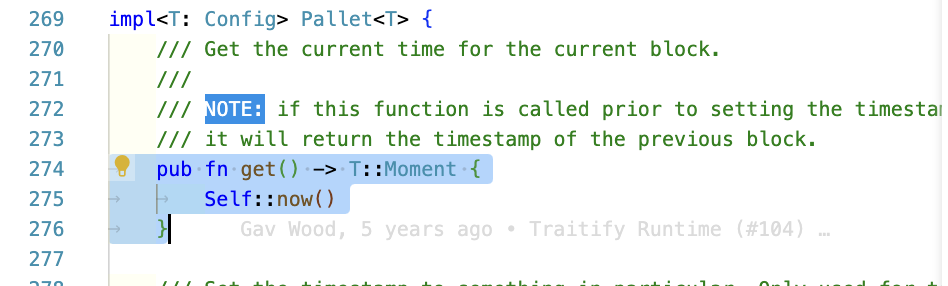

# Timestamp Pallet

Timestamp pallet & inherents

## Overview

- Timestamp Pallet provides functionality to get and set the on-chain time.
- This pallet works like a clock for the susbtrate blockchain.
- Repo code: https://github.com/paritytech/substrate/tree/master/frame/timestamp
- **Inherents**:
  - They are functions with some data parsed as parameters.
  - They don't have to stand in transaction queue, as they are added by the validator (block author) itself.
- **Min. time**: 6s
- **Max. drift time**: 30s. Set inside the `check_inherent` function that is run by non-author nodes. The function contains logic - if any block has time > 30s from the last block, then the block is rejected by the non-author nodes for each block.

## Notes

### Theory


They are used to order transactions in the block explorer.


The Substrate community mutually agreed to 6s block time.


When `substrate-node-template` binary is run on CLI, in the "Developer >> Storage" section, we can see the current time as shown below, the time also gets updated as the block gets added to the chain & the time is updated by 6s.


---

In substrate nodes, there are 2 types of node: **producer** & **consumer**. The producer node is the one that creates the block & the consumer node is the one that receives the block. The producer node is also called as block author.

So, the producer would package the block (with inherent data) & send it to the consumer node. The consumer node would then check the inherent data & if it is valid, then it would add the block to the chain (previous validated blocks).

---

In the recent codebase as per `polkadot-v0.9.39`, there are dispatch calls like `block` not available for the timestamp pallet. Hence, just pasting the screenshot. More can be seen in the video referenced down below.

Here in this timestamp pallet, the time being set by block author is checked by other nodes in the network. If the time is not in sync with the other nodes, then the block is rejected. This is how the consensus is achieved in the network.

The timestamp pallet's dispatchable - `set` function is called inherently by the block author. So, unlike normal dispatchable, it can't be called by any external account.

### Coding

- Structure of the pallet.

  ```
  [Timestamp mod]
      |__ [Config]
      |__ [Pallet struct]
      |__ [Storage]
      |__ [Hooks]
      |__ [Impl Pallet with extrinsics]
      |__ [Impl Pallet with intrinsics]
  [Impl Pallet]
  [Impl Time for Pallet]
  [Impl UnixTime for Pallet]
  ```

- Here, we are using 2 uncommon components - `Hooks`, `Inherent`.
- The call `set` makes an inherent call. So, can't be called by any external accountId.
  
- We find a `#[pallet::compact]` macro for `now` function param in `set` extrinsics. It is used to store the value in a compact form. It is used for blockchain optimization. The blockchain data (not storage) gets reduced to a large extent. Imagine sending `1 byte` data instead of `8 bytes` data. It is used for [these types](https://docs.substrate.io/reference/scale-codec/). [StackOverflow](https://substrate.stackexchange.com/questions/679/when-to-use-compact-on-extrinsic-arguments?rq=1)
- The `block` dispatchable is not available in the recent codebase as per `polkadot-v0.9.39`. Hence, just pasting the screenshot. More can be seen in the video [here](https://youtu.be/HjtxPcuR8a0?list=PLOyWqupZ-WGsfnlpkk0KWX3uS4yg6ZztG&t=656)
  
- The corresponding `code` for `block` extrinsic is as follows:
  
- If this `block` extrinsic was run, then the chain stopped. Here is the demo [video](https://youtu.be/HjtxPcuR8a0?list=PLOyWqupZ-WGsfnlpkk0KWX3uS4yg6ZztG&t=679) & screenshot:
  

  The time keeps on running to 14s, but there are no blocks. Hence, the chain panics with a msg - "Timestamp must be updated once in the block" as shown in CLI:
  

  as per the `on_finalize` function shown below. Basically, the error is thrown when trying to finalize the last block that was authored.

- The timestamp whether set or not is checked during `finalization` using this code snippet inside `Hooks` trait.
  
- Inside `on_finalize` function, the DidUpdate value is taken i.e. `true` & then reset to default value i.e. `false` afterwards.
- We can also unblock this by `block` with value as `No`.
  

  And then the block starts ticking time.

- Add a custom inherent data (remark)
  old code of `pallet-timestamp`:
  

  As of today [(June-2023)](https://github.com/paritytech/substrate/releases/tag/monthly-2023-06), there is only 1 extrinsic - [`store`](https://github.com/paritytech/substrate/blob/85415fb3a452dba12ff564e6b093048eed4c5aad/frame/remark/src/lib.rs#L67-L78) in `remark` pallet, which is used to store offchain data. So, with the above code, you can find in the referenced video that the remark once set with a bytes value, can be seen in every block after timestamp set.

- [assert!](https://github.com/paritytech/substrate/blob/85415fb3a452dba12ff564e6b093048eed4c5aad/frame/timestamp/src/lib.rs#L206-L210) here checks for the current time i.e. `now` (function param) to be either zero (in case of genesis block) or greater than the last block time by min. `6s`. This is to ensure that the time is always increasing.
- The `InherentDataProvider` struct type is used by block author (also called producer) to provide the inherent data of type `InherentData` (key: INHERENT_IDENTIFIER, value: system unix time). This is done via this code in [`node/src/service.rs` file](https://github.com/substrate-developer-hub/substrate-node-template/blob/87b1b4728e29f68c6b2bafde7f3d0f4c8af9b302/node/src/service.rs#L111-L120):
  
  The <u>left most code</u>: create a timestamp inherent data provider variable that takes the system time.

  The <u>middle code</u>: shows the code of `from_system_time` method of `InherentDataProvider` struct.

  The <u>right most code</u>: shows the code of the unix timestamp taken.

- The type of data that is parsed in the `ProvideInherent` trait methods is `InherentData`.
- This type is defined in [primitive/inherents/src/lib.rs](https://github.com/paritytech/substrate/blob/85415fb3a452dba12ff564e6b093048eed4c5aad/primitives/inherents/src/lib.rs#L203-L217).
  

  <details><summary><b>Explanation</b>: </summary>

  The code above defines two Rust types: `InherentIdentifier` and `InherentData`.

  `InherentIdentifier` is a type alias for an array of 8 bytes (`[u8; 8]`). It is used to represent an identifier for an inherent.

  `InherentData` is a struct that represents the inherent data to include in a block. It contains a `BTreeMap` called `data` that maps `InherentIdentifier` keys to `Vec<u8>` values. The `data` field is used to store all inherent data encoded with parity-scale-codec and an identifier.

  The `InherentData` struct also provides a `new()` method that creates a new instance of the struct with an empty `data` field.

  Both types derive several traits, including `Clone`, `Default`, `Encode`, `Decode`, and `TypeInfo`. The `Encode` and `Decode` traits are provided by the `parity-scale-codec` crate, which is used to encode and decode the inherent data. The `TypeInfo` trait is provided by the `scale_info` crate, which is used to generate type information for the struct.

  Overall, this code defines a data structure for storing inherent data in a block, which can be used in a Rust blockchain implementation like substrate.

  </details>

- The data of type `InherentData` is taken from the system of the block author in map format which has a key i.e. INHERENT_IDENTIFIER i.e. `timestamp` & value as the timestamp value (in bytes).
  
- This `InherentData` is constructed by the block author & given to the runtime.
  > The same data type is also used in the `check_inherent` function (run by non-author node) when checking with the data (sent to runtime by author node).
- _The data that is passed_ by the non-author node has to be compared with the _one imported by the non-author node_. In order to do this checking for a valid time, `check_inherent` function is called by the non-author node to make a comparo between the 2 function params - `call_data` & `inherent_data`.
- We have `ProvideInherent` trait which has 2 functions:

  - `create_inherent` - called by block author when constructing the block via runtime API (TODO: verify this)

  - `check_inherent` - called by every other node except block author via runtime API

- `create_inherent` is supposed to be run by the block author.
- `check_inherent` is supposed to be run by every other node except the block author.
  > In this way, we can check for at least 2/3 majority of nodes to be in sync with the time. Hence, the consensus is achieved. This is how time synchronization in the distributed system is achieved.
- Inside `check_inherent`, there are 2 params:
  - `call_data`: the data that is passed by the block author. This data comes from the block imported by the non-author node.
  - `inherent_data` - the data that is passed by this node (except block author).
  - The max. drift allowed is 30s. Hence, the block imported by non-author node if has set time more than 30s than the non-author's latest block timestamp, then the block is rejected.
  - If the `received_t` is less than the min. allowed time i.e. 6s, then the block is rejected.
  - So, the `inherent_data`'s time & `call_data`'s time should be within 30s i.e. <= 30s. And the `call_data`'s time should be >= 6s. Then, the block is accepted.
- There is another function called `is_inherent` which checks if the call is actually inherent or not for every unsigned transactions.
- #### We have helper functions defined like [`get()`](https://github.com/paritytech/substrate/blob/85415fb3a452dba12ff564e6b093048eed4c5aad/frame/timestamp/src/lib.rs#L274-L276) which acts as `view` (like in solidity) function for other pallets to call.

  

- [`impl_runtime_apis`](https://github.com/paritytech/substrate/blob/85415fb3a452dba12ff564e6b093048eed4c5aad/bin/node/runtime/src/lib.rs#L2070-L2071) is the middleware between `WASM_runtime` & `substrate_node`

  ```mermaid
  graph LR
  A[substrate_node] --> B[Runtime APIs] --> C[WASM_runtime]
  ```

  So, when `substrate_node` sends the inherent data to `WASM_runtime`, it goes via `Runtime APIs` which is defined in `impl_runtime_apis` function.

- The `OnTimestampSet` associated type defined in the consensus algorithm where the `on_timestamp_set` function is defined afterall. This function is called when the timestamp is set by the block author on a high level.
  

  

  Left to Right shows on clicking the code.

## Reference

- [Pallet Timestamp and Inherents | Polkadot Deep Dives](https://www.youtube.com/watch?v=HjtxPcuR8a0) ✅
