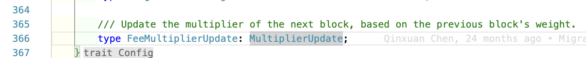

# Transaction Payment Pallet

## Overview

- It has 4 fields:

  - `base_fee`
  - `weight_fee`
  - `length_fee`
    > `inclusion_fee` = `base_fee` + `weight_fee` + `length_fee`; also the minimum fee that must be available for a transaction to be included in a block.
  - `tip`

- The formula of final fee:

  ```text
  inclusion_fee = base_fee + length_fee + [targeted_fee_adjustment * weight_fee];
  final_fee = inclusion_fee + tip;
  ```

- `targeted_fee_adjustment`: This is a multiplier that can tune the final fee based on the congestion of the network.

> If an account does not have a sufficient balance to pay the inclusion fee and remain alive—that is, enough to pay the inclusion fee and maintain the minimum existential deposit—then you should ensure the transaction is cancelled so that no fee is deducted and the transaction does not begin execution.
>
> Substrate does not enforce this rollback behavior. However, this scenario would be a rare occurrence because the transaction queue and block-making logic perform checks to prevent it before adding an extrinsic to a block.

## Notes

### Theory

### Coding

Here, there is a dynamic parameter `TargetedFeeAdjustment` that can be changed based on the network congestion (of previous block).



- If the previous block is more saturated, then the fees are slightly increased. Similarly, if the previous block has fewer transactions than the target, fees are decreased by a small amount. [More](https://w3f-research.readthedocs.io/en/latest/polkadot/overview/2-token-economics.html#relay-chain-transaction-fees-and-per-block-transaction-limits)

## References

- [Transactions, weights and fees](https://docs.substrate.io/build/tx-weights-fees/) 🧑🏻‍💻
- [Transaction lifecycle | Substrate Seminar | May 2020](https://www.youtube.com/watch?v=3pfM0GOp02c)
- [Build a feeless transaction pallet | Substrate Seminar](https://www.youtube.com/watch?v=7GOd2g4JZqg)
