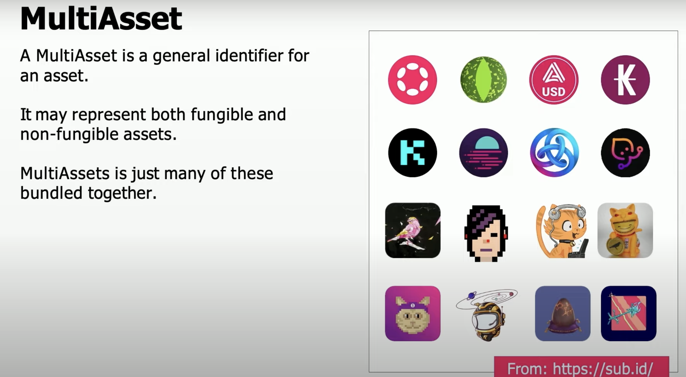

# XCM Pallet

## Overview

Dictionary meaning:

XCMP vs XCM:

XCMP: Cross-chain messaging protocol

2 channels open during XCMP:

- Sending message
- Receiving message

There is a handshake 🤝 mechanism followed in order to avoid malicious messages coming from malicious parachains. The XCMP is only allowed if both chains agree to open respective channels.

**VMP: Vertical Message Passing**

We generally are not supposed to have any message format as it would consider them as bytes.

But, we do have a message standard defined.

That's where XCM comes in:

Cross-consensus messaging

It is designed to work across any consensus systems and not just polkadot or parachains.

Dig deeper? Here it is simplified:

Where does XCM fit in the Polkadot ecosystem?

Applications:

## Notes

### Theory

Here, only XCMP is used, it works fine:

But the problem happens when one of the parachains is upgraded. The coordination of upgrade can be very difficult. Hence, the messages are getting sent to the wrong place and wrong actions take place.  

So, XCM defines a common language for parachains to communicate with each other.

So, that's why we need a XCM pallet (executer). It's a pallet that allows us to send messages between parachains irrespective of whether a parachain is upgraded or not.

### Coding

- **Q**. How can an asset be withdrawn and deposited? Which assets can be transacted?

  - **Asset Transactor** (as shown in `XCM Executer` diagram).
    

<!-- TODO: Cover later after all the pallets -->

## References

- [Shawn Tabrizi: XCM - The Backbone Of A Multichain Future | Polkadot Decoded 2022](https://www.youtube.com/watch?v=2tmspefsygQ) ✅
- [XCM Overview | Polkadot Deep Dives](https://www.youtube.com/watch?v=kAAzgpTAMZ4&list=PLOyWqupZ-WGsfnlpkk0KWX3uS4yg6ZztG&index=20)
- [XCM Config & Pallet-XCM | Polkadot Deep Dives](https://www.youtube.com/watch?v=bFMvWmU1pYI&list=PLOyWqupZ-WGsfnlpkk0KWX3uS4yg6ZztG&index=27) 🧑🏻‍💻
- [XCM v3 | Polkadot Deep Dives](https://www.youtube.com/watch?v=MMIPNR3SuB4&list=PLOyWqupZ-WGsfnlpkk0KWX3uS4yg6ZztG&index=18)
- [Workshop 11 | “Getting Started with XCM" by Steve Degosserie | IBC Continuum 2022-23](https://www.youtube.com/watch?v=D90bbadkNcE)
