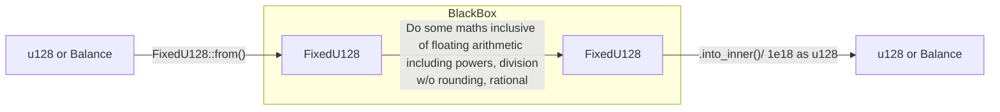

`FixedU128` vs `u128`:

- `FixedU128`: for handling the decimal u128 for math operations including powers, division w/o rounding, rational, etc.
- `u128`: for handling all balances.

---

This is how we can get the decimal balance.

```rust
// tests.rs
let mut x = FixedU128::from_float(5.5);
x = x.checked_mul(&FixedU128::from_float(0.3)).unwrap();
println!("x: {:?}", x);     // x: FixedU128(1.650000000000000000)
```

---

Conversion from `u128` to `FixedU128` and back to `u128`:

> This has been implemented in Bank pallet in my playground. [Implementation](https://github.com/abhi3700/substrate-playground/blob/0de819d639d36dc592e414e47d92f4f8b64102f5/pallets/bank/src/lib.rs#L621-L676).



```rust
// tests.rs

// relevant imports
use frame_support::sp_runtime::{
	traits::{checked_pow}};

const PRINCIPAL_AMOUNT: Balance = 1e10 as u128 * 5000; // representing 5000$ in 1e10 units (as decimals)
let p_fixedu128 = FixedU128::from(PRINCIPAL_AMOUNT);
println!("p_fixedu128: {:?}", p_fixedu128);         // p_fixedu128: FixedU128(50000000000000.000000000000000000)

// NOTE: some compound interest factor calculation here
// formula: A = P(1 + r/n)^(nt)
const INTEREST_RATE: Permill = Permill::from_percent(2); // 2%	or Permill::from_parts(20_000)
let interest_rate_in_percent: u32 = INTEREST_RATE.deconstruct();
println!("interest_rate_in_percent: {:?}", interest_rate_in_percent);       // interest_rate_in_percent: 20000

// r/n
// Source: https://substrate.stackexchange.com/questions/680/from-float-function-or-associated-item-not-found-in-fixedu128
// let k = FixedU128::from_float(interest_rate_in_percent as f64 / 1000000f64);	// ❌ can't work in `lib.rs` file.
// Below, inside from_inner, we are multiplying the previous value as 🔝 with 1e18. Hence, 1e12 is used.
let k = FixedU128::from_inner(interest_rate_in_percent as u128 * 1e12 as u128);
println!("k: {:?}", k);             // k: FixedU128(0.020000000000000000)

// 1 + r/n
let l: FixedU128 = FixedU128::from(1).checked_add(&k).unwrap();
println!("l: {:?}", l);             // l: FixedU128(1.020000000000000000)

// n * t
const COMPOUND_FREQUENCY: u16 = 1; // 1 time per fd_epoch (1 year)
let compound_frequency_u32: u21 = COMPOUND_FREQUENCY as u32;
const FD_EPOCH: u32 = ONE_YEAR; // 1 year
const MATURITY_PERIOD: u32 = 3 * ONE_YEAR; // 3 years
let nt: u32 = compound_frequency_u32 * MATURITY_PERIOD / FD_EPOCH;
println!("nt: {:?}", nt);   // nt: 3

// (1 + r/n) ^ (n * t)
let cp = checked_pow(l, nt as usize).unwrap();
println!("m: {:?}", cp); // cp: FixedU128(1.061208000000000000)
let cp_minus_one = cp.checked_sub(&FixedU128::from_u32(1)).unwrap_or_default();
println!("cp-1: {:?}", cp_minus_one);
let cp_minus_one_u128 = cp_minus_one.into_inner();
println!("cp-1_u128: {:?}", cp_minus_one_u128);

let ma: FixedU128 = p_fixedu128.checked_mul(&cp).unwrap();
println!("ma: {:?}", ma);                           // ma: FixedU128(53060400000000.000000000000000000)

// FixedU128 to u128
let ma_inner: u128 = ma.into_inner();
println!("ma_inner: {:?}", ma.into_inner());        // ma_inner: 53060400000000000000000000000000

// And then divide by 1e18
let ma_actual: u128 = ma_inner / 1e18 as u128;
println!("ma_actual: {:?}", ma_actual);             // ma_actual: 53060400000000
```

So, principal amount 5000$ at 2% interest rate compounded 3 times a year for 1 year will give us 5306.04$.

> NOTE: Here, the principal amount returned from on-chain calculation has to be further divided by 1e10 in order to get the real-world value in DOT (chain's coin) currency.
