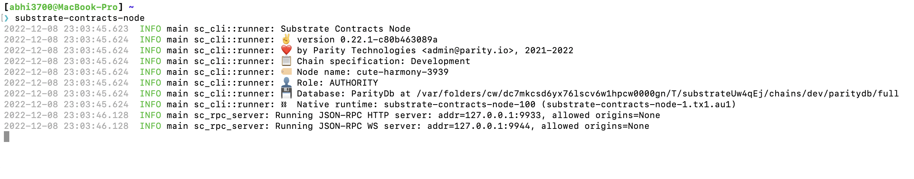

# ink!

## About

- Substrate's Contract Pallet (out of all library of pallets) allows Substrate-based chains to run SC on top of it.
- SC language: A eDSL based `rust` language
- SC binary: `wasm` format
- Testnet (local): Kickstart your own substrate parachain with [substrate-contracts-node](https://github.com/paritytech/substrate-contracts-node) & to view on block explorer:
- Testnet (public):
  - Rococo (Relay chain)
    - Canvas (parachain) supporting `ink!` SC. It is substrate-based.
- Mainnet (Relay chain)
  - Polkadot
  - Kusama (for canary release): The newer features are first integrated here & then launched on Polkadot as stable version like LTS vs Latest in NodeJS.
    > Unlike other blockchains, where there are 1 mainnet, here there are 2 relay chains. They did this to ensure test happening on Kusama with real tokens, not with the faucet ones.

## Installation

> Below guide is for macOS (M1)

### 1. Cargo, Rust

- Follow this [guide](https://github.com/abhi3700/My_Learning-Rust/blob/main/README.md#installation)

### 2. Linting, Compiler

1. `$ rustup component add rust-src` (add rust standard library)
2. `$ cargo install cargo-dylint dylint-link` [lint `ink!` code]
3. `$ cargo install cargo-contract --force --locked` [**install**/**update** compiler]
   > 1, 2, is for `cargo-contract` to work with `cargo-dylint` & `dylint-link` respectively.

**Verify installation**

```console
❯ cargo-contract --version
cargo-contract 1.5.0-unknown-aarch64-apple-darwin
```

### 3. Substrate Framework Pre-requisites

1. `$ rustup toolchain install nightly`
2. `$ rustup target add wasm32-unknown-unknown --toolchain nightly`

### 4. The Substrate SC Node

**Install**/**Update** the substrate node from source code:

`$ cargo install contracts-node --git https://github.com/paritytech/substrate-contracts-node.git --force --locked`



#### probable issues

- Error: missing protobuf
  - _solution_: `brew install protobuf`

## [Standards](./standards.md)

## Troubleshooting

## References

- [ink! Github repo](https://github.com/paritytech/ink)
- [ink! CLI repo](https://github.com/paritytech/cargo-contract)
- [ink! Documentation](https://ink.substrate.io/)
- [CLI tool](https://github.com/paritytech/cargo-contract)
- Tutorials
  - https://docs.substrate.io/tutorials/smart-contracts/
  - [Substrate contract Web App interactor template - for stock Flipper SC](https://github.com/polk4-net/flipper-app)
  - [By Figment](https://learn.figment.io/protocols/polkadot)
- [Rust before Substrate Ink](https://rust-unofficial.github.io/patterns/intro.html)
- [OpenBrush](https://github.com/Supercolony-net/openbrush-contracts) like OpenZeppelin. It is a library of SCs.
