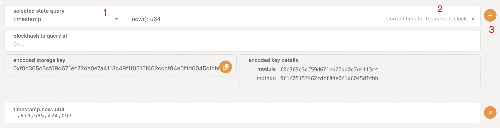

# Timestamp Pallet

## Overview

- Timestamp Pallet provides functionality to get and set the on-chain time.
- Repo code: https://github.com/paritytech/substrate/tree/master/frame/timestamp
- They act as inherents which do not have to stand in transaction queue, as they are added by the validator.

## Notes

They are used to order transactions in the block explorer.

The Substrate community mutually agreed to 6s block time.

When `substrate-node-template` binary is run on CLI, in the "Developer >> Storage" section, we can see the current time as shown below, the time also gets updated as the block gets added to the chain & the time is updated by 6s.

