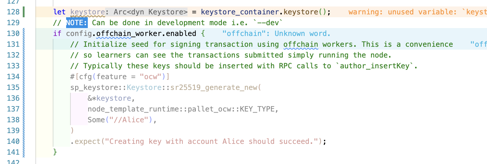

In `Cargo.toml` file, import this:

```toml
[dependencies]
sp-keystore = {version = "0.27.0"}
```

In order to activate the OCW feature, a node can use this feature with `--features ocw` flag. But in development mode, just uncomment this from the code.

> After uncommenting, the code shows error which means that the `pub const KEY_TYPE: KeyTypeId = KeyTypeId(*b"demo");` in `src/lib.rs` file should use `sp-core`'s `KeyTypeId` type with `std` feature. But that is not recommended as Runtime is a sandboxed environment. So, just leave this code as is with `#[cfg(feature = "ocw")]` flag in the code as shown below.

But, in production mode, a node is supposed to use `author_insertKey` under "RPC" tab and generate an account with public key, keytype_id, seeds. Thereafter, the node can use the account to sign transactions.

For more, refer the [tutorial](https://docs.substrate.io/tutorials/build-application-logic/add-offchain-workers/#signed-transactions).


