# Offchain Worker (OCW)

## Overview

- **OCWs** are pieces of logic run after every block.
- **OCWs** are separate from block import and do not affect consensus.
- Workers can
  - run code,
  - _read_ ✅ the state,
  - submit results back on-chain.
  - access storage but cannot ❌ modify it as they are run aside from the block import process.
- Multiple workers can run in parallel via separate threads.
- Examples include printing the current block number and making HTTP requests.
- NOTE: OCWs are part of the runtime, not the node.
- Typically, OCAs are used in blockchain DApps. But OCWs are used in the runtime i.e. the data verification logic can be written inside the `offchain_worker` function inside the pallet module.

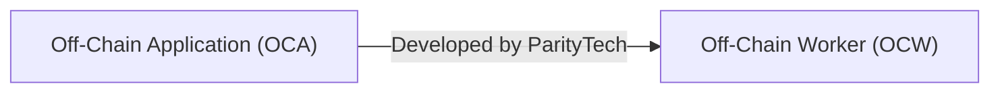
```mermaid
flowchart LR
    A["Off-Chain Application (OCA)"] --Developed by ParityTech--> B["Off-Chain Worker (OCW)"]
```

- OCW applications:
  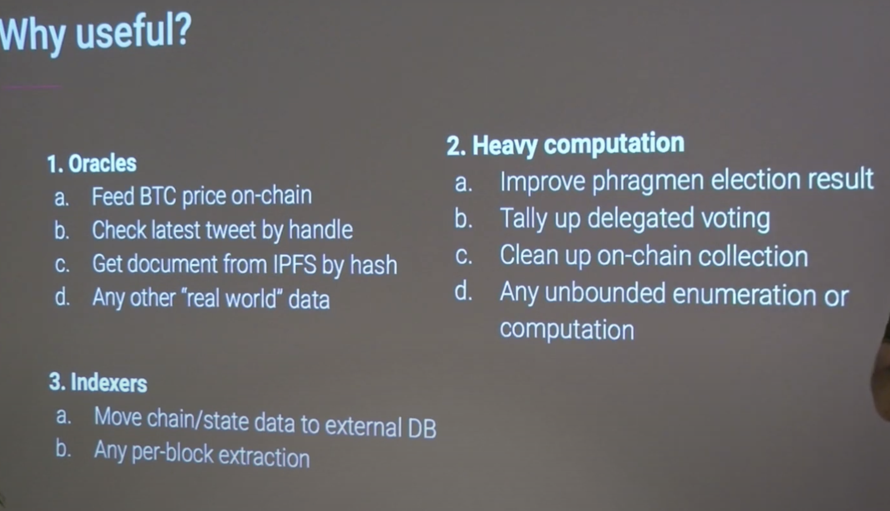
- OCW connection w Substrate node:
  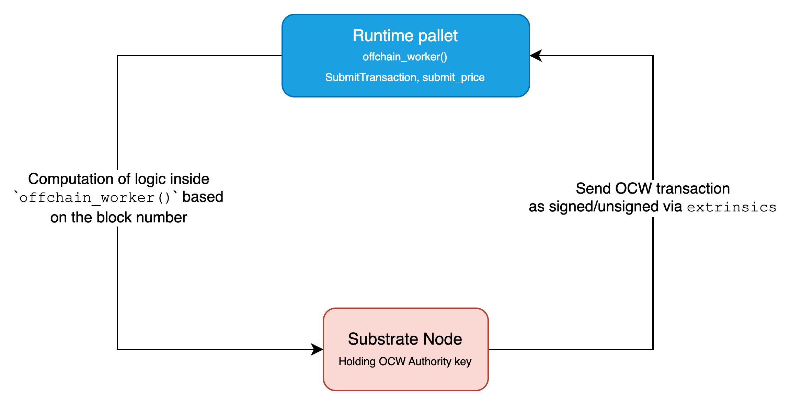

## Notes

### Theory

**Running an OCA**

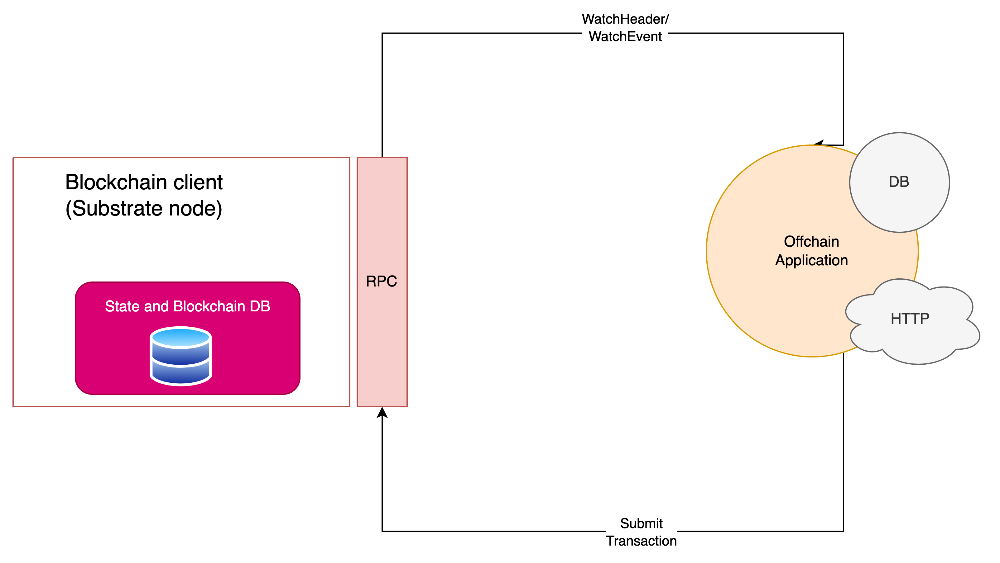

It could be run by single entity or multiple nodes. In that case, it would be a distributed application for sure.

Also, a custom logic has to be written to validate signed/unsigned transaction fed back to the chain from external API services.

You can also introduce a reward mechanism to incentivize the validators to run the OCA on their node in accurate manner.

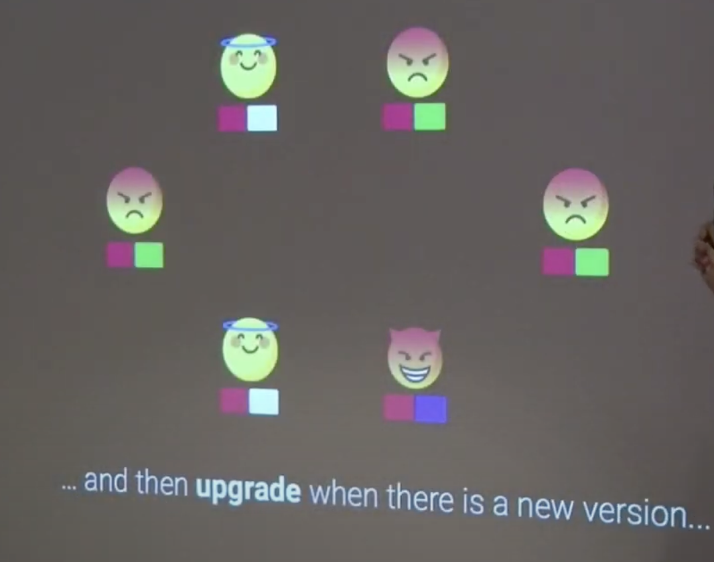

Here is the extrinsic logic of submitting the BTC price to the chain:

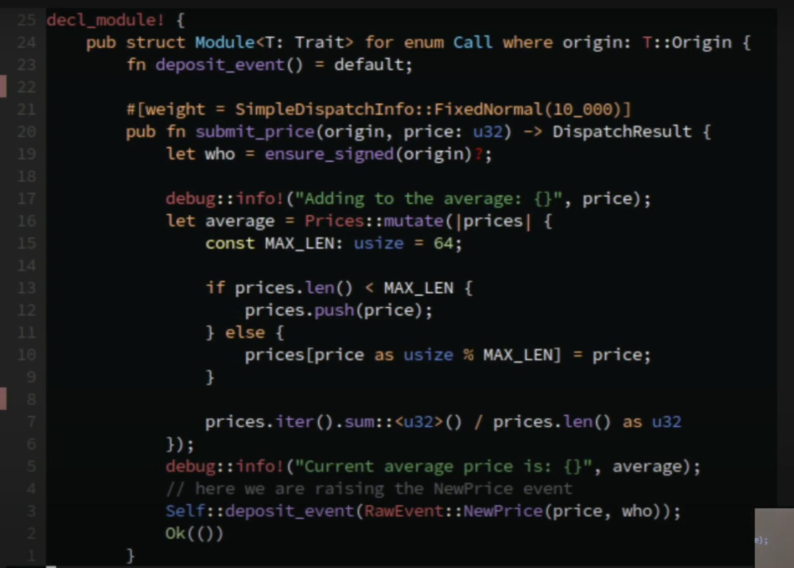

Now, when upgrading the BTC url, you can use the `storage` pallet to store the new url. So, the validators can update the url by using the `storage` pallet. In order to do that, they need to upgrade their OCA in some cases. Hence, it is difficult to keep up with the changes in the OCA.

The attack surfaces are present in your runtime module (pallet). Suppose you have `submit_btc_price` extrinsic available for setting the price onchain. But, keep this in mind that the price may not necessarily be the BTC price. So, we need to validate that info at the RPC level. And one way of doing is through OCW.

---

**Illustrate the state of OCA processing**:


1. Fetch some on-chain data
2. Process & store
3. Make external calls
4. Feed results back on-chain

---

**Architecture of OCW**:

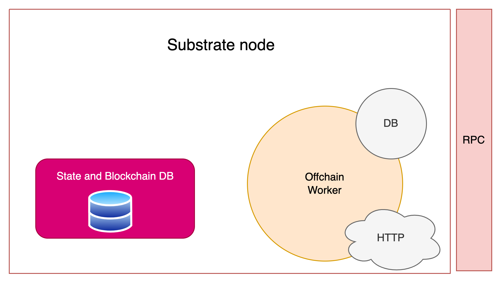

In comparison to OCA, we wanted to make it more close to the runtime module/pallet. So, we have the `offchain_worker` function inside the `Hook` trait. So, now in order to validate the parsed external info, we need to write the custom logic inside the `validate_unsigned` function. So, we can use the `validate_unsigned` function to validate the unsigned transaction sent by OCW to the node.

Unlike OCA, OCW enforces all the validator nodes to run the validation logic via a CLI flag (OCW turned on for nodes connected as validator). So, it's more secure in terms of decentralizing the info parsing process.

---

**Pros of OCW over OCA**:

- It has direct access to the state of the chain.
- It can submit the results back on-chain.
- It's upgraded at the same time as the runtime.
- Can work in std & WASM (but doesn't need to be).
  > If OCW is not in WASM, then it can't be upgraded at the same time as the runtime. This is the associated cons.

---

**How does it work?**

- after a block is imported the node calls into the runtime and triggers workers.
- any `pallet` can declare the Off-chain worker.

  ```rust
  fn offchain_worker(block_number: T::BlockNumber) {
      // do something
  }
  ```

- There can be a situation where a `offchain_worker` operation might take more than a block time & hence let's say runs for 5 blocks. Then, in that case it might be running in parallel with the new OCW operations. So, there can be multiple OCWs running at a time. They can interact with each other via offchain storage. E.g. OCW at block #5 is running till block #6 in parallel with the new OCWs at block #6. This is because the previous OCW is not finished by then.

---

**How exactly the Price fetching actually happens inside the `offchain_worker` function of a pallet?**

We have seen the `submit_price` extrinsic above. Now, we need to validate the price before submitting it to the chain. So, we can use the `offchain_worker` function inside the pallet module to validate the price. So, the data verification logic can be written inside the `offchain_worker` function inside the pallet module.

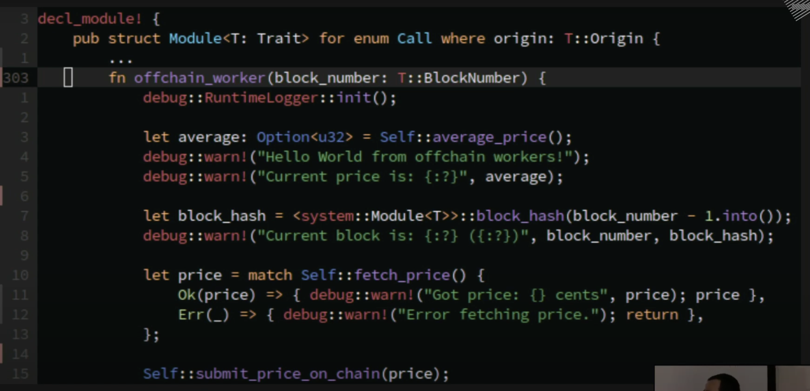

Now, let's dive into the `fetch_price()` function defined within the pallet module:

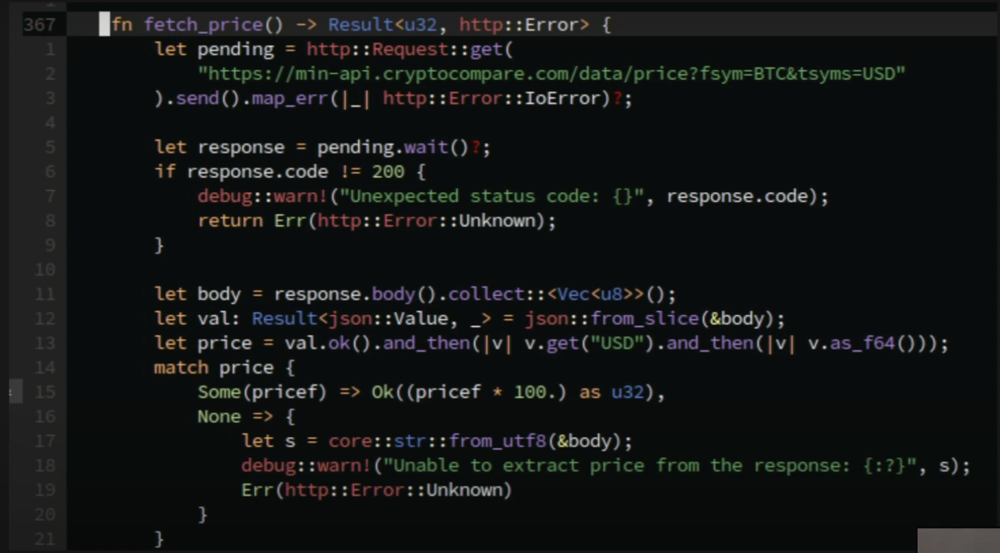

Here is the code explanation:

- L1-3: getting the pending price from the url parsed.
- L5: waits indefinitely for the result to be ready. It's like a blocking call which waits for the result to be ready. But, we can time bound that.
  > There is also an option to set a time bound & hence return to the further logic. Here, there is no option of `async` functionality because the runtime itself is single-threaded. So, there is no way to spawn multiple threads.
- L6-9: checks the response code that returns error if the response code is not 200.
- L11: collects the response body to a vector of bytes.
- L12: convert the response body (in bytes) to a JSON object.
  > Introducing JSON is now available in non_std environment. Hence, can be added to runtime WASM binary. Moreover, this JSON based code doesn't add much to the runtime binary size.
- L13: gets the price as f64.
- L15: returns the price into u32 (USD converted to cents) by multiplying with 100 to retain the decimal part.

---

**How does OCW being non-deterministic become part of runtime (deterministic)?**

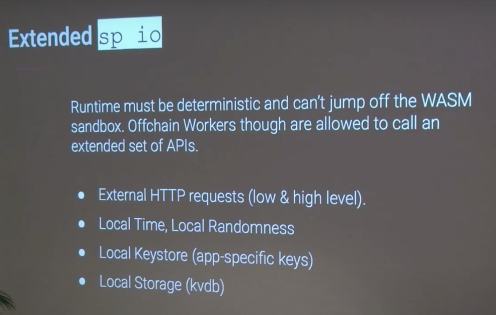

There are extended set of low-level APIs available for OCW. These APIs are available inside `sp_io::offchain` module. So, there is an overlapping of some of the functions between runtime `lib.rs` & `tests.rs` for a pallet supporting OCW. But, some of the functions are not allowed in runtime module. This is similar to the case with `FixedU128::from_float` (not allowed in runtime, but in tests).

---

This is how the OCW is implemented inside `client/service/src/builder.rs`:

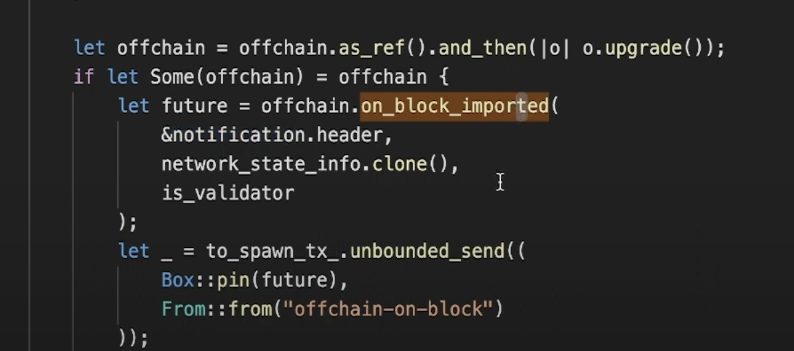

In general, block import process includes:

- Running all extrinsics before consensus is achieved.
  > Here, the consensus is for matching the state (output) of the function.

But, OCW is not part of the block import process (checking the state of the function). It's run after the block is imported.

---

**Turn on/off `offchain_worker` functionality**:

There is a provision of turning on/off the OCW operation. It's done by setting the `offchain_worker` flag to `true` inside `chain_spec.rs` file. So, if you are a validator, you can turn on the OCW operation by setting the flag to `true` and if you are a collator/other types , you can turn off the OCW operation by setting the flag to `false`.

Here is a related demo via this code in file: ``:

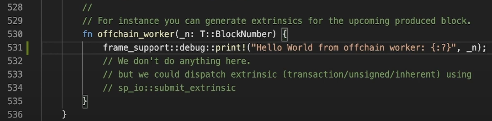

So, now if any validator turns on the CLI flag, then it would start printing the parsed statement.

---

**What happens inside `offchain_worker` function?**

When a block is imported, the `offchain_worker` function is called. An example is shown in [`susbtrate/frame/examples/offchain-worker/src/lib.rs`](https://github.com/paritytech/substrate/blob/master/frame/examples/offchain-worker/src/lib.rs) file. Check the [`tests.rs`](https://github.com/paritytech/substrate/blob/master/frame/examples/offchain-worker/src/tests.rs) file for knowing how it works.

**Example**: Suppose, block #5 is imported by the validator node, then the `offchain_worker` function is called & then it is pinned for the operation related to the block number (parsed). Inside the function:

- it checks if the block number is divisible by 5 or not.
- run some oracle related service like fetching the price of a crypto token, etc.
- If it is divisible by 5, then it prints the block number. Otherwise, it does nothing.
- Does some oracle related service.

---

**Where is Offchain (worker & others) defined for substrate pallet & node?**

Ideally, for pallet, `offchain_worker` is defined inside `Hooks` trait implementation scope. For example, for `pallet-template`, it's defined inside `pallet-template/src/lib.rs` file.

For a node, it is defined inside [`client/rpc/src/offchain/mod.rs`](https://github.com/paritytech/substrate/blob/master/client/rpc/src/offchain/mod.rs).

---

**How to handle multiple offchain workers from same/different blocks?**

When a block is imported by a validator, then there can be multiple OCW supposed to run at a time for each (if there is any hooks w `offchain_worker()`) pallet of which extrinsics requested belong to. These OCWs can have interaction between them. For example, one OCW can fetch the price of a crypto token & another OCW can use that price to do some other operation.

In the diagram below, there are 2 blocks imported by the validator. So, depending on the extrinsics requested, there can be multiple OCWs for each block. So, there can be multiple OCWs running at a time. They can interact with each other via offchain storage.

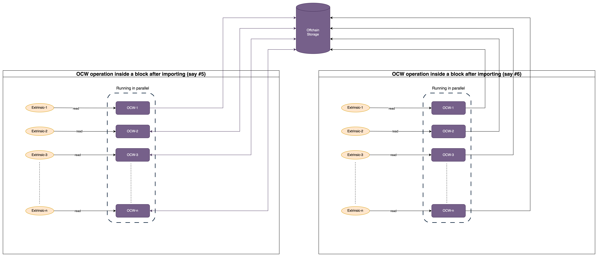

Some operations can take some time to compute. So, it can be run every few blocks rather than every block. For example, fetching the price of a crypto token can be done every 5 blocks rather than every block. In order to do this, we can apply lock on the OCW to run every 5 blocks. This is done by using `sp_io::offchain::timestamp` function. It returns the current timestamp of the block. So, we can use this to run the OCW every 5 blocks.

---

**How to validate unsigned transactions sent by OCWs (received via http request/response using a url) to the node?**

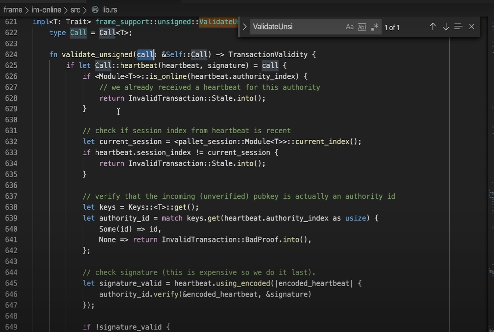

So, there is a trait `ValidateUnsigned` inside `frame_system::unsigned` module. It has a function `validate_unsigned` which takes 1 argument of `Call` type. And then it returns `TransactionValidity` type. So, we can use this function to validate the unsigned transaction sent by OCW to the node.

As unsigned transactions don't have nonce, so we can't use `TransactionPool` to validate them. So, we have to use `ValidateUnsigned` trait to validate them. Hence, we have to implement this trait for our pallet. So, the risk factor is that the same transaction can be valid multiple times. So, we need to have a custom logic for each unsigned transaction to validate them. These custom logic can be implemented inside `validate_unsigned` function. An example of unsigned transactions can be found inside `iam-online` pallet.

In the code snippet shared above, there is also a lot of other things happening like signature validation. Authority keys have to validated.

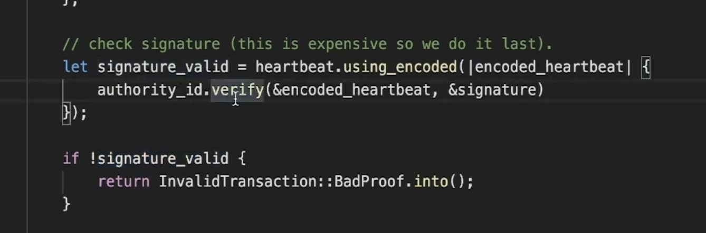

Implementing unsigned transactions inside OCW is a bit risky as they have the access to outside world. So, they can be used to spam the network. So, inside a pallet, developer should apply due diligence to write the custom logic.

Example: Suppose in a pallet's `offchain_worker` function "price fetch OCW" is implemented. Here, everybody needs to find the price of some token and then the validation logic would actually say like "does my off chain worker find the same price within say 1%. And this price change tolerance is because everybody requests this API at different times or this HTTP request they might get slightly different. And we have the logic to fetch the price of a crypto token from an oracle. This logic should be applied inside `validate_unsigned` function in order to validate the unsigned transaction.

On the other hand, signed transactions are easier to validate as they have to pay a fee. Also, there is replay & DDoS protection in place for signed transactions.

---

**When to use signed & unsigned transactions by OCW?**

- Use **signed transactions** if you want to record the associated transaction caller account and deduct the transaction fee from the caller account.

- Use **unsigned transactions** with signed payload if you want to record the associated transaction caller, but do not want the caller be responsible for the transaction fee payment.

---

**What the future of OCW holds?**

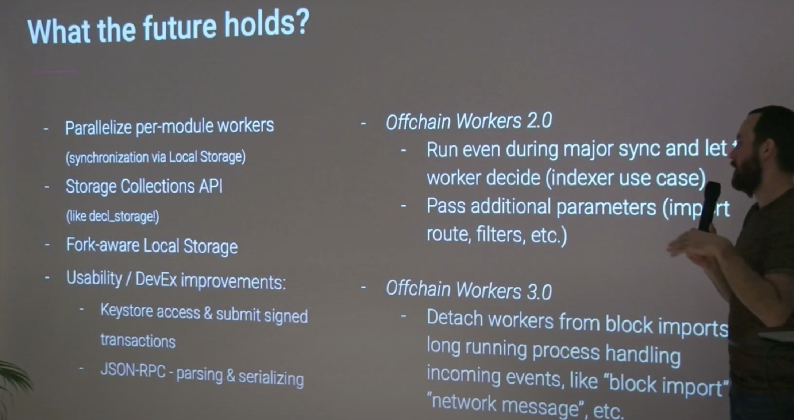

### Coding

Define OCW in a pallet:

```rust
	#[pallet::hooks]
	impl<T: Config> Hooks<BlockNumberFor<T>> for Pallet<T> {
		/// Offchain worker entry point.
		///
		/// By implementing `fn offchain_worker` you declare a new offchain worker.
		/// This function will be called when the node is fully synced and a new best block is
		/// successfully imported.
		/// Note that it's not guaranteed for offchain workers to run on EVERY block, there might
		/// be cases where some blocks are skipped, or for some the worker runs twice (re-orgs),
		/// so the code should be able to handle that.
		fn offchain_worker(block_number: T::BlockNumber) {
			log::info!("Hello from pallet-ocw.");
			// The entry point of your code called by offchain worker
		}
		// ...
	}
```

> The code in the screenshots might be outdated. So, please check the latest code in the substrate repo OCW example

**TESTING**:

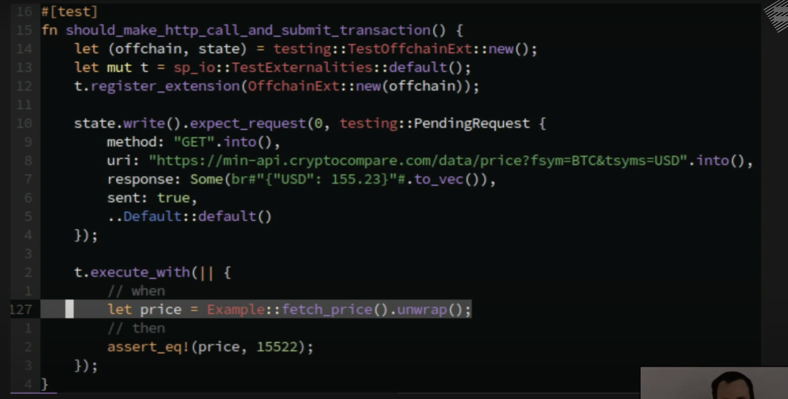

---

**How to push data on-chain from OCW?**

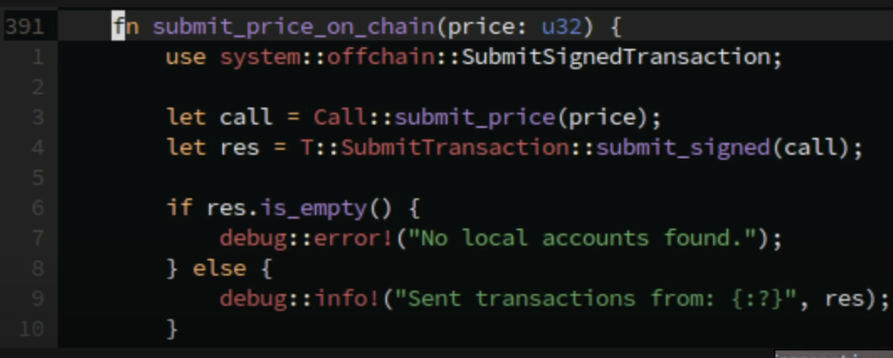

---

**How to add OCW related param in a pallet's having OCW feature?**
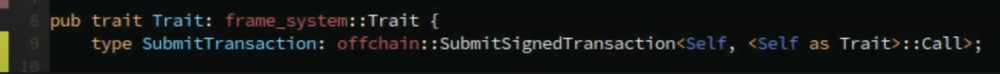

---

**What key is used to sign this OCW transaction?**

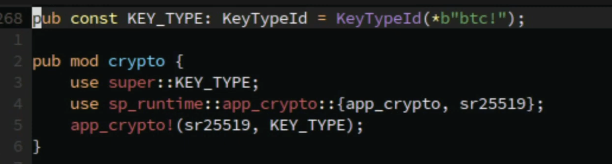

Here, we can define the key unique id for this pallet's OCW transaction. So, we can use this key to sign the OCW transaction related to this pallet.

Also, we can set the key type to `sr25519`, `ed25519`, etc. So, then the validator has to use the same key type to sign the OCW transaction. Otherwise, it would fail.

We can also incorporate multi-sig with OCW. So, we can use the multi-sig key to sign the OCW transaction.

> NOTE: Here, the key related code is wrapped into a module and that module can be imported into runtime (`src/lib.rs`).

---

**How to import OCW pallet into runtime?**

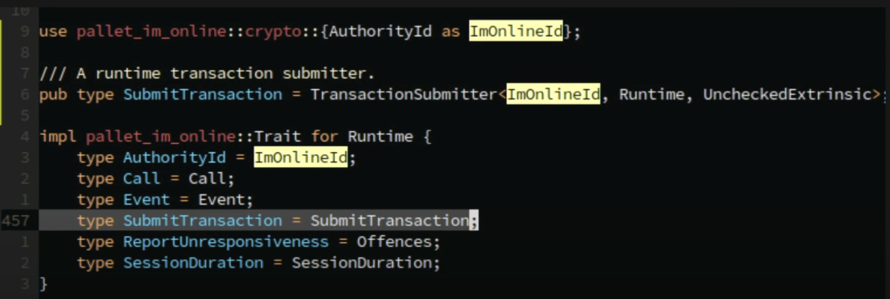

1. Here, we are importing application specific module i.e. `crypto`'s `AuthorityID` as `IamOnlineID` required for the Node to sign the OCW transaction.
2. And then we create a type `SubmitTransaction`.
3. And then we assign to the corresponding param inside the `impl` block of trait.

---

Some glue code that has to be added to the runtime:

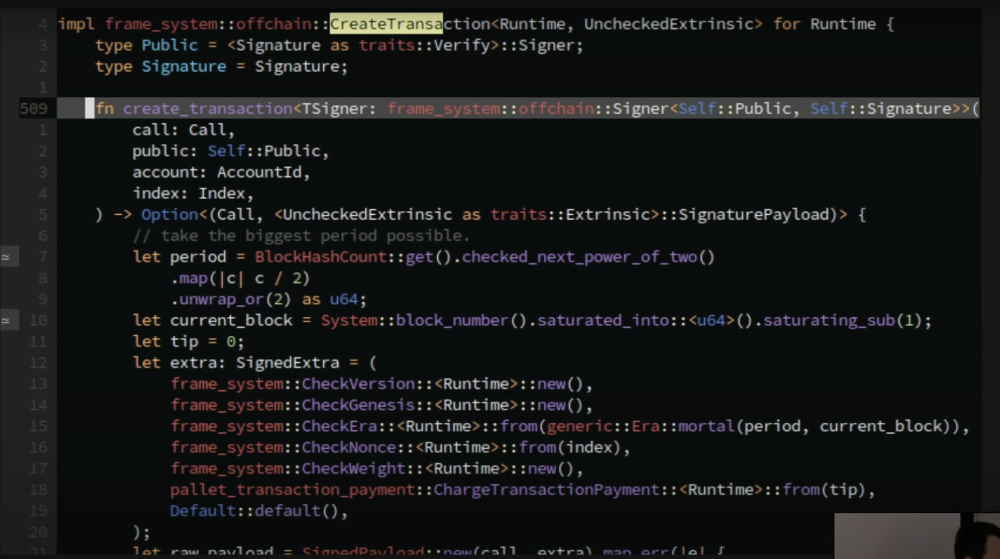

Here, we also have the option of adding tip so that our transaction is added faster to the block.

---

**How to test `SubmitTransaction`?**

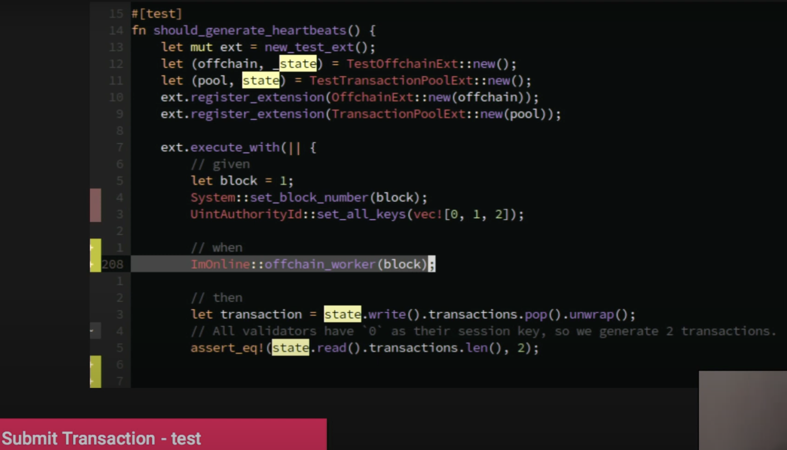

## Resources

- [SDC2020: Off-Chain Storage for Blockchain](https://www.youtube.com/watch?v=ulgeRPewC0k) ✅

<details>
<summary><b>In short</b>:</summary>

In this conversation, Tomasz give a journey from OCA to OCW and
how they can be used in a runtime.

**Highlights**:

- Off-chain workers in Substrate allow for the execution of code outside of the blockchain.
- An example of an off-chain worker is building an Oracle to store BTC prices on chain.
- Off-chain workers can be used to fetch prices from external sources and submit them on chain.
- Upgrading off-chain worker code is done through regular runtime upgrades.
- Off-chain workers can run in parallel with block imports.

</details>

- [Intro to Substrate Off-Chain Workers with Joe Petrowski and Tomasz Drwięga](https://www.youtube.com/watch?v=rwzvRi1JkWU) ✅

<details>
<summary><b>In short</b>:</summary>

In this conversation, Joe and Tomasz discuss off-chain workers and how they can be used in a runtime.

**Highlights**:

- Off-chain workers are pieces of logic run after every block.
- Off-chain workers are separate from block import and do not affect consensus.
- Workers can run code, read the state, and submit results back on-chain.
- Workers can access storage but cannot modify it.
- Multiple workers can run in parallel.
- Examples include printing the current block number and making HTTP requests.

</details>

- [Add offchain workers](https://docs.substrate.io/tutorials/build-application-logic/add-offchain-workers/)
