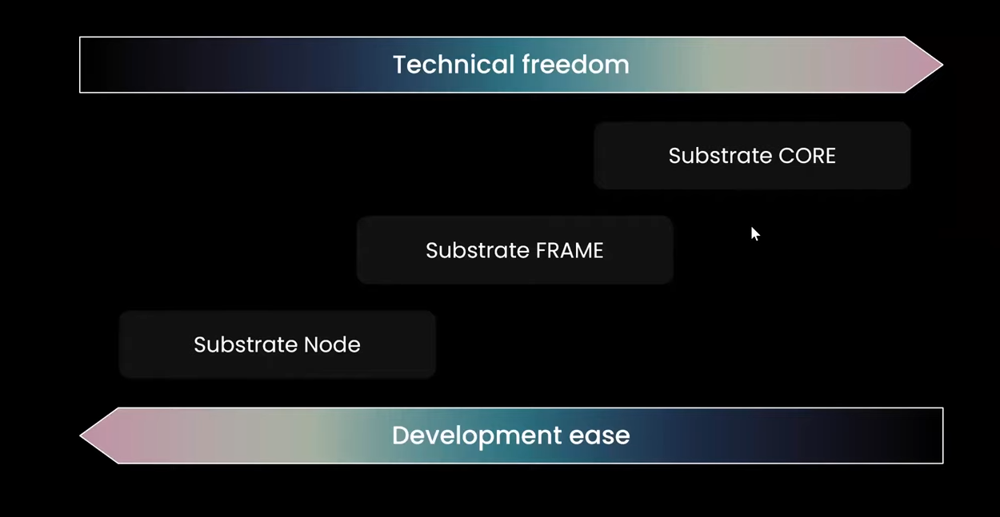

# Substrate

## Installation

Refer [this](../ink/README.md#installation) for installation.

## Terminology

- **Relay chain**: The Polkadot super chain which is connected to different parachains.
- **Parachain**: The side-chains which are connected to the main Polkadot relay chain. They are more like shards in ETH 2.0.
- **Collator**: Validator for Polkadot parachain
- **Substrate runtime**: It's like `wasm`, `bytecode` for other blockchain networks.

## ink!

## Comparo with EVM

| EVM Stack                          |
| ---------------------------------- |
|  |

| Substrate Stack                 |
| ------------------------------- |
|  |


## Why Rust

- Able to write safe code, at compile-time (done using `$ cargo check`), rather than run-time failures in C++
- Fast
- High level compared to C++

> NOTE: Any language can be chosen for Substrate. Parity, Web3 foundation is inclined towards Rust.

## Architecture


Substrate is modular & extensive. Each module is called "Pallet".

## Blockchain Framework

If someone wants to create a blockchain, then they can use Substrate. It's a framework for creating different blockchain modules. The image below shows the different layers of a blockchain framework:


Here, `Database Layer`, `Networking Layer`, `Consensus Layer` is provided by Substrate.

---

Development wise, here is the diagram which shows the easy to difficult way of using Substrate for your own blockchain:

`Substrate Node` --> `Substrate FRAME` --> `Substrate CORE`



---

Here is what it looks like before & after creating blockchain using Substrate:

**Before**:


**After**:


## Coding

FRAME is itself a programming language. It's a DSL (Domain Specific Language) for writing Substrate runtime, pallets.

### Pallet

**Start a chain with given/custom runtime**:

- If needs to create a substrate node, then go to `substrate::bin/node/runtime/` & use the codebase. All pallets are used.
- If needs to use a substrate node template, then go to `substrate::bin/node-template/runtime/` & use the codebase. Here, limited pallets are used. You can add more pallets here.
- If needs to create a chain with your own runtime, then just go to `runtime/src/lib.rs` & write your own code.

---

**pallets**: `sudo`, `system`

- `sudo` pallet gives the root permission. It's like `sudo` in Linux. It's more like a on-chain governance.
- `system` pallet is the most important pallet without which no other pallet would work. Infact, it's the core pallet.
- `origin` is the account which is sending the transaction i.e. the caller of the transaction. These are the possible origin values:
  - `None`: For unsigned transactions
  - `Signed`: For signed transactions
  - `Root`: For transactions which are sent by the root
    

`get` who is making the call here:

```rs
let who = ensure_signed(origin)?;
```

---

**Recovery pallet**

This is mainly to recover your account based on validation given by a set of users (no. defined in the pallet).

### Others

In Substrate, one can create a blockchain which supports any length of account id. Like in Ethereum, it's 20 bytes. In Substrate, it can be any length. That's why we need to use `AccountId` instead of `Address`. And the `AccountId` type can be defined as:

```rs
type AccountId = [u8; 20];  // 20 bytes for Ethereum
type AccountId = [u8; 32];  // 32 bytes for a chain
```

In order to make things generic, we define `Config` like this for defining AccountId, Event, Blocksize, etc.:

```rs
// `frame_system` has already defined the `Config` trait
trait Config {
  type AccountId;
  type BlockNumber;
  // etc...
}
```

And therefore, we get to see `<T>`, `T::`. This is because we are using the `Config` trait.

---

**Gas** in Substrate is called **Weight** (max. value). It's a unit of measurement for the amount of computation required to execute a transaction. It's a measure of the time it takes to execute a transaction.

---

Storage (data persistence) has 2 types in blockchain:

- **StorageValue**: Storing a single type in storage.
- **StorageMap**: Storing a map from key to value in storage.

More complex storage types are also possible.

- `StorageDoubleMap`: Storing a map from key to map in storage.
- `StorageCountMap`: Storing a map from key to counter in storage.

Manipulating `StorageValue`:

```rs
// Put a value in storage
CountForItems::<T>::put(10);

// Get the value from storage
CountForItems::<T>::get();

// kill a value in storage
CountForItems::<T>::kill();
```

Manipulating `StorageMap`:

```rs
// Check if a value exists in storage
let is_false = Items::<T>::contains_key(user);

// put a value in storage
Items::<T>::insert(user, new_item);

// Get the value from storage
Items::<T>::get(user);

// kill a value in storage
Items::<T>::remove(user);
```

## Tutorials

Try out the following tutorials:

- [kitties-tutorial](https://learn.figment.io/tutorials/substrate-kitties-setup), [doc in PDF](tuts/Figment%20Learn%20_%20Substrate%20Kitties%20-%20Basic%20Setup.pdf)

## Repositories

- [zhubaiyuan/awesome-substrate](https://github.com/zhubaiyuan/awesome-substrate)

## References

- [Documentation | By Parity](https://docs.substrate.io/main-docs/)
- [Substrate StackExchange](https://substrate.stackexchange.com/)
- [Substrate Recipes](https://substrate.recipes/introduction.html)

### Videos

- [Substrate: A Rustic Vision for Polkadot by Gavin Wood at Web3 Summit 2018](https://www.youtube.com/watch?v=0IoUZdDi5Is)
- [Chainlink | Intro to Substrate](https://www.youtube.com/watch?v=o5ANk0sRxEY)
