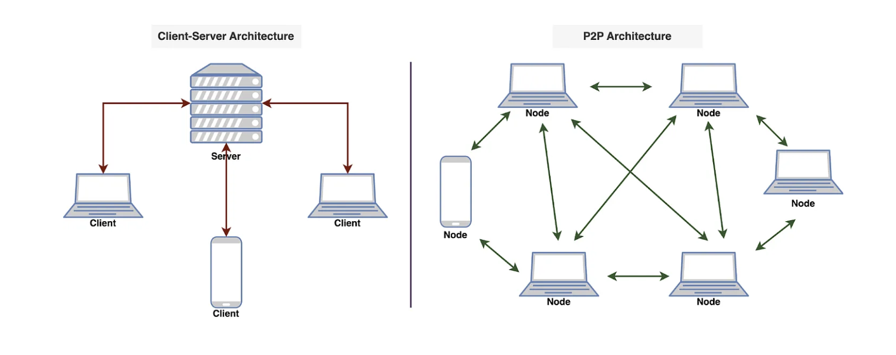

# Libp2p



## Description

- A P2P network is a type of network in which different computers communicate with each other directly without the need for a central server. The peer in the term indicates that all participating computers/systems are equal. These computers are also called nodes.
- In p2p network, each node has equal status and is capable of both requesting and providing resources or services.
- In a traditional network architecture (known as the client-server architecture), there is usually one server and multiple clients. If two clients want to communicate with each other, the message has to first reach the server and then the server sends the message to the second client.
- **Applications**: file sharing, communication, distributed computing, and more.
  - P2P could play a role in how our smart devices communicate. Imagine your smart fridge and coffee maker having a direct chit-chat without involving a server. They might even plan your breakfast together.


### Types

#### Pure p2p

Both metadata & data transfer is done over the p2p network.


#### Hybrid p2p

To facilitate initial connection and peer discovery, the metadata is fetched by the peers from the central server. Further the communication is done among the peers. This approach balances the benefits of a decentralized network with the efficiency of centralized coordination.


#### Blockchain-based p2p

In this model, blockchain serves as the underlying distributed ledger or database that records and verifies transactions, creating a secure and transparent environment for peer-to-peer interactions.


### How p2p network operates

#### 1. Node Initialization

- **Node Initialization**: It is initialized with a random ID and a private key when the p2p client application is installed. The peer ID is used to identify the node in the p2p network.

  ```sh
  # locally generated
  $ subkey generate-node-key
  12D3KooWBUBKF8kV5fNdvbHwLp5DiYoamVFbHY9p2Esxt3tseNh5
  af6450bc2acab85e6643a00ab509a1cbb6f8188ea30e3f5f2e5d29c58cc01b56
  ```

  - Properties:
    - A node is usually represented by `ip_address/port/node_id`. This is very much similar to `/ip6/::1/tcp/30433/p2p/12D3KooWGyosWZP4kARqc1va8Q8b8DNxjQovW1Xj4w7BFCCMhtMU` in the above example.
    - Node ID must be unique. Generally, the uniqueness is achieved by hashing the computer's network card MAC address and hard disk serial number.

#### 2. Discovery and Connection

When a new node in a P2P network boots up, it doesn’t know anything about the network, because there is no central server. Usually, developers provide a list of trusted nodes called "**Bootstrap nodes**" written directly into the code of the P2P client application that can be used for initial peer discovery. These trusted nodes could be centralized servers or peers depending upon the P2P application.

This is how it looks like when a Subspace node is started:

```sh
2024-03-15T16:38:01.032378Z  INFO Network: space_acres::backend::networking: DSN listening on /ip6/::1/udp/30433/quic-v1/p2p/12D3KooWGyosWZP4kARqc1va8Q8b8DNxjQovW1Xj4w7BFCCMhtMU
2024-03-15T16:38:01.032456Z  INFO Network: space_acres::backend::networking: DSN listening on /ip4/192.168.0.100/udp/30433/quic-v1/p2p/12D3KooWGyosWZP4kARqc1va8Q8b8DNxjQovW1Xj4w7BFCCMhtMU
2024-03-15T16:38:01.032623Z  INFO Network: space_acres::backend::networking: DSN listening on /ip4/127.0.0.1/tcp/30433/p2p/12D3KooWGyosWZP4kARqc1va8Q8b8DNxjQovW1Xj4w7BFCCMhtMU
2024-03-15T16:38:01.032637Z  INFO Network: space_acres::backend::networking: DSN listening on /ip6/::1/tcp/30433/p2p/12D3KooWGyosWZP4kARqc1va8Q8b8DNxjQovW1Xj4w7BFCCMhtMU
2024-03-15T16:38:01.032641Z  INFO Network: space_acres::backend::networking: DSN listening on /ip4/192.168.0.100/tcp/30433/p2p/12D3KooWGyosWZP4kARqc1va8Q8b8DNxjQovW1Xj4w7BFCCMhtMU
```

This bootstrap nodes are generally provided in the P2P client application. Once a new peer is discovered to connect with, then it periodically looks for more peers as redundancy. And then it doesn't need the bootstrap nodes anymore once it is connected to set of other peers. This has been getting followed since Bitcoin or prior version of P2P (like BitTorrent).

##### a. Centralized Server/Tracker

There is a central server aka tracker that has the list of peers. It periodically sends out a list of active peers. The tracker is usually provided by the P2P client application.<br/>
Any node would want to have the latest list of available peers for data transfer like files, etc. for redundancy.

In short, the tracker is used just to provide the latest list of available peers. In some cases, the tracker also provides the information of the files as in which node(s) has that file.


##### b. Distributed Hash Tables

When a node wants to discover another peer, it can perform a lookup in the DHT to find the corresponding IP address. The pure P2P model utilizes this approach.


Here there is a mapping table maintained like this:

| Node ID | IP Address |
| -- | --|
| | |
| | |
| | |

##### c. Broadcasting and Multicasting

Here, a node can broadcast their presence or send multicast messages to the network. Other nodes can listen to these broadcasts or messages to discover peers. This method is more common in smaller, local P2P networks like ZK-SNARK proof generation setup with SCS key.

Also, when a node sends files to the requester, then other nodes can redirect the file to the requester.


#### 3. Distributed Data Storage

In p2p network, we have touched upon interaction (mostly peer discovery), but what about the resources like files that we want to share/transfer?

As example, this is seen commonly in BitTorrent files sharing system.

So, each peer has to store part of a file in its own storage. This is done by the Distributed Storage Networks (DSN) protocols like Subspace Network. In a file-sharing P2P network, each peer contributes a portion of its storage to host parts of files. This results in a distributed storage system where the complete file is reconstructed by combining contributions from multiple peers in the network.

## Advantages

- **Redundancy and Reliability**: prevents single point of failure as the data is stored in multiple nodes. Also, there is a replication factor of the same piece of data. Imagine a file broken into 10 pieces and each piece is stored in multiple nodes. The data is not lost even if a single node is lost. This is achieved using Erasure coding (used in Subspace Network).
- **Scalability**: A P2P network is more scalable than a traditional client-server architecture. In a traditional client-server architecture, a single server has to handle all requests. If there are too many client requests, the server may not be able to handle all of the requests. However, in the case of P2P, each request is not necessarily handled by a single node, thus providing scalability.
- **Distributed computing**: P2P networks can be used for distributed computing tasks where processing is distributed among multiple nodes. This is beneficial for tasks that require significant computational power.
- **File Sharing and content distribution**: P2P networks, especially those using protocols like BitTorrent, excel in distributing large files efficiently. Users can download and upload simultaneously, reducing the load on individual servers.
- **Privacy and anonymity**: In P2P systems, users may enjoy increased privacy and anonymity as they communicate directly with peers without relying on a central server. This can be advantageous in applications where privacy is a concern.

## References

- [A Crash Course in P2P](https://blog.bytebytego.com/p/a-crash-course-in-p2p) by ByteByteGo ✅
